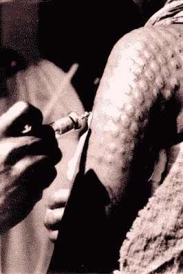
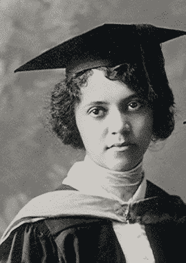
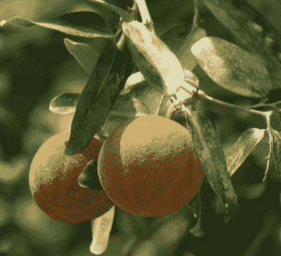

# 爱丽丝·鲍尔蒸熟了麻风病

> 原文：<https://hackaday.com/2021/06/15/alice-ball-steamrolled-leprosy/>

麻风病是一种细菌性疾病，会影响皮肤、神经、眼睛和上呼吸道的粘膜表面。它通过飞沫传播，导致这些区域的皮肤损伤和感觉丧失。在 19 世纪科学家发现了麻风病的细菌起源后，麻风病也被称为汉森氏病，它从古代就存在了，那些受折磨的人也同样长时间地被污名化和排斥。多年来，人们被送到麻风病人聚居地度过余生，以避免传染他人。

The common result of injecting chaulmoogra oil. Image via [Stanford University](https://web.stanford.edu/group/parasites/ParaSites2005/Leprosy/pictures/chaul%20injection.jpg)

在爱丽丝·鲍尔出现之前，对麻风病唯一能做的事情——从一种东部常青树的种子中注入油——并没有真正起到多大作用。自 17 世纪以来，东方医学一直使用大风子树的油来治疗各种疾病，包括麻风病。

问题是，虽然它有点效果，但大风子油很难让它进入体内。摄入它会让大多数人呕吐。这种物质太粘了，不能局部应用于皮肤，注射它会导致油在脓肿中凝结，使患者的皮肤看起来像气泡包装。

1866 年，夏威夷政府通过了一项法律，对莫洛卡岛的麻风病人进行隔离。偶尔会有一艘渡船开往这个岛，将这些人送上死亡之路。大多数病人不是死于麻风病，而是死于继发感染或疾病。到 1915 年，有 1100 名来自美国各地的人住在莫洛卡岛上，他们已经没有地方住了。必须做点什么。

爱丽丝·鲍尔教授破解了大风子油的化学成分，降低了它的粘性，使其易于注射。因此，它更加有效，并一直是理想的治疗方法，直到 20 世纪 40 年代硫酸抗生素被发现。那你为什么以前没听说过爱丽丝呢？她的作品还没出版她就去世了，然后被她大学的校长偷走了。现在，一个多世纪过去了，爱丽丝开始得到她应得的认可。

Alice at one of her graduations. Public Domain via [Wikipedia](https://commons.wikimedia.org/w/index.php?curid=10635615)

## 被化学包围

爱丽丝·奥古斯特·鲍尔于 1892 年 7 月 24 日出生在华盛顿州的西雅图。她有四个孩子，两个哥哥和一个妹妹。爱丽丝的家庭是中产阶级——她的父亲是报纸编辑、律师和摄影师。她的母亲是一名摄影师。她的祖父詹姆斯·普雷斯利·鲍尔是一位著名的摄影师，他是第一批使用银版照相法的美国黑人之一，银版照相法是在金属板上而不是纸上印刷照片。这是第一个公开的印刷过程，它涉及碘敏化银板和汞蒸汽，所以爱丽丝从小就被化学所包围。

当爱丽丝还是个孩子的时候，他们全家搬到了夏威夷，试图用热量来缓解鲍尔爷爷的关节炎。他们到达后不久，他就去世了，大约一年后，这家人搬回了西雅图。爱丽丝就读于西雅图高中，直到 1910 年，在所有的科学领域都获得了高分。到 1914 年，她获得了华盛顿大学的两个学士学位——一个是药物化学，另一个是药剂学。

艾丽丝获得了几份研究生奖学金，并选定了夏威夷大学。她获得了化学硕士学位，并继续担任教授。她的硕士论文的一部分包括对卡瓦植物种类及其化学特性的研究。她的工作引起了哈里·t·霍尔曼博士的注意，他招募爱丽丝研究大风子油，并在她不教书的时候在卡利希医院协助他治疗麻风病人。

## 球法

爱丽丝和霍尔曼博士一直在加热大风子油，但她意识到这是错误的方法，并尝试在将油中的脂肪酸暴露于酒精后冷冻提取物。在这样做的过程中，爱丽丝想出了一种方法，从油中分离出酯化合物，并对其进行修饰，以产生一种可以更好地被人体吸收的物质，同时保持药用价值不变。

Fruit of the chaulmoogra tree from which the seeds are extracted. Image via [Madame Botanic](http://madamebotanic.com.au/2018/06/14/wonderful-chaulmoogra-oil/)

球法效果很好。几年之内，近 100 名接受了静脉注射大风子油治疗的人不再有病变，并被允许回家与家人团聚。它是如此成功，以至于几年内，没有新的病人被流放到莫洛卡岛。大风子油一直被使用，直到 1940 年代磺胺类抗生素发明。

不幸的是，爱丽丝在有机会发表她的作品之前，于 1916 年 12 月 31 日去世。尽管她的死亡证明上写着“肺结核”，但病因可能不明。据报道，她在演示如何正确使用防毒面具时意外接触到了氯气。

该学院的院长亚瑟·迪恩(Arthur Dean)继承了艾丽斯的遗志，然后在 1920 年与人合著了一篇论文，声称这是他自己的论文，没有归功于艾丽斯。两年后，霍尔曼博士发表了自己的论文，给予了爱丽丝应得的荣誉，并告诫迪安，他竟敢对爱丽丝的工作一无所知，然后冒充自己的工作。

20 世纪 30 年代，暹罗(现在的泰国)国王送给夏威夷大学一棵大风树作为感谢礼物。2000 年 2 月 29 日，莫洛卡伊的几位前居民参加了一个仪式，在那里挂上了一块牌匾。那一天，夏威夷副州长宣布，从今以后，这一天将被称为爱丽丝舞会日，每四年庆祝一次。自 20 世纪 70 年代以来，历史学家一直致力于恢复爱丽丝·鲍尔的遗产，我们认为这是一个值得永垂不朽的重要遗产。