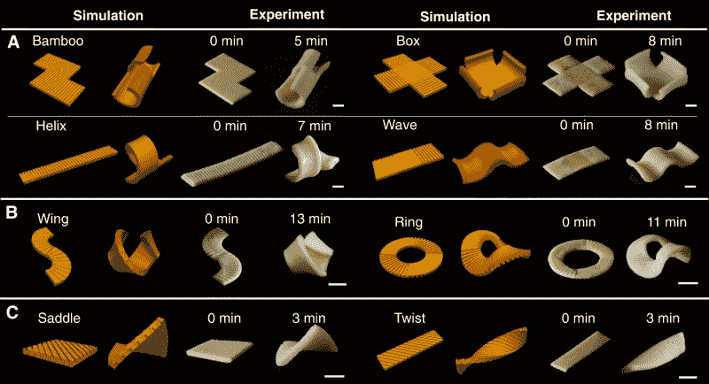
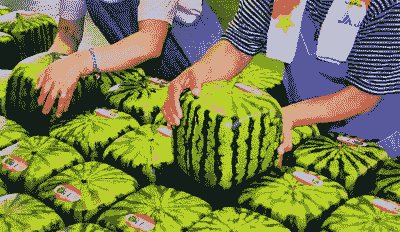

# 扁平包装的意大利面:就像没有奇怪扳手的宜家家具

> 原文：<https://hackaday.com/2021/05/26/flat-pack-pasta-like-ikea-furniture-without-the-weird-wrench/>

说到食品包装，没有比薯片袋更大的骗局了吧？人们抱怨里面的空气(实际上是氮气)，但它的存在是有原因的——氮气挤出氧气，所以芯片处于工厂新鲜的休眠状态，直到你撕开袋子并释放气体。如果你想要扁平包装的薯片，总有那些形状一致的罐装马铃薯泥薄饼。但即使是这些人通常也会有一些坏掉的。

另一方面，没有人抱怨他们的盒里有多余的空间——那是愚蠢的。但说真的，成功运输易碎食品需要扁平包装或大量额外空间，特别是如果食品像意大利面一样有无数有趣的 3D 形状。每个人都知道 3D 意大利面优于平面意大利面，因为它能更好地保存酱汁。意大利面必须保持完整！

意大利面作为一种食物的伟大之处在于它制作简单，而且比薯片更有营养。由于这些因素，意大利面经常在极端情况下提供给大群人，如士兵和非自愿流离失所者。但是储存大量形状良好的意大利面会占据相当大的空间。因为所有必要的空气，许多包装都被浪费了。

那么，如果你能把过多的意大利面放在比如说文件柜里，会怎么样呢？由卡内基梅隆大学变形物质实验室领导的一个研究小组创造了一种方法来制作扁平包装的意大利面，在沸水中几分钟后就可以复活。

Just a few of the fun shapes they created. Image via [Morphing Matter Lab](https://advances.sciencemag.org/content/7/19/eabf4098)

这可能不言而喻，但他们受到了宜家包装模式的启发，并试图将扁平包装原则应用于食品。该团队在过去几年中一直在用纤维素、蛋白质和淀粉的 2D 薄膜进行实验，以使它们在吸水时变形为 3D 形状。然而，他们的方法需要添加剂，这可能不会被消费者或面食制造商接受。因此，他们想出了一种通过冲压意大利面来实现的方法，他们称之为“[基于凹槽的瞬态变形](https://advances.sciencemag.org/content/7/19/eabf4098)”。对我们来说，听起来像是可以取代高保真/嘻哈音乐来学习/放松的东西。

## 为什么我们没有想到这一点？

我们非常喜欢这种简单的用途。这就像锯木头一样，或者用剪刀沿着罗缎丝带剪来卷曲它。只要你像研究人员一样使用食品安全的脱模剂，用 3D 打印的邮票在家里重现这个实验就非常简单。

为了找到一种适合意大利面的变形机制，研究小组转向了 PDMS，一种广泛用于研究动力学行为的硅胶。他们对凹槽类型进行了实验，将长方体形状的方波凹槽与截头体形状的奇巧侧视凹槽进行了权衡，发现截头体形状的凹槽使弯曲 PDMS 的曲率最大化。随着变形机制的分类，研究人员将他们的实验室外套换成围裙，并开始将其应用于面团。

该团队从用传统意大利方式制作的简单意大利面开始，除了粗面粉和水什么都没有。面团被擀平，然后像平常一样切成各种形状，尽管大多数都是新的、令人兴奋的。最后，他们用自己设计和 3D 打印的塑料片在面团上盖章，中间使用食品安全脱模剂。他们从手工冲压开始，正如你在下面的视频中看到的，他们最终使用四轴龙门获得更精确的印象。然后一切如常:根据形状和厚度，将意大利面煮 7-12 分钟，然后观察变形的发生。凹槽的地方需要更长的时间来软化，它们没有光滑部分膨胀得多。一名团队成员在一次徒步旅行中带了一盒扁平包装的意大利面，并在火上烹饪以证明其实用性。

[https://player.vimeo.com/video/543657466](https://player.vimeo.com/video/543657466)

## 比方形西瓜更多汁

一项快速调查显示，麻省理工学院几年前也有同样的想法。那么，为什么这个想法还没有实现呢？显然，有人需要做一个 Kickstarter，成立一家平板包装的意大利面公司。

Squares save space. Image via [Red Duck Post](https://www.redduckpost.com/the-secret-of-the-square-watermelon/)

问题是，这种意大利面会让消费者多花多少钱？不需要太多，对吧？我们既不是商业专业的，也不是工业设计专业的，但是对于这样一家公司来说，管理费用能有多少呢？当然，像方形西瓜一样，扁平包装的意大利面是一个不会变软的想法。

在立方体模具中种植西瓜被认为是一项节省冰箱空间的举措，可以使堆叠变得轻而易举。实际上，[它们每个的价格在 100-200 美元之间](https://www.mashed.com/179400/the-real-reason-square-watermelons-are-so-expensive/),因为它们并不都长有完美的垂直条纹或者填满模具。因为每个都必须在成熟前采摘，所以它们基本上不能食用，大多用于装饰。

我们想象，如果平板包装的意大利面成为一种东西，它不会是完美的——可能仍然会有一些像那些平板包装的马铃薯薄饼一样的坏掉的。但是谁在乎呢？它们还能盛调味汁。