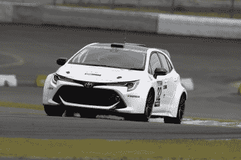
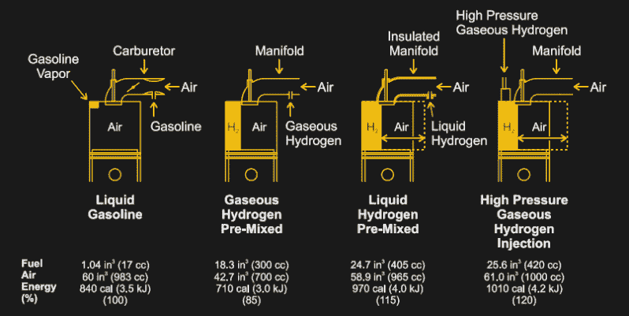
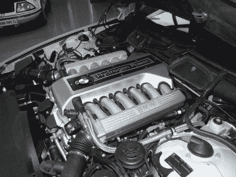

# 丰田氢燃料赛车即将上路

> 原文：<https://hackaday.com/2021/05/13/toyotas-hydrogen-burning-racecar-soon-to-hit-the-track/>

随着可用电动汽车在市场上的崛起，以及世界各地的市场逐渐淘汰化石燃料汽车的销售，你可能会认为内燃机时代即将结束。然而，历史很少如此平淡无奇，新技术旨在让内燃机继续工作一段时间。

Toyota’s upcoming Corolla Sport-based hydrogen-burning racer. Credit: Toyota media

这个领域最有趣的技术之一是氢燃烧内燃机。与燃料电池技术相反，燃料电池技术通过特殊的薄膜将氢和氧结合起来发电，这些发动机以传统的方式发电——在火焰中。丰田最近一直在探索这项技术，并宣布一辆搭载三缸氢燃料发动机的赛车将参加今年的富士超级技术 24 小时耐力赛。

## 氢发动机

氢燃料发动机的好处在于，与燃烧化石燃料不同，氢燃料的排放非常清洁。在纯氧中燃烧氢气只会产生副产品水。当在大气中燃烧时，结果是一样的，尽管会产生少量的氮氧化物。因此，有很大的动力去探索用氢来替代现有的运输燃料。这是一种减少污染排放的潜在方式，同时避免了电池电动技术长时间充电的麻烦。

氢燃料内燃机的基本原理与任何汽油发动机基本相同。事实上，几乎任何现有的汽油引擎都可以转换成以氢为燃料，只要将燃料喷射器换成适合喷射氢的零件就行了。然而，很大程度上由于氢气和空气的可燃混合物在气缸中占据了更多本来用于空气的空间，[与燃烧汽油的相同发动机相比，功率输出将减少 20-30%，](https://www.sciencedirect.com/topics/earth-and-planetary-sciences/hydrogen-engine)假设氢气在进气门关闭之前被喷射。

Low-tech methods of premixing gaseous hydrogen with the intake air charge reduce potential engine power output. Direct injection methods could theoretically allow a hydrogen-burning design to produce 120% of the power of a similar gasoline engine.

然而，可以采取措施来抵消这一点。通过从一开始就设计燃烧氢的发动机，压缩比、燃烧室设计和喷射方法都可以优化以适应氢燃料。例如，通过使用直接喷射技术，在进气门关闭后将氢气喷入燃烧室，[氢发动机的功率可以显著增加](https://www1.eere.energy.gov/hydrogenandfuelcells/tech_validation/pdfs/fcm03r0.pdf)，如上图所示。这是因为发动机真空在进气冲程吸入 100%的空气，而不是 30%的空间被化学计量混合物中的氢气占据。

在氢发动机成为主流之前，仍有一些工程问题需要解决。影响燃料电池汽车的还有同样的先有鸡还是先有蛋的问题；在缺乏加油站基础设施的情况下，公司仍然很难销售氢动力汽车。还有曲轴箱通风的问题，其中气态氢可能在曲轴箱中滑过活塞环而点燃，以及在进气口预混氢气的系统中的回火问题。然而，这些问题没有一个是不可克服的，解决这些问题更多的是日常工程工作，而不是天马行空的研究。

还值得注意的是，尽管氢燃料发动机比化石燃料发动机要清洁得多，并且不排放任何一氧化碳，但微量的润滑油仍然会偷偷进入燃烧过程，因为没有完美的活塞环。显然，这对于氢燃料电池来说不是问题。

## 真实世界的例子

By and large, hydrogen-burning engines look unremarkable compared to their gasoline counterparts. The only major difference is fuel injection method. Credit: [Claus Ableiter](https://commons.wikimedia.org/wiki/User:Claus_Ableiter "User:Claus Ableiter"),  CC-BA-SA-4.0

丰田的赛车参赛作品将在一辆基于丰田卡罗拉运动版的汽车上安装三缸发动机，打算参加 24 小时耐力赛。虽然 YouTube 上一个关于氢发动机的视频似乎暗示，正在使用进气口喷射，而不是直接喷射，但是已经没有太多了。这并不奇怪，因为参赛作品本质上是一个提升氢汽车形象的技术演示，而不是全力以赴用氢发动机产生尽可能高的功率。

然而，丰田并不是唯一一家试验这项技术的公司。马自达的努力产生了 RX-8 氢燃料发动机，它配备了双燃料汪克尔发动机，可以根据需要燃烧汽油或氢气。这些车辆中的一小部分被租赁到不同的地点，并配有合适的加注基础设施。

BMW’s Hydrogen 7 featured a dual-fuel V12 and was on sale in limited markets from 2005 to 2007\. Credit: [Sachi Gahan](https://www.flickr.com/photos/14657061@N00/414677183), CC-BY-SA-2.0

宝马甚至制造了一款 7 系豪华轿车，配备 6.0 升双燃料 V-12 发动机。[然而，与纯汽油驱动的车型](https://www.caranddriver.com/news/a15147892/2007-bmw-hydrogen-7-car-news/)相比，这款发动机放弃了一些性能，而且在 2005 年至 2007 年间也只限量发布。

早期的项目，如宝马和马自达的项目引起了极大的兴趣，但市场几乎没有真正的需求。高昂的价格加上初级的氢储存技术，再加上几乎完全缺乏基础设施，意味着这种汽车对普通司机来说不是一个好主意。

虽然以前的氢燃烧发动机实验失败了，但不断推动开发更好的氢储存和填充站，以及更好的发动机，可能会看到它在未来有一些希望。然而，与现有的电动汽车相比，这将是一场艰苦的战斗，因为电动汽车在基础设施竞赛以及人心和思想方面都拥有巨大的领先优势。