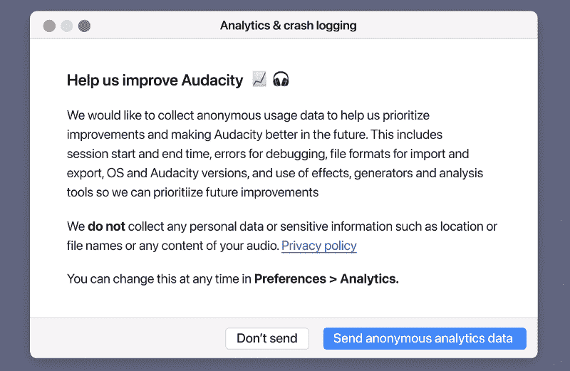

# 遥测辩论震撼了开源社区

> 原文：<https://hackaday.com/2021/05/17/telemetry-debate-rocks-audacity-community-in-open-source-dustup/>

启动一个开源项目很容易:写一些代码，选择一个兼容的许可证，然后把它推送到 GitHub。如果你想出了一个聪明的标志，并记得实际记录项目应该做什么，额外加分。但是维护一个大型的开源项目并保持其社区的快乐，同时继续发展并保持领先地位，这完全是另一回事。

问问 Audacity 的维护者就知道了。自 1999 年以来，GPLv2 许可的多平台音频编辑器一直为业余爱好者和专业人士提供一套强大且易于使用的工具，并且每天都被…嗯，很难说。几百万，几千万？没有人真正知道有多少人在使用这个特定的工具，在什么平台上，所以不难理解为什么最近提出了一个[拉请求，将分析纳入软件](https://github.com/audacity/audacity/pull/835)，以努力开始回答这些核心问题。

现在，那些相信软件应该像言论一样自由的人往往是一群易怒的人。他们高度重视隐私，任何关于监控他们活动的言论总是会遭到强烈的抵制。果不其然，这个特别的拉请求的评论很快就传开了。指责开始满天飞，没过多久，F 开头的词就开始流传开来:fork。他们认为，如果 Audacity 打算开始窥探其用户，那么是时候将源代码剥离出来，投入到一个没有这种监控的新项目中。

这种情况听起来可能很可怕，但是说实话，这在自由和开源软件(FOSS)开发的世界里是很常见的。你很难找到一个大型的自由/开源软件项目，当它的一部分用户不喜欢他们认为事情正在发展的方向时，它没有受到一两个分叉的威胁，而且可以说，这正是系统应该如何工作。在正常情况下，你可以把这一次归因于[雷蒙德的*巴扎*](https://en.wikipedia.org/wiki/The_Cathedral_and_the_Bazaar) 在工作。

但是这一次，事情有点复杂。在没有任何警告的情况下提出如此大规模和彻底的变革，显示出令人不安的缺乏透明度，一些关于如何实施这种新遥测系统的决定完全令人担忧。在宣布 Audacity 将接受新的管理后几天，就提出了撤销请求，结合这一事实，有足够的理由敲响警钟。

## 见见新老板

如果不承认该项目的新主人——缪斯集团，就不可能谈论对 Audacity 的修改建议。该组织致力于为各行各业的内容创作者开发和支持音频工具和音乐软件，除了 Muse 品牌的软件包，如 MuseScore 和 MuseClass，他们还负责 Ultimate Guitar 和 Tonebridge。尽管软件和社区的目录令人印象深刻，在 Audacity 被考虑进来之前代表了数亿用户，[Muse 组作为一个实体从 4 月 26 日](https://mu.se/newsroom/tpost/3dkxig59m1-muse-group-launches-to-support-music-tec)才正式存在(是的，那是在遥测拉请求之前的八天)。

Muse Group 收购 Audacity 仅四天后，Martin Keary(网名为 Tantacrul)在 YouTube 上发布了一个名为“ *[我现在负责 Audacity”的视频。说真的](https://www.youtube.com/watch?v=RMWNvwLiXIQ)*。5 月 3 日，[Audacity 网站](https://www.audacityteam.org/audacity-musescore-announcement/)发布了一份官方声明，确认他们已经加入了缪斯团队，Keary 将接任新的项目负责人。

事情发展的速度至少可以说是惊人的。但在他的视频中，凯里明确表示，他的意图并不是要剥去《无畏》的心脏和灵魂。它仍然是 GPLv2 下的自由软件，除了一些公认的非常需要的用户界面调整之外，将是数百万用户已经享受了 20 多年的同一程序。

在 Audacity 网站上发布他们收购的官方声明后不到 24 小时，实现遥测技术的 pull 请求就被打开了。

## 良好的意图，可怕的光学

显而易见，如果你对权力的平稳过渡和一个快乐的社区感兴趣，你绝对不应该做的事情就是在接手后的几个小时内匆忙完成破坏项目核心价值的大规模变更。然而，这正是这里发生的事情。在用户看到该项目已被另一个小组吸收的第一个官方消息后不到一天，不受欢迎的改变似乎在没有讨论时间的情况下就通过了批准程序。对许多人来说，这很难被视为一个一周前还不存在的集团对一个既定项目的敌意收购。

正如你所料，现实远没有这么生动。Muse 小组希望将开发时间和资金投入到 Audacity 过时的 UI 的改造和一些特别棘手的错误的消除中，希望像他们现有的项目一样深入了解该软件的用户群。事实上，Keary 在 2019 年为 MuseScore 实施了一个类似的遥测计划，特别是为了确定软件的哪些元素被使用得最多。有了这些数据，开发团队认为他们可以打造更精简的体验，更好地反映典型的工作流程。

 不同的是，当时是[发布了一篇经过深思熟虑的详细博客文章](https://musescore.org/en/telemetry)，明确阐述了开发团队试图实现的目标以及他们希望如何实现。仍然有一些反对的声音，但解释和明确的目标有助于平息事态。Audacity 网站上的一个解释这些变化的类似帖子可能有助于避免最初几天的许多混乱，但不幸的是，这次有人犯了一个非常严重的错误。

最终，pull 请求被修改为澄清信息，例如遥测技术将被选择加入，即使这样也只适用于通过 GitHub 发布的 Audacity 的二进制版本，而不是特定于发行版的包。它甚至包括了将收集哪些数据以及如何使用这些数据的细目分类。新的信息确实平息了一些抱怨，但其他人仍然对数据收集的方式有异议。例如，Muse Group 打算通过谷歌和 Yandex 推送所有遥测数据，而不是在内部处理。为了改善 Audacity 用户体验而收集可选分析是一回事，但我们真的需要通过搜索巨头收集更多的使用信息吗？

## 收到消息

当我开始写这篇文章时，我真的不清楚这种情况会如何发展。当然，这个社区很疯狂，但只要 Muse Group 信守承诺，让用户在他们的数据被收集之前选择加入，现实是他们中的大多数人最终都会冷静下来。这样一个成熟的项目实际上被一个甚至不会包含在特定于发行版的软件包库中的可选特性所取代的可能性微乎其微。一些用户会因为纯粹的意识形态原因跳槽去找另一个音频编辑器吗？大概吧。但坦率地说，没有足够多的问题。

但是在这篇文章付印之前，有问题的拉取请求被关闭了，马丁·凯利亲自来解决这个问题。他解释说，该计划是在实际提出任何改变之前，向 Audacity 社区介绍遥测技术的想法，就像他们对 MuseScore 所做的那样，但由于内部沟通不畅，导致事情发生混乱。此外，根据社区的反应，决定暂停任何当前为 Audacity 添加遥测技术的计划。

展望未来，Keary 表示，该团队有兴趣获得社区反馈，了解他们如何实施一些有限的分析以用于诊断目的。他们承认，这需要在内部处理，而不是通过第三方，但即使如此，仍然有一些争论，甚至在一开始就将跟踪代码添加到项目中。一些社区成员已经建议将它实现为一个插件，与主要的 Audacity 源代码分开维护，但是现在还不清楚这在技术上是否可行。

至少目前，Audacity 社区可以高枕无忧了。虽然毫无疑问，缪斯集团在这里搞砸了事情，并开始了错误的一步，但似乎他们正在寻找正确的方式，并给予社区应有的尊重。我们经常谈到，当一个项目[拥抱用户的创造力，并将他们视为共同开发者](https://hackaday.com/2021/03/04/arduboy-fx-mod-chip-now-youre-playing-with-power/)而不是对手时，可以实现不可思议的事情，我们希望 Audacity 的新所有者可以利用这种潜力来指导该项目度过第二个十年甚至更长时间。