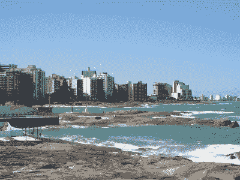

# 切尔诺贝利-4 中子水平增加:堆芯熔融物有多危险？

> 原文：<https://hackaday.com/2021/05/14/increased-neutron-levels-at-chernobyl-4-how-dangerous-is-corium/>

当切尔诺贝利核电站遭遇[功率输出激增](https://www.nrc.gov/reading-rm/doc-collections/fact-sheets/chernobyl-bg.html)将摧毁其#4 反应堆时，一种叫做“[堆芯熔融物](https://en.wikipedia.org/wiki/Corium_(nuclear_reactor))的物质形成了。这种最初像熔岩一样的物质是由毁坏的燃料棒和周围的材料形成的，比如混凝土，它们组成了反应堆。堆芯熔融物最终冷却下来，并在聚集的房间中留下大量固体堆芯熔融物。

在过去的几天里，媒体上有许多关于这个堆芯堆芯的中子通量水平“突然激增”的报道，一些人预测会发生“第二次切尔诺贝利灾难”。显然，这已经引起了相当多的人的警觉，但是这些中子输出的变化到底有多可怕，它们告诉了我们 4 号反应堆建筑废墟内堆芯堆芯的状况？

## 观点的问题

当涉及到将科学测量和数据转化为健康和安全信息时，观点就是一切。例如，在 2011 年福岛第一核电站灾难后，受损核电站附近的海洋生物暴露在放射性铯同位素水平上升的环境中。其中一些，如金枪鱼，是洄游性的，被美国西海岸的渔民捕获。正如美国国家海洋和大气管理局渔业部解释的那样，我们可以测量捕获的金枪鱼中这些增加的水平并不意味着它们会影响公共健康，但这并不酷。

说到吃鱼，更大的危险是重金属。就金枪鱼而言，汞含量通常很高，一份 85 克的金枪鱼的汞暴露量可能会超过(美国环保局)一整周的汞消费安全水平。我们[之前报道过](https://hackaday.com/2019/12/11/the-story-of-the-quickening-mercurial-metal/)鱼类中甲基汞的危害及其在水俣病中的作用。

The radioactive beaches of Guarapari, due to monazite minerals.

回到切尔诺贝利。排放量增加了多少，是很多吗？每年 1 毫西弗是公众的标准最大剂量。虽然有一个保守的最大剂量显然是一个好主意，但在有些地方，自然发生的辐射会让公众暴露在更多的辐射中。

巴西著名的[黑色海滩](https://en.wikipedia.org/wiki/Guarapari)使游客和居民暴露在比这 1 mSv 高得多的辐射水平下，这是由于[独居石](https://en.wikipedia.org/wiki/Monazite)的存在，独居石是一种含有钍和一些铀的磷酸盐矿物。独居石在印度、南非和其他地区也有发现。尽管这些严重违反了被认为的安全极限，研究[并没有发现这些高背景辐射水平的重大危害](https://www.ncbi.nlm.nih.gov/pmc/articles/PMC4674188/)。

## 回到科里亚姆

切尔诺贝利-4 的堆芯熔化物并不是一个均质体，而是根据不同材料加入的时间显示出不同的阶段。在堆芯熔融物首次汇集的 305/2 号子反应堆室中，它很可能是[黑色陶瓷](https://en.wikipedia.org/wiki/Corium_(nuclear_reactor)#Chernobyl_accident)类型。所有的堆芯熔融物都是由一种[硅酸盐玻璃](https://en.wikipedia.org/wiki/Glass#Silicate)基质和其他物质混合而成。成分是(非浓缩)氧化铀燃料、燃料棒包壳中的锆和[蛇纹石](https://en.wikipedia.org/wiki/Serpentinite)。

蛇纹石在 RBMK 反应堆内部被用作反应堆顶部的辐射屏蔽，因为它能够通过弹性碰撞减慢中子——中子实际上在不改变蛇纹石的情况下反弹。在分析的堆芯熔融物样本中，主要成分是二氧化硅(SiO [2] )，俗称玻璃。熔融物样品中 SiO [2] 的含量范围为 60-70%，熔融物的长期稳定性取决于这种玻璃基质在持续辐照下的稳定性。

由于堆芯熔融物中的放射性同位素，主要是[超铀元素](https://en.wikipedia.org/wiki/Transuranium_element)和[锕系元素](https://en.wikipedia.org/wiki/Actinide)经历放射性衰变，短寿命同位素负责大部分辐射。高能但低穿透力的阿尔法衰变粒子会导致所谓的[库仑爆炸](https://en.wikipedia.org/wiki/Coulomb_explosion)，这可能会破坏晶体 SiO [2] 矩阵，达到崩溃的地步。据估计，切尔诺贝利-4 堆芯熔融物的自辐照水平不足以保证在 100 年的时间内进行这样的转化。

## 雨水

切尔诺贝利-4 反应堆最近的一个重大变化是在废墟上放置了新的安全密封结构。这取代了最初的 1980 年代由苏联政府在反应堆周围临时搭建的混凝土石棺。这座古老的石棺一点也不密封，雨水甚至小动物都可以进入其中。

然而，随着 NSC 的到位，这种稳定的雨水供应现在已经停止，这可能已经开始使反应堆残骸和地下房间变干。作为高效的中子减速剂和吸收剂，这些雨水[被推测](https://www.neimagazine.com/news/newsfission-reactions-increasing-at-damaged-chernobyl-npp-8742114)降低了堆芯熔融物的反应性。随着水含量的减少，最初的影响是形成空洞，减少中子俘获，从而增加裂变材料的反应性。

随着水的减少，中子通量相应增加。但是，也应该看到，这不是一个新的或突然的现象。中子通量在过去四年中逐渐增加，在此期间 305/2 室增加了一倍。自从安装 NSC 以来，它和其他变化一直是乌克兰科学院核电厂安全研究所(IPBAE)不断研究的课题。

根据 IPBAE 的说法，下一步可能会发生什么有许多不确定性，但迄今为止，中子通量尚未超过既定的安全限制。由于中子通量密度仍在逐渐增加，这种情况值得警惕，但不必惊慌。他们的模型显示，由于失控的裂变反应，最糟糕的情况会导致热量输出突然增加，同时 305/2 房间内的材料中剩余的水蒸发。

由此产生的蒸汽爆炸可能会进一步削弱反应堆的废墟和退化的石棺，但在这种情况下，预计 NSC 将包含放射性尘埃。对 NSC 操作人员来说，这绝对是糟糕的一天，但不太可能影响到安全壳之外的区域。

## 真皮茶壶里的暴风雨？

考虑到这是一个缓慢发展的情况，自国家安全委员会在切尔诺贝利-4 废墟上就位以来一直受到监控，即使是最糟糕的情况也可能留在国家安全委员会的范围内，这似乎有点奇怪，它会得到这么多媒体的关注。特别是考虑到目前的中子通量密度在科学术语中仅仅是“引起关注”，这意味着这种情况仍然远离任何需要立即采取行动的情况。

目前，科学家的目标是进一步监测和模拟 305/2 室和切尔诺贝利-4 废墟的其他部分发生的相互作用。由于切尔诺贝利-4 堆芯堆芯的严重程度和范围在本质上是独一无二的，这在很大程度上仍是一次学习经历。然而，这不应该是普通公民关心的问题。

例如，放射性氡气是美国非吸烟者肺癌的头号病因，每年导致 21，000 人死于肺癌。对于不在切尔诺贝利-4 国家安全委员会工作的人来说，合理的方法是关注他们房子里的氡气水平，并注意他们吃的金枪鱼的数量。

此外，正如我们之前关于切尔诺贝利核电站灾难的文章所述，灾难背后的主要原因是完全缺乏安全文化。这不仅贯穿了这座 RBMK 式反应堆的设计，也贯穿了它的运行和维护方式。如今，在 T2 国际原子能机构(IAEA)的监督下，安全文化在现已关闭的切尔诺贝利核电站不再是可有可无的。

这并不是说意外不会发生，但是在生活中保持正确的观点是很重要的。