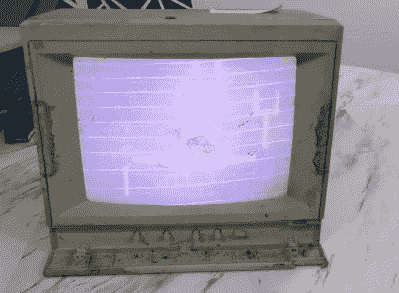

# 恶心的苹果二代显示器又直播了

> 原文：<https://hackaday.com/2021/05/17/disgusting-apple-ii-monitors-live-again/>

[8 位家伙]最近去检查一个藏在外面垃圾堆里 20 年的旧苹果 II 彩色显示器，[决定带一台回家修复](https://www.youtube.com/watch?v=xzba3iV2nxA)。正如你从主图中看到的，它们很脏——真的很脏。令人惊讶的是，发现这些显示器的志愿者团队已经启动了它们，并且它们中的每一个都在某种程度上工作。

看看下面的视频，他清理这个肮脏的显示器，并开始故障诊断。当他把电路板翻过来，让一个神秘的二极管脱焊时，你会放声大笑，当他把电路板翻过来时，二极管已经消失了(它实际上在他的实验室工作台上分解成了灰尘)。出于好奇，YouTube 上的一位评论者发现这是一种玻璃钝化和封装的快速恢复二极管，称为 V19。将会有第二部分，我们完全有信心[8 位的家伙]会成功，并很快增加一个闪亮的，像新的显示器到他的收藏中。

如果你是一个旧显示器的收藏家，这表明它们可以经受住相当多的虐待和暴露。我们不确定翻遍你当地的垃圾填埋场是不是最好的主意，但是如果你碰到一台已经暴露在自然环境中的旧显示器，不要这么快就认为它是一个失败的事业。你有从垃圾中恢复的宝石吗？请在评论中告诉我们。

 [https://www.youtube.com/embed/xzba3iV2nxA?version=3&rel=1&showsearch=0&showinfo=1&iv_load_policy=1&fs=1&hl=en-US&autohide=2&wmode=transparent](https://www.youtube.com/embed/xzba3iV2nxA?version=3&rel=1&showsearch=0&showinfo=1&iv_load_policy=1&fs=1&hl=en-US&autohide=2&wmode=transparent)

