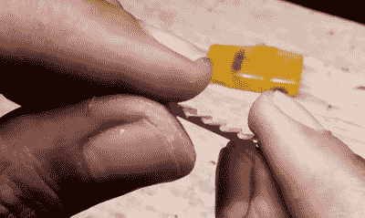

# 由打火机制成的小型德罗宁汽车完全是气体

> 原文：<https://hackaday.com/2021/05/18/tiny-delorean-made-from-lighters-is-a-total-gas/>

有用垃圾制造东西的，还有像这样令人兴奋的东西:[用四个一次性打火机和各种其他零碎东西](https://www.youtube.com/watch?v=nAeiJCcviVA)如电线护套和棉花棒制成的德罗林汽车。如果不是下面嵌入的视频证据，我们永远也不会相信【Ank Creative】或其他任何人能够把方方正正的亚克力变成我们都知道并喜爱的 fastback 时光机。

Is the back window the most important detail? Maybe.

[Ank 创意]似乎没有浪费打火机的任何零件，甚至用弯曲的下脚料做轮井，给自己省了一点麻烦。安装挡风玻璃后，我们当然不希望他们把东西锯成两半，但是当鸥翼门不是真的时，他们怎么能把小座椅和转向柱放进去呢？

这个建筑是关于难以置信的工艺和灵巧而大胆的手工工具的使用。虽然这完全符合开源视频的标准，但是你必须是一个魔法师才能完成这个视频。放大过去的休息(如果你还没有)，看看这个惊人的建设。

一次性打火机非常便宜，但是它们很好用，而且你可以随时看到油箱里还有多少油。另一方面，一个可重复充气的打火机就是这样，如果你自己做的话，[你可以让它像鸭舌帽枪一样启动。](https://hackaday.com/2021/02/06/cap-gun-lighter-built-from-scratch/)

 [https://www.youtube.com/embed/nAeiJCcviVA?version=3&rel=1&showsearch=0&showinfo=1&iv_load_policy=1&fs=1&hl=en-US&autohide=2&wmode=transparent](https://www.youtube.com/embed/nAeiJCcviVA?version=3&rel=1&showsearch=0&showinfo=1&iv_load_policy=1&fs=1&hl=en-US&autohide=2&wmode=transparent)

谢谢你的提示，[基思]！