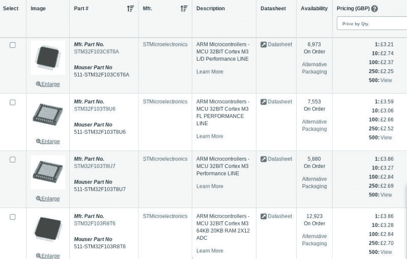

# 问 Hackaday:芯片短缺对你有什么影响？

> 原文：<https://hackaday.com/2021/05/24/ask-hackaday-how-is-the-chip-shortage-affecting-you/>

我的一些朋友正在设计一种围绕 STM32F103 微控制器的新板，这种商用 ARM 芯片可以在许多项目和许多开发板上找到。当订购样机部件的时候，他们惊讶地发现，通常的股东没有这些芯片的库存，更令人惊讶的是，甚至连中国的引脚兼容克隆都找不到。你们当中精明的人现在可能已经猜到，这种商品零件奇怪的缺乏供应背后的罪魁祸首是全球半导体短缺。

政治上意想不到的后果、气候相关的危机[遏制台湾芯片代工厂](https://asia.nikkei.com/Business/Tech/Semiconductors/Taiwan-drought-at-most-critical-phase-for-chip-sector)和[关闭美国芯片代工厂](https://www.bbc.com/news/technology-56114503)以及疫情不完善的复苏计划的完美风暴，使得芯片制造商无法跟上从 COVID 引发的衰退中复苏的行业的需求。在这种背景下特别提到的是汽车行业，它已经看到[工厂因缺乏芯片](https://www.bbc.com/news/uk-england-oxfordshire-56915685)而关闭，甚至[车型也抛弃了数字仪表盘，代之以模拟前辈](https://jalopnik.com/peugeot-goes-old-school-to-deal-with-the-chip-shortage-1846730818)。

Chips on order everywhere on the Mouser website.

全球汽车工厂所有这些戏剧性事件的影响已经渗透到依赖半导体的所有层面；随着汽车制造商尽可能地利用芯片厂的每一点产能，其他芯片客户也在争先恐后地维持自己的供应链。通过 Mouser 或 Digi-Key 等分销商对微控制器进行快速扫描，可以找到一页又一页的延期交货或缺货的生产线，这些仍然可用的生产线主要用于利基应用、不寻常的封装选项或极其过时的产品线。给你选择的芯片打分的机会似乎很遥远，大多数设计师可能会拒绝尝试围绕一个 20 世纪 90 年代的古老 8 位器件进行重新设计，那么该怎么办呢？

这类事情通常涉及商业敏感信息，因此我们理解并非所有读者都能做出回应，但我们想问一个问题:半导体短缺对你有什么影响？我们已经听说了一些不寻常的选择，比如用任何可以工作的微控制器来运输产品，用功率非常大的芯片来取代商用设备，甚至用专门的片上系统来填补空白。几年后，也许我们会以拆卸为特色，其作者想知道为什么蓝牙 SoC 不使用无线电功能，而是用 50R 电阻代替天线，我们会认为这是一个陷入 2021 年芯片短缺的工程师的绝望措施。

请在下面的评论中告诉我们你在采煤工作面的故事。你是那个绝望的工程师，在经销商的库存清单中搜寻你能找到的任何微控制器，还是你选择的设备仍在生产？无论你有什么样的经历，我们都想知道半导体市场的真实状况，所以就交给你了！