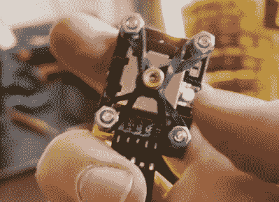

# 球形键盘让黑客变得全面

> 原文：<https://hackaday.com/2021/05/20/spherical-keyboard-build-leaves-hacker-well-rounded/>

作为黑客，我们经常不知道自己在做什么，但我们还是冲出去做了。在 Hackaday，我们认为这是着手一个新项目的最佳方式之一，也是在你进行的过程中绝对最快的学习方式。只要问一下【Aaron Rasmussen】关于这个[球形、直立的 5×6 手指形键盘构造](https://www.tiktok.com/@aaronaarontoktok/video/6949157252049702150)，你可以在休息后嵌入的三部分短视频系列中看到它。

 【亚伦】在第一段视频中直奔主题。他必须马上发挥创意，将手指模型切割成适合一个小打印床的大小。然而，球体内部有足够的空间来放置所有的布线和一对运行 QMK 的 Elite-C 微控制器。一定要打开声音，才能听到伴随的画外音。

第二个视频回答了我们迫切的问题:一个角度如何在不牺牲光泽的情况下研磨光滑的球体？我们喜欢这个解决方案，它包括用胶带和泡沫包裹东西。

你可能想知道[Aaron]站在基座键盘前如何使用任何类型的鼠标。虽然顶部有空间让鼠标保持平衡，但这个问题在第三个视频中得到了回答，在那里[Aaron]了解了标志性的 ThinkPad nubbin 背后的真相，并将这些知识应用于构建力反馈操纵杆/跟踪点鼠标。超赞的回答，[Aaron]！

不准备全力以赴，科幻道具因此？用一个方便的 macropad 将你的脚趾浸入 DIY 水中。

> [@ aaronaarontoktok](https://www.tiktok.com/@aaronaarontoktok "@aaronaarontoktok")
> 
> Make a spherical keyboard. [# Craft](https://www.tiktok.com/tag/craft "craft") [# Keyboard](https://www.tiktok.com/tag/keyboard "keyboard") [# How to](https://www.tiktok.com/tag/howto "howto") [# Sculpture](https://www.tiktok.com/tag/sculpture "sculpture") [# Time delay](https://www.tiktok.com/tag/timelapse "timelapse")
> 
> [Original sound-Aaron Rasmussen [T11](https://www.tiktok.com/music/original-sound-6949157122735131397 "♬ original sound - Aaron Rasmussen")