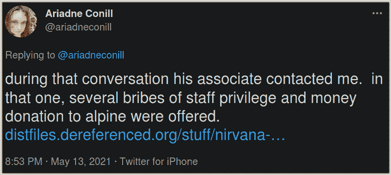

# Freenode 崩溃促使员工流失，新网络

> 原文：<https://hackaday.com/2021/05/20/freenode-debacle-prompts-staff-exodus-new-network/>

近年来，互联网中继聊天(IRC)失去了一些吸引力，这已经不是什么秘密。如今，有很多免费聊天平台都拥有漂亮的网络界面和智能手机推送通知，更不用说像脸书和推特这样的社交网络了。与来自世界各地志同道合的人进行实时交流的能力现在是我们理所当然的事情，所以更新更炫的协议和服务稳步侵蚀 IRC 用户群也就不足为奇了。

但是使用这些更现代的通信协议通常会有隐藏的成本。缺乏操作透明度自然会导致对监控和审查的担忧，这使得这些服务与自由和开源社区不匹配。因此，许多开放项目已经避开了这些由社区自己开发和维护的 IRC 网络的更新和更流行的服务。其中，最著名和最受尊敬的是 Freenode。Freenode 最初于 1995 年作为 Linux 支持渠道成立，后来发展成为各种形式和规模的免费开源项目的事实上的交流和支持工具，到 2013 年，它已正式成为世界上最大、最活跃的 IRC 网络。

不幸的是，Freenode 令人难以置信的遗产现在正受到前员工所描述的敌意收购的威胁。通过几年前开始的一系列复杂的事件，Freenode 的控制权已经从社区转移到一位神秘而富有的企业家手中，他声称自己的最终目标是彻底改革 IRC，使其重返在线交流的前沿。奇怪的是。

## IRC 的王储

安德鲁·李(Andrew Lee)的故事，至少是前半部分，与科技界许多年轻的后起之秀并无不同。这位韩裔美国人出生在印第安纳州，曾就读于普渡大学(Purdue)和布法罗大学(University of Buffalo ),后来辍学，在多家初创公司碰运气。2010 年，他推出了一项名为 Private Internet Access 的匿名 VPN 服务，后来以 9550 万美元的价格出售，并致力于一个比特币价格追踪器，最终被 Mt. Gox 收购。

在这段时间的采访中，李开复称赞 IRC 和黑客亚文化在他作为少数民族在美国中部成长的过程中培养了他。Lee 说，虽然他不得不与外部世界的种族主义作斗争，但 IRC 的匿名精英制度让他得以学习和成长。这种开放和友好的环境让他更深入地了解了计算机世界，并最终让他走上了成为软件开发人员的道路。

虽然他已经积累了普通人做梦都想不到的财富和成功，但当人们发现他是金一石殿下的亲戚，并在 2018 年的奢华活动中正式任命他为韩国王储时，幸运之神再次向他微笑。

Crown Prince Andrew Lee (center-left) during the 2018 Passing of the Sword ceremony.

决心利用他的名声和财富来实现积极的改变， [Lee 给 IRC 社区写了一封公开信](https://www.irc.com/lets-take-irc-further)，详细说明了他通过资金和人才的流入来复兴 30 多年前的协议的计划。这不仅包括赞助开发开源 IRCv3 服务器，支持诸如持久日志、离开通知和编辑已发送消息的功能等现代功能，还包括旨在吸引新用户的雄心勃勃的“IRC 大学”和“IRC 游戏”计划。

在信中，李开复非常明确地表示，他认为自己的命运与 IRC 的命运交织在一起，领导 IRC 度过下一阶段的发展是他命运的一部分:

> 今天，我很坚强。今天，我很自信。今天，我是社会的。今天，我很有耐心。今天，我接受。今天，我有一个目标。
> 如果昨天对我来说，不是 IRC，就不会这样。
> 
> 我愿意怎样对待自己，就怎样对待别人。IRC 创造了我。为此，我发誓要重振 IRC。

对于 IRC 用户来说，这是一个激动人心的超现实事件。一位年轻英俊的王子拥有数百万美元的可支配资金，他发誓效忠于他们心中所珍视的一项过时的通信协议，这就像是一个花白胡子狂热梦想中的事情。即使 IRC 重返主流意识的可能性很小，假设它真的存在过，但不可否认的是，对于成千上万仍然信赖 IRC 的黑客来说，这是一个积极的发展。

## 花招

不幸的是，据 Freenode 工作人员的几个关键成员说，Lee 将 IRC 带入 21 世纪的愿望最终转向了黑暗。这一切都始于他在 2017 年被任命为“Freenode Limited”的[董事，这是一家控股公司，表面上是为了帮助向网络输送资金和管理现场会议而成立的。当时，公司向其他员工解释说，该公司不会参与 IRC 网络本身的日常运营。](https://find-and-update.company-information.service.gov.uk/company/10308021)

但随着时间的推移，李开复开始在网络上施加过多的权力。正如职员 [亚伦·琼斯的辞职信](https://gist.github.com/aaronmdjones/1a9a93ded5b7d162c3f58bdd66b8f491)中记载的那样，事情的开始很简单。首先，李开复的另一家公司的标志突然出现在 Freenode 官方网站的标题上，而不是出现在相应的*致谢页面上。随后，李开复要求从网站上删除详细介绍该网络人员和运营结构的页面，并在网络上创建了一个 *#freenode-board* 频道。*

最终，他和他的同伙开始在所谓的“自由节点董事会”的授权下寻找和安插新的工作人员，在此之前，这个实体并不存在。正是在这一点上，其中一个人，Shane“nirvana”Allen，[试图贿赂开发人员 Ariadne Conill，承诺如果她支持 Lee 对 Freenode 的要求，她将担任一个渠道运营商的角色](https://twitter.com/ariadneconill/status/1393006479700078595)。

混乱期间，Freenode 的幕僚长 Christel Dahlskjaer 下台。据进一步披露，通过尚不完全清楚的机制，她将网络本身的所有权转让给了 Freenode Limited。全部由志愿者组成的工作人员认为，达尔斯克亚从一开始就不应该有权放弃网络的所有权。然而，在与法律专家协商后，一致的意见似乎是，在法庭上对抗该协议的成本太高；尤其是在李拥有大量资金和影响力的情况下。

## 不确定的未来

在撰写本文时，[几名 Freenode 的高级员工已经辞职](https://boingboing.net/2021/05/19/freenode-irc-staff-quit-after-new-owner-seizes-control.html)并发表了[的辞职信](https://gist.githubusercontent.com/jesopo/45a3e9cdbe517dc55e6058eb43b00ed9/raw/7972a595255560f23d9a61bb7c9f4e696dce1db4/03-freenode.txt)，这些辞职信基本上讲述了同一个故事:Andrew Lee，尽管采取了一系列不光彩的策略，但实际上已经接管了该网络，并打算对其进行改革，以符合他的理想主义愿景。这种逻辑很合理:如果李开复有机会通过他公开概述的彻底变革来“复兴”IRC，完全控制这个世界上最活跃的网络肯定是一个很好的敲门砖。

为了记录在案，[李发布了他自己的声明](https://gist.github.com/realrasengan/88549ec34ee32d01629354e4075d2d48)，这自然描绘了一个非常不同的故事。有趣的是，虽然他否认对他的指控，但他*确实*同意 Freenode 目前正处于恶意收购的阵痛中。然而，根据他的描述，他是 Freenode 的项目和社区负责人，也就是实际的犯罪者。在李对事件的描述中，他只不过是一个被不情愿地拖入动荡局势的旁观者，为了 Freenode 的利益，他敦促员工找出其中真正的叛徒，从而结束了这封信。

Former staffers have launched Libera Chat.

显然，我们还没有听到这个故事的结尾。与此同时，前 Freenode 员工已经建立了一个新的 IRC 网络，他们称之为 Libera Chat。Libera Chat 被宣传为“下一代 IRC 网络，用于免费和开源软件项目以及类似的协作努力”，它希望在 Freenode 停止的地方继续发展，并成为重视自由、透明和隐私的社区的新家。

但是，要赶走 Freenode 的一部分以上用户，可能需要的不仅仅是高层的一些戏剧性事件，不管这可能多么有趣。没有经验丰富的领导人的帮助，面对即将到来的潜在的激进变革，大多数留在后面的人很可能会遇到坎坷。如果情况真的超过了各方可以达成友好协议并重新统一的程度，这可能是整个开源社区的损失。

或者也许每个人都会转到 Libera Chat。非随机抽样:#vim 和# reprap 已经正式迁移，#archlinux 正在“尘埃落定”——与此同时，freenode 仍然是官方的，当我到那里的时候，#hackaday 已经在 Libera 上注册了。]