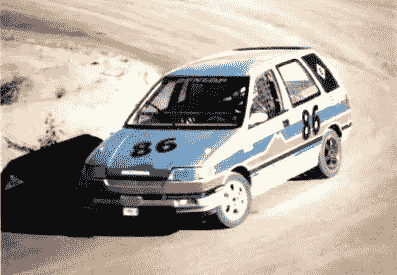
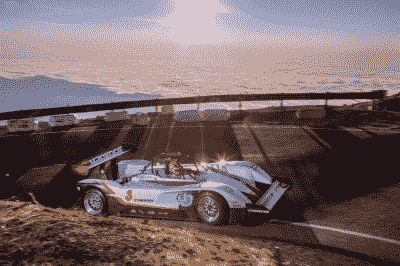
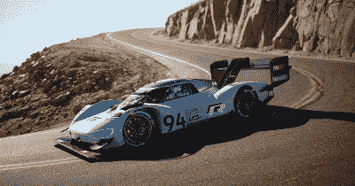
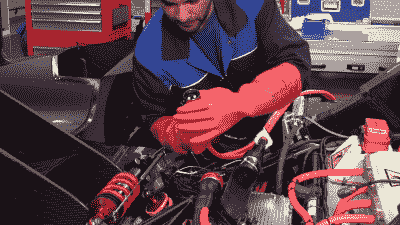
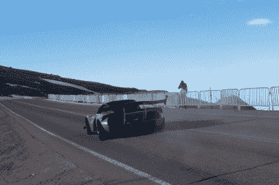

# 电动车在派克峰上做战

> 原文：<https://hackaday.com/2021/05/27/electric-vehicles-do-battle-on-pikes-peak/>

当我们想到电动汽车时，我们往往会被它们的环保优势和平稳安静的通勤驾驶所吸引。然而，电动汽车也可以提供令人尖叫的性能，最明显的是由于它们的瞬时扭矩使它们比内燃机汽车有很大的提升。

近年来，这导致了各种独立和制造商支持的努力，采取了一些赛车运动的经典事件。今天，我们正在看一些最近的参赛作品，它们解决了赛车运动中最艰苦的事件之一——派克峰国际爬山赛。

## 历史

对于那些不熟悉的人来说，派克峰国际爬山赛，也就是俗称的云端赛跑，是一项在通往科罗拉多州派克峰的公路上举行的赛事。12.42 英里的路线是一条蜿蜒曲折的柏油路，海拔超过 14000 英尺。(在环境问题导致最近几十年逐渐铺上路面之前，这条路以前是土路。)该球场以其多年来夺走多条生命的危险落差而闻名，还有著名的*攀登舞蹈*短片[，该短片描绘了阿里·瓦塔宁在 1988 年的活动中驾驶他的涡轮增压标致 405 T16 爬山。](https://www.youtube.com/watch?v=UEuZG37gFdM)

The first competitor to run a sub-20 minute time in an electric car was Katy Endicott, in a converted Honda Civic Shuttle in 1994.

相对较短的爬山距离适合电动汽车，由于电池存储的限制，电动汽车在涉及多圈的较长事件中能力较差。紧凑、蜿蜒的赛道也使电动汽车能够利用其低端扭矩优势，并且在大多数情况下，无需换档。因此，有可能制造出一种相对轻便的电动车，其续航里程足以在充满电的情况下完成派克峰赛道，并与内燃竞争对手设定的时间保持竞争力。

电动汽车在这项赛事中的竞争历史悠久，第一批参赛者之一是 1981 年的 Joe Ball，他驾驶 Sears 电动汽车在 32 分钟多一点的时间内完成了全程-尽管比典型的汽油燃料参赛者所用时间长一倍多。第一个打破 20 分钟障碍的电动参赛项目是本田思域穿梭式参赛项目，由凯蒂·恩迪科特于 1994 年驾驶，时间为 15:44.710。传奇车手 Nobuhiro Tajima 是 2013 年第一个打破 10 分钟障碍的人，他在定制的 E-RUNNER Pikes Peak Special 中跑出了 9:46.530 的成绩。

Rhys Millen won in 2015 in the eO PP03, custom built for the Pikes Peak event, though it would be a few years before an EV set the overall course record.

最近几年，随着电动汽车技术的进步，对内燃机竞争对手构成了真正的挑战，竞争明显升温。随着高效电机、能够提供巨大电流的电池以及能够让汽车全天运行的充电技术的出现，派克峰的潮流开始转向。

2015 年，一辆电动汽车首次赢得了这场比赛，里斯·米伦(Rhys Millen)驾驶着一辆定制的电动赛车，但电动汽车打破彻底的赛道纪录还需要几年时间。时间来到了 2018 年，罗曼·迪马(Romain Dumas)驾驶大众汽车(Volkswagen)的 I.D.R .以 7:57.148 的成绩跑上山，首次超越了 8 分钟的障碍。派克峰站今天作为第一个主要的汽车赛事之一，落在电动汽车的三月。

## **需要什么**

Volkswagen set the course record on Pikes Peak in 2018, the first time ever by an electric vehicle.

运行一个竞争性的派克峰入口并不意味着壮举，无论动力涉及。在获得正确的悬挂设置、空气平衡以及确保轮胎温度针对赛道表面和环境条件进行优化方面，有大量的比赛工程在进行。将这些与世界级的赛车手结合起来，你可能有机会获得冠军。但是，当涉及到运行电动汽车时，有一些独特的挑战需要克服。

Special insulating gloves are used when plugging in the high-voltage, high-current connector used to charge the ID.R at competition events.

毕竟，派克峰是一座山，并不具备向空电池的定制赛车输送大量电流的条件。因此，团队必须找到自己供电的方法。

以大众 ID 这样的车为例。一个巨大的发电机被使用，消耗甘油以获得更清洁的排放，以避免破坏这项活动的环境证书。充电速率高达 90 千瓦，20 至 30 分钟即可完成。这种快速充电能力对于在 Pikes Peak 比赛的汽车来说是必要的，因为比赛之间的周转时间可能很短。为避免电池过热，电池由维修站区域的风扇主动冷却。用热电池开始跑步会损害电池的电流输出，因此保持电池冷却对性能至关重要。

The Palatov D2EV finished ninth overall in the 2019 event, plagued by weather and initial handling issues that stymied its attempts at a faster time.

仔细考虑车上电池的大小也很重要。与液体燃料汽车不同，液体燃料汽车可以根据行驶所需的确切燃料量增加或减少燃料，电动汽车必须始终携带电池的全部重量。

可交换或模块化包是可能的，但由于连接器中的功率损失，可能会带来效率损失。理想情况下，电池组的大小应足以在充电量过低之前完成一次行驶，以避免汽车不得不承受过多的重量，从而对性能产生负面影响。电池重量困境的一个很好的例子是 Palatov D2EV，它参加了 2019 年的活动。为了在街道上达到 300 英里的里程，而不是在 12.42 英里的爬山中获得纯粹的性能，[这辆车必须携带额外的 500 公斤电池上山，这影响了操控性能，降低了加速性能。](https://www.whichev.net/2020/05/26/meet-the-ev-that-conquered-pikes-peak-and-hit-nearly-200mph-at-bonneville/)

山上面临的其他问题对所有参赛者的影响更加平等。雨、雪或大风对赛道上的任何车辆都是危险的。由于护栏少之又少，所以随时都有从山上滑下的危险。然而，几十年来，赛车手一直面临着这些危险，无论电动汽车与否，它们都不会很快消失。

## 结论

这是一个简单的事实，电动汽车的扭矩传递在性能情况下是一个巨大的优势。阻碍电动汽车主导更多形式的赛车运动的主要因素是电池技术的限制，这使它们无法参加更长时间的比赛，如拉力赛或包含许多圈的赛道比赛。然而，去掉这个障碍，或者简单地在某个无关紧要的地方比赛，比如派克峰，突然之间，电动汽车开始主宰昔日传奇的内燃机。随着技术的不断进步，期待在赛车运动的世界里看到同样的故事。