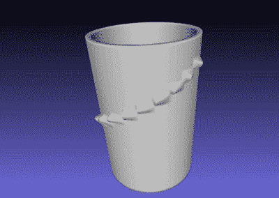

# 定制的音乐盒圆筒为浪漫增添了一抹亮色

> 原文：<https://hackaday.com/2021/05/25/custom-music-box-cylinder-puts-a-spin-on-romance/>

音乐盒是很棒的小机械装置。现在，他们甚至制作一些稍微现代一些的曲子，比如塞尔达和星球大战的主题。当然，他们并不是什么都有——当然不是电视连续剧中的那首[RandomPrototypes]女朋友绝对喜欢的歌。

但是现在是 2021 年了，还有制作自己音乐盒的选项。[RandomPrototypes]本可以把整件事都打印出来，但是那些听起来没有他们的塑料梳子好。还有那些打孔机，但你必须坐在那里，不断转动才能听到这首歌。[最后，[RandomPrototypes]混合了各种方法，制作了一个定制的圆柱体，可以用标准音乐盒机制播放](https://www.youtube.com/watch?v=Hx4FuogXTyk)。

【random prototypes】从拆开音乐盒来测量圆柱体开始，然后创建了一个圆柱体的软件表示，旨在从低到高弹奏十八个音符，而不是演奏一首歌。然后他用 Python 脚本把它变成 3D 模型。切片预览显示了许多停止和开始以及弱点，所以[RandomPrototypes]直接生成了 Gcode，这样它就可以以一种连续的螺旋方式打印，并且更加强大。

为了生成一个包含他女朋友非常喜欢的歌曲的圆柱体，[RandomPrototypes]打印了这个刻度圆柱体，并使用它将音符记录为单个 mp3，并记下每个音符的开始时间。最后，他根据音乐盒中内置的可用音符构建了新的乐谱。如果你想自己做这件事，[代码是免费的](https://github.com/RandomPrototypes/MusicBoxMaker)。难的部分将是选择一个音乐盒机制，因为[它们往往带有一个单独的梳子，旨在播放特定的歌曲](https://www.youtube.com/watch?v=COty6_oDEkk)。你必须找出哪首曲子有你需要的大部分或全部音符。

如果你不介意摇摇把来听曲子，那么打孔的音乐盒会容易得多。但是，当你可以制造一台机器的时候，为什么要自己动手呢？

 [https://www.youtube.com/embed/Hx4FuogXTyk?version=3&rel=1&showsearch=0&showinfo=1&iv_load_policy=1&fs=1&hl=en-US&autohide=2&wmode=transparent](https://www.youtube.com/embed/Hx4FuogXTyk?version=3&rel=1&showsearch=0&showinfo=1&iv_load_policy=1&fs=1&hl=en-US&autohide=2&wmode=transparent)

