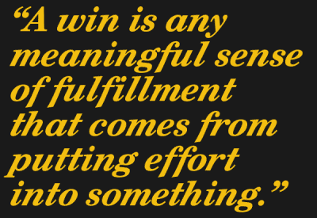
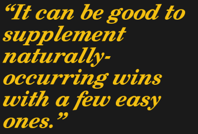

# 我们有时都需要胜利，所以自己去争取吧

> 原文：<https://hackaday.com/2021/06/28/we-all-need-a-win-sometimes-so-make-them-yourself/>

在工作或个人项目上，我们都需要偶尔的胜利。能够感受到进步和满足的回报是非常重要的，因为如果每件事都是艰难的，那会让你精疲力尽。避免这一点非常重要，可以探索如何让自己轻松取胜。

 偶尔的胜利有助于我们保持动力、创造力和成就感。有意义的工作可以实现这一点，但我们许多人依靠爱好来弥补任何不足。有时候，这还不够。爱好本身最终会感觉像是一件苦差事，当这种情况发生时，它们就不再提供喘息的机会。好消息是，我相信在最需要的时候，利用爱好的好处来获得额外的“胜利”是可能的，我将解释如何做到这一点。

我发现成功不一定要来之不易才能有益，但它们必须与一个人的激情和兴趣相关。所以，当自然发生的成功太少，兴趣爱好不奏效时，利用对自己的了解来赢得一些轻松的胜利。面对可能导致精疲力竭的事情，它可以让你感受到有意义的进步和成就感。

## 我们有时都需要胜利

“赢”是任何有意义的成就感，它来自于对某事的努力。这种积极感觉的回报可能来自于完成一项工作、达到里程碑或完成一个项目。被剥夺这些权利是不健康的。对于需要大量时间和精力的挑战性工作来说，这尤其是一种风险，但可能会遭遇停滞或挫折。

如果一个人同时在做许多不同的工作，那么他甚至有更多的机会感受不到进步。虽然很少会同时在所有方面遭遇挫折和失败，但也很少会取得全面的成功。我的经验是，一些领域的成功可能最终会被其他领域的挫折所抵消。当成功与其他地方的停滞或失败结合在一起时，就很难享受成功。

对于企业家、自由职业者和独立开发者来说，同时做很多工作是很常见的。我上面列出的问题可能会引起我偶然发现的这条听起来很累的推文的作者的共鸣，这条推文表达了“我只想足够成功，这样我就可以专注于一项工作。”

## 什么算赢？

对于项目来说，为创作者提供进步和发现的感觉是很重要的，但体验一种结束和完成的感觉也很重要。当我们自己的 Kristina Panos 问 [*如果我永远也拍不出第二版会怎么样时，我们开始对这个过程有了一些了解。*](https://hackaday.com/2021/02/25/what-if-i-never-make-version-two/) 这引出了一些非常有趣和有见地的[观察，关于对一个项目](https://hackaday.io/page/10115-the-psychology-of-version-two)感到快乐实际上意味着什么。

归结起来就是:项目可以提供满足感，但个人的观点和心态也起着重要的作用。对自己说“我对我在这里所做的一切很满意”的能力是确保结束和实现的重要部分。

##  如何以简单的项目取胜

我自己的经验是，成功不一定是困难的或来之不易的，才能“算数”。简单的项目完全有能力提供健康的成就感，只要它们符合正确的条件。

每个人都是不同的，但这里有一些普遍有用的方法来选择项目和活动，这些项目和活动最有可能带来积极而有意义的体验。

#### 选择与你的激情和兴趣相关的东西(但不一定与你的工作相关。)

一个项目应该是帮助你的大脑快乐发光的东西，每个人都有不同的杠杆来做到这一点。一个喜欢建筑、创造或学习的人应该选择与这些事情相关的项目，但没有必要将其与工作或生活中的其他事情联系起来。例如，我喜欢烹饪和烘焙，但这些事情与我可能会停滞不前的工作无关。我用烹饪来刺激我大脑中“我在做东西”的部分。

#### 明确地允许自己专注于这项活动。

旨在取得“胜利”的项目或活动的范围不应含糊不清或没有限制。让活动成为有明确时间段的明确事情。允许自己在这段时间专注于此。不要低估告诉自己“今天下午我将为我选择的活动留出一个小时，在这段时间里我可以完全专注于它”的力量

我对烹饪的使用是一个很好的例子，因为它不仅有一个清晰的开始和结束，而且它还让我离开了工作室，我可以完全专注于它。有时候，我只是想在厨房里尝试一个想法作为一个项目，我事先接受它可能不会成功，这没关系，这让我想到了下一点。

#### 有一个简单的目标，或者更好，只是玩和探索。

幸福总是在地平线上，因为这是人类的天性，有模糊的目标，并在接近目标时不断移动目标。您必须明确拒绝这一点。为轻松获胜而设计的活动应该简单、清晰、短期。

仅仅给自己设定目标*玩*是完全有效和健康的。“我将插入新的部分，看看它是否工作，并浏览内置的例子”除了玩一个新的部分或工具之外没有其他目的。“我将打开这个新工具，看看用它切割一些废料感觉如何”是另一个好方法。或许在这个过程中你会学到一些东西或者有一个新的想法，但是这不是必须的。

如果一个更具体的目标是有帮助的，保持简单。“我一直想学 FreeCAD，也许今天下午就可以”让人望而生畏，而且是开放式的。但是“我至少会安装软件并收藏一个好的教程，除此之外的任何东西都是额外的奖励”是一个有明确范围的伟大的短期项目。

#### 选择接受并对自己的结果感到满意。

有一个简单的目标(即使只是沉迷于漫无目的的游戏的目标)是什么使完成一项任务成为可能，并感觉到努力的结束感，产生感觉一个小但有意义的“胜利”的回报。它不会自己发生，所以事先做出有意识的决定，对所花的时间感到满意，不管它是什么结果。

记住，所有这些的目的不是强迫你的大脑快乐地发光。目的是创造一个宽松的环境，在这个环境中，你的大脑被允许愉快地点亮，没有任何附加条件。

## 什么对你有用？

我故意给自己时间和许可去沉迷于简单的(但仍然有意义的)项目。因为成功不一定要来之不易才能“算数”，这帮助我感受到专业工作中有时缺乏的满足感和封闭感。大多数人通过兴趣爱好来实现这一点，但有时用一些简单的爱好来补充自然发生的成功也是不错的。

当不能依靠爱好来提供喘息的机会时，你有自己的应对方法吗？我们都是不同的，即使我们有时会为同样的事情而挣扎，所以请在评论中分享对你有用的东西。