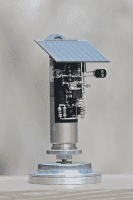

# 活着的机器人:重访 BEAM

> 原文：<https://hackaday.com/2021/05/29/living-robots-revisiting-beam/>

你受到了全球集成电路短缺的打击，被迫使用石刀和熊皮，但你仍然想做一些整洁的东西？是时候重温一下[的光束机器人](http://solarbotics.net/bftgu/tutorials.html)了。

 [生物学、电子学、美学和力学](https://en.wikipedia.org/wiki/BEAM_robotics)——马克·蒂尔登提出了极简主义电子生物的想法，通过相互耦合的弱控制系统和聪明的机械设置，可以模仿活的虫子。如果你想想像蟑螂或蚯蚓这样的东西有多少神经，这并不疯狂。然而，它们收集的传感器、马达和骨骼构成了一些非常有趣的行为。

我最喜欢的光束机器人一直是太阳能机器人。在太阳能的驱动下，它们移动缓慢或不频繁，但也不可阻挡。这样，他们才是最“活”的。设计技巧的一部分是确保它们呆在食物(太阳)附近，不会被卡住。我最喜欢的风格之一是“摄影爱好者”或“摄影爱好者”，因为它们提供了惊人的性价比。

回到 BEAM 的全盛时期，大概是 15 年前，太阳能电池效率低下且价格昂贵，使用其小电流的电路存在泄漏，小型电机很难获得。如今，一切都变了。能量收集电路仅泄漏纳安，低压 MOSFETs 几乎可以无损切换。是时候重温光束原理了吗？我敢打赌，你会让那些保守的人感到羞愧，而且你甚至不需要那些新奇的微控制器，反正已经缺货了。

如果你做了什么东西，[给我们看](https://hackaday.com/submit-a-tip/)！

This article is part of the Hackaday.com newsletter, delivered every seven days for each of the last 200+ weeks. It also includes our favorite articles from the last seven days that you can see on [the web version of the newsletter](https://mailchi.mp/hackaday.com/hackaday-newsletter-649368). Want this type of article to hit your inbox every Friday morning? [You should sign up](http://eepurl.com/gTMxQf)!