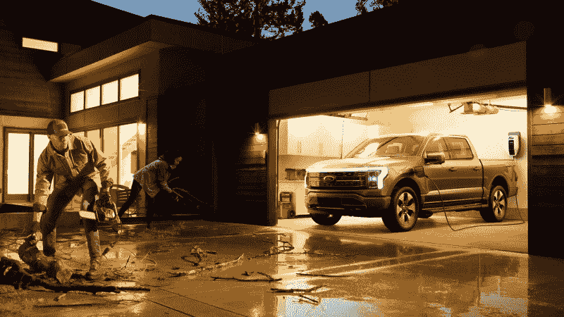
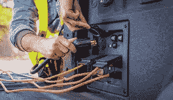
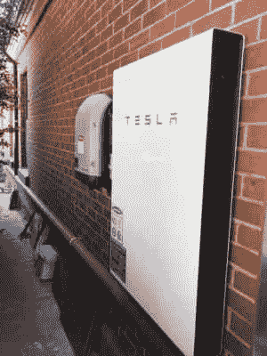

# 电动汽车可能是我们梦寐以求的电网存储解决方案

> 原文：<https://hackaday.com/2021/06/07/electric-vehicles-could-be-the-grid-storage-solution-weve-been-dreaming-of/>

随着各国努力应对气候变化带来的环境和经济损失，我们已经看到越来越多的可再生能源取代煤炭和天然气等污染更严重的能源。这些能源的一个主要缺点一直是它们的间歇性可用性，这刺激了人们对能够在电网层面运行的储能技术的兴趣。

随着家庭太阳能等分布式能源发电的兴起，人们对分布式家庭电池存储的想法也产生了类似的兴趣。然而，房主可能不愿意投资昂贵的电池，因为这些电池需要几年时间才能在节能方面收回成本。但是如果他们已经有一个巨大的电池，就在外面的车道上呢？电动汽车能成为电网储能的有用来源吗？[事实证明，福特想让他们的电动卡车兼做你家的电网蓄电池](https://www.motortrend.com/news/2022-ford-f-150-lightning-electric-truck-charging-generator-power/)。

## 如果你有一块大电池，为什么不用它呢？

The Ford F-150 Lightning, the company’s first electric pickup truck, has plenty of power sockets on board and can even keep a house running for three days from the power in its batteries.

Ford have already made waves with the generator on their F-150 Hybrid, capable of delivering up to 7.2kW in service. Many used the pickups to power their appliances during the recent Texas blackouts.

这项技术基于福特充电站 Pro，这是一款 80 安培的双向充电器，用于他们的新电动皮卡 F-150 Lightning。充电器允许皮卡的电池在停电的情况下为用户的家庭供电，通常使用长达三天。它需要专业安装，并配备了适当的隔离保护装置，以避免电网反向充电，这对于进行维修的生产线工人来说是危险的。它建立在福特今年早些时候在得克萨斯州大停电期间受到的巨大压力之上，当时 F-150 混合动力车[的车主由于车辆的车载电池、发电机和逆变器](https://www.motortrend.com/news/2021-ford-f-150-powerboost-hybrid-powering-texas-homes-winter-weather/)能够保持电器运行数天。

## 超越紧急情况

真正有趣的是福特推出了系统的智能动力升级。这将使用皮卡的电池在电价最高的高峰时期为家庭提供能源——例如在下午或傍晚。然后，它会在晚上价格较低时给汽车充电。它本质上是将汽车作为家用电池，类似于我们以前见过的特斯拉 Powerwall 或[自制电池。](https://hackaday.com/2016/09/29/homebrew-powerwall-sitting-at-20kwh/)该功能仅在福特充电站 Pro 上提供，它将智能管理进出电网的电力流量。更基本的家庭充电解决方案的用户将无法使用这项技术。

Tesla’s Powerwall is one of the more popular home battery solutions thus far, but requires an expensive one-off investment for the hardware.

该系统没有理由不能监控实时电价，并与汽车的使用时间表进行比较，以便在尽可能最便宜的时间充电，同时仍将电池保持在最低充电水平，以避免用户在没有交通工具的情况下被困。当然，要充分利用这种能力，仔细的实现将是关键。只需要几个用户醒来发现汽车电池没电，或者随着时间的推移里程下降的恐怖故事，公众舆论就会反对这种做法。必须对软件进行优化，以便在驾驶员需要时，始终让他们的电池有足够的续航时间，并最大限度地延长汽车电池的寿命。尽管十年来电动汽车已经成为主流，但我们还没有听到太多电池没电的恐怖故事，但它仍然是更广泛社区的一种潜在恐惧。

## 你家中最智能的电器

充电器需要专业人员安装到家里的电线上。然而，这是典型的最严重的电动汽车充电解决方案。随着司机对充电器每分钟续航里程的要求越来越高，快速充电器和 220V 装置正成为购买电动汽车的标准配置。

随着时间的推移，随着可再生能源开始在整个电力组合中占据更大的份额，存储对于健康的电网运行将变得越来越重要。一些管辖区已经面临问题，因为在晴天大量太阳能涌入，很难在不使电网过载的情况下保持传统的基本负载发电机在线。在网格中分布大量存储有助于解决这一问题。在上述场景中，连接智能充电器的电动汽车会注意到阳光明媚的日子太阳能涌入电网时电价下降，并切换到充电模式以储存廉价能源。如果太阳暂时躲在云层后面，而不是电网电压崩溃，智能充电器可以检测到电压下降，并通过让电池电力流回电网来立即做出反应。[这类似于像霍恩斯代尔电力储备](https://hackaday.com/2019/12/16/the-hornsdale-power-reserve-and-what-it-means-for-grid-battery-storage/)这样的大型电网电池项目的运作，只是分布在成千上万个家庭中。

使用电动汽车进行电网存储的好处是，那些购买兼容电动汽车的人不只是得到一辆运行成本更低、对环境更友好的汽车。他们还可以在维护电网稳定和充分利用地球上每天可用的可再生能源方面发挥积极作用。随着每年数千辆电动汽车的购买，如果装备得当，它们可能会成为世界一直在寻找的网格存储革命。