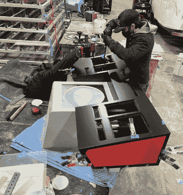

# 企业号掌舵指挥娱乐中心

> 原文：<https://hackaday.com/2021/06/05/enterprise-helm-commands-the-entertainment-center/>

许多年轻的极客希望他们能有机会坐在企业号的舵手位置上，像一个正式的星际舰队军官那样自信地疯狂敲击着没有标签的彩色按钮。对我们大多数人来说，这是一个未实现的梦想，但现在华盛顿西雅图地区的某人正在他们的媒体室里做这件事。我们不否认会嫉妒，但至少我们的集体自尊可以得到一些安慰，因为他们不得不[将他们的复制头盔的建造外包给[布莱克茅斯设计公司]的优秀员工。](https://www.blackmouthdesign.com/projects/uss-enterprise-navigation-helm)

 没有太多的技术细节，但考虑到这个项目的页面只是为了展示该公司的设计和制作技能，我们不能过分指责他们。如果我们在销售这些东西，我们可能也会对榨汁机的一些细节保密。

但我们知道引擎盖下有“Arduino 技术”,根据哪个老式摇臂开关被拨动，它会发出不同的灯光和声音效果。咖啡桌大小的面板右侧排列的红色瞬时按钮被连接到家庭媒体中心，用于关灯和降低投影仪屏幕等操作。请观看下面的视频，观看简短的演示。

在 Reddit 上的一篇帖子中，该项目的一名工程师解释说，头盔的顶部表面是 3/16”粉末涂层铝，胶合板构成了红色、灰色和黑色的经典*原创系列*配色方案的底座。astrogator 的艺术品是从头开始创作的，用 led 背光，放在 1/4 英寸的丙烯酸面板后面进行保护。我们想象它与地面平行的事实意味着它应该是一个放置饮料或爆米花的空间，尽管如果它在我们的房子里，没有人会带食物或饮料靠近它。

老实说，虽然 Hackaday 肯定更多的是关于建设而不是购买，但我们不能指责任何人为这种水平的工艺付出自己的血汗钱。毕竟，我们已经关注那个官方授权的三录机复制品有一段时间了。

 [https://www.youtube.com/embed/XdahUs0zmF4?version=3&rel=1&showsearch=0&showinfo=1&iv_load_policy=1&fs=1&hl=en-US&autohide=2&wmode=transparent](https://www.youtube.com/embed/XdahUs0zmF4?version=3&rel=1&showsearch=0&showinfo=1&iv_load_policy=1&fs=1&hl=en-US&autohide=2&wmode=transparent)

