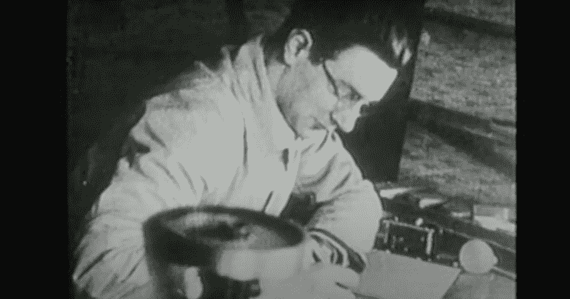
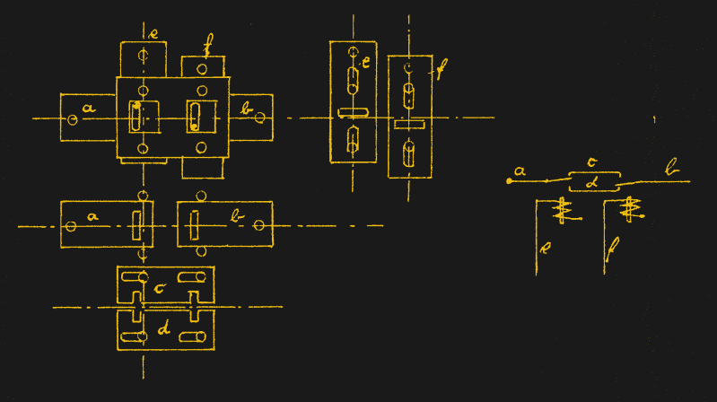
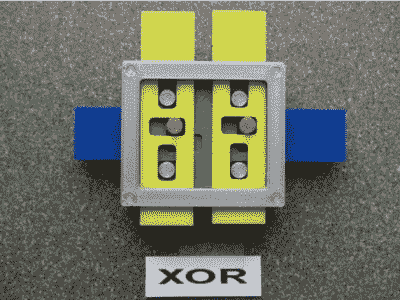
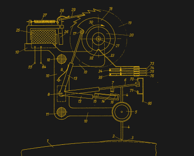
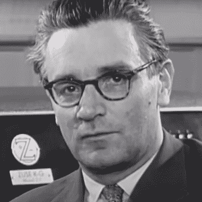
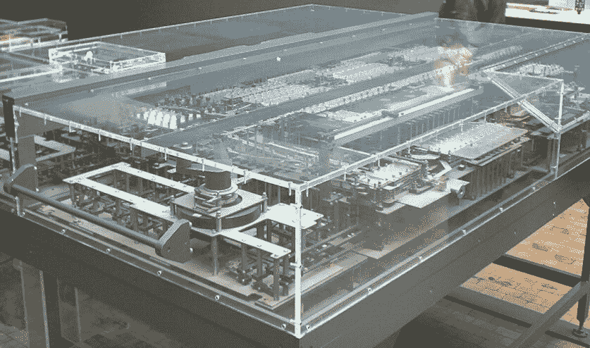
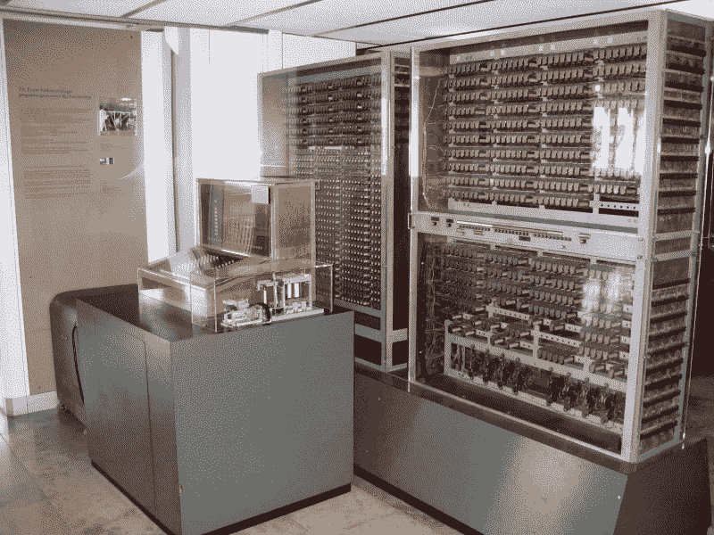

# 另一台第一计算机:康拉德·楚泽和 Z3

> 原文：<https://hackaday.com/2021/06/16/the-other-first-computer-konrad-zuse-and-the-z3/>

### *巴伐利亚阿尔卑斯山，1945 年 12 月:*

自 1935 年以来，柏林工程师康拉德·楚泽花费了他的整个职业生涯开发了一系列自动计算器，这是世界上第一个此类计算器:Z1、Z2、Z3、S1、S2 和 Z4。他与一群混杂的工程师、技术人员和数学家一起克服重重困难完成了这项工作。尽管经历了战争的艰难困苦和物资短缺，尽管他们的同龄人漠不关心，但他们最终成功的事实证明了他们的奉献精神和足智多谋。随着战争的结束，更多的困难正在增加。

两年前，在柏林战役中，轰炸机完全摧毁了 Zuse 家的房子和 Methfesselstraß附近的车间，他们在那里进行研究和制造。所有的计算器、工程图纸和笔记都在废墟中丢失了，除了在 oranienstrae 的另一个车间里即将完工的新 Z4。在这一切发生的同时，Zuse 在今年 1 月结婚，但当战争中最大的盟军空袭在 2 月摧毁了 oranienstrae 车间时，他立即陷入了另一场危机。他们设法从地下室抢救出 Z4，并奇迹般地安排将其运出柏林。Zuse、他的家人和同事随后很快跟进。在逃跑路线的各处，他们设法完成了 Z4 的最后组装和测试——甚至在哥廷根的空气动力学研究所进行了演示。

到达巴伐利亚阿尔卑斯山后，祖泽发现了一群乌合之众的难民，包括沃纳·冯·布劳恩博士和来自 nde 的 100 名火箭科学家。当这里的每个人都在挣扎着生存，寻找食物和住所时，Zuse 更担心的是如何保护他的发明免受窥探。随着谣言的传播，紧张局势进一步升级，一名党卫军头目在喝了三瓶白兰地后，无意中透露他的部队不是来保护科学家的，而是在美国人或法国人靠近时将他们全部杀死。

在这一片疯狂之中，祖泽和他的妻子吉塞拉迎来了一个男婴，并在欣特斯坦的一个农舍里住了下来。Zuse 花时间研究一种名为 *Plankalkül* 的东西，他解释说，这是一种数学语言，允许人们与这些新机器进行交流。他的另一个爱好是制作当地风景的木刻，他计划一旦经济复苏就开一家公司来销售他的设备。毫无疑问，康拉德·楚泽很快就会作为自动计算机之父而闻名于世。

## 同时，回到 2021 年

80 年前，康拉德·楚泽展示了他的 Z3 车型，这是回顾他一生和成就的恰当时机。但是，尽管我们想象中的通讯记者在沉思，大多数计算机历史爱好者之外的人从未听说过康拉德·楚泽。为什么有人创造并制造了世界上第一台可编程计算机，而它只是历史上的一个脚注？

康拉德·楚泽很难找到自己的人生定位。作为一名青少年，他似乎注定要根据自己的兴趣和技能成为一名工程师，总是摆弄安装工具和发明小玩意。但他也是一位才华横溢的素描艺术家、摄影师，并喜欢在小品和戏剧中表演。在柏林工业大学期间，他换了两次专业。起初，他对机械工程的刻板循规蹈矩感到厌恶，于是转而研究建筑，结果发现建筑同样乏味。他最终选择了土木工程，这在工程师和艺术家之间取得了恰当的平衡。

Zuse in 1935

1935 年完成学业后，他的第一份工作是在柏林郊外的亨舍尔飞机制造厂。但仅仅几个月后，他就辞职了，将注意力转向了他已经思考了一段时间的事情——他能否制造一台机器来自动化那些无聊而重复的工程计算？

## 它应该如何工作？

在新兴的计算机领域，Zuse 几乎完全与他人隔绝。至少最初，他并不像我们今天认为的那样专注于通用计算机。他的目标是制造一种自动化的机械加法机，来处理诸如静态应力分析所需的繁琐计算。早期，他做了一个重要的决定，使用二进制而不是十进制。他正确地看到，这将极大地简化这种机器的构建，无论实现是什么。

你可能会认为选择二进制数会立刻让继电器成为最明显的选择。当他用继电器做实验时，它们被认为太不可靠。今天，我们认为继电器的可靠性和质量是理所当然的，但 Zuse 生活在 20 世纪 30 年代的德国，在家人和朋友的支持下以微薄的预算运营。继电器很贵，而且它们被设计成不经常开关，不能以许多赫兹连续运行。他能得到的中继多半是他的朋友从当地电话交换站的垃圾桶里救出来的垃圾。和他的朋友赫尔穆特·施莱尔一起，他们也试验了真空管的使用，但意识到由于战时的短缺，技术会被大大推迟。

Zuse’s Mechanical XNOR Gate

那么他是如何实现一台没有继电器和真空管的计算机的呢？这都是机械的。Zuse 设计了一种巧妙的排列方式，用金属板、扁条和钢针来制作数字存储器和浮点二进制算术逻辑单元(ALU)。

Print Your Own Z1 Mechanical Logic Gate

这个[视频](https://www.youtube.com/watch?v=PWj7toEOOG8)解释了机械加法器的基本操作(不要因为它是德语版就打消你看它的念头)。

如果你想深入了解 Zuse 如何机械地实现内存和 ALU，请查看[【fjk raan】的项目，该项目解释了基本知识](https://electrickery.nl/mechanics/zuseGates/)和 OpenSCAD 3D 打印机示例，你可以自己制作:

*   [存储单元演示](https://www.thingiverse.com/thing:3350972)
*   [逻辑门演示](https://www.thingiverse.com/thing:3552684)

## Z1 规格

存储器由 64 个各 22 位的字组成(14 位尾数和 8 位指数和符号)。ALU 可以加、减、乘、除。程序指令以穿孔带的形式提供，仅由八个操作组成:

*   `Lu`输入十进制数
*   `Ld`输出十进制数
*   `Pr z`从地址`z`读入寄存器`r`
*   `Ps z`从寄存器`r`存储到地址`z`
*   `Ls1`加两个浮点数，R1 = R1 + R2
*   减去两个浮点数，R1 = R1–R2
*   `Lm1`将两个浮点数相乘，R1 = R1 * R2
*   `Li1`除以两个浮点数，R1 = R1 / R2

计算机的时钟相当于现代的四相 CPU 时钟。但它是机械的，而不是电动的，可以由手摇曲柄或电动马达驱动。每个时钟周期是四个平面运动中的一个——想象将一个正方形的盘子向北推几厘米，然后向西，然后向南，然后向东推回到起点。每个阶段执行一个基本操作，幸运的是没有一个基本操作需要超过三个这样的循环。

正如指令集所暗示的，Zuse 还构建了转换器，允许使用对人类友好的十进制数进行输入和输出。纸带在当时太罕见了，所以需要另一种解决方案。他们发现空白的 35 毫米电影胶片工作良好，并使用手持打孔机编写程序。

## 新模式比比皆是

Z1 于 1938 年完成，但一直不太可靠。但它并不意味着是一个成品，只是一个概念验证的原型。接下来的工作从 Z2 开始，计划测试继电器是否适用。Zuse 为 Z2 保留了机械内存，但用继电器版本替换了 ALU，但只对定点数进行操作。它于 1938 年完成并成功演示，Zuse 因此获得了部分资金来建造后续模型。

Z3 完全采用继电器设计。这基本上是对 Z1 的改进，更快更可靠。它于 1941 年 5 月 12 日交付并展示，然后 Zuse 开始建造另一台计算机，即引言中提到的 Z4。Z4 在 Z3 的基础上扩展，增加了新的特性，如平方根、穿孔带输出、多带输入单元和条件转移指令。Zuse 继续在 ALU 中使用继电器，但由于其更大的密度，又回到了机械存储器。Z4 最终投入全职服务，从 1950 年运行到 1959 年。

Analog to Digital Converter to Measure Wing Curvatures

当 Z3 项目正在进行中时，亨舍尔公司请求帮助生产导弹机翼。Zuse 建造了可能是第一台过程控制计算机，S1 和 S2，并发明了模数转换器。当一百个配备了模拟-数字转换器的滚筒测量新制造的机翼的曲率时，这些专用计算机会跟踪它们的轮廓。

然后，机器会根据这些数据自动计算出尾翼和副翼所需的配平，这项任务以前是由十几台计算机(人，而不是机器)完成的。在连续两年夜以继日地工作之后，工厂在 1944 年被炸毁，S1 和 S2 要么被摧毁，要么可能被苏联占领。

如果你想了解更多关于每个型号的信息，可以查看这个描述所有电脑的网站。它是由康拉德·楚泽的儿子制作的，他在上面的介绍中出生，[霍斯特·祖塞教授](https://en.wikipedia.org/wiki/Horst_Zuse)，他成为了一名电气工程师、软件工程师和计算机历史专家。

## 逻辑和数学

Zuse 和他的团队能够在计算机组件的机械、继电器甚至真空管实现之间来回切换，因为 Zuse 掌握了工作中的基本方程。他发展了自己的规则和符号系统，直到他以前的数学老师告诉他，他已经重新发明了命题演算，或今天更常用的布尔代数。通过将计算机运算简化为方程，设计概念从物理结构中分离出来，使得在实现之间来回跳转变得更加容易。

Zuse 意识到，有了这个框架，也就是我们今天所说的计算机语言，计算机可以做的不仅仅是解方程。自 1939 年以来，他一直在考虑这样一种语言，在战争结束后，他花了很多时间形式化他所谓的 [Plankalkül](https://en.wikipedia.org/wiki/Plankalkül) ，这是第一种计算机高级编程语言——在英语中，它翻译成*，一种用于规划的正式系统*。尽管 Zuse 寄予厚望，但 plank alül 从未起飞，尽管有人说它的元素可以在 Algol 58 中找到，尽管未经编辑。

## 专利问题与增长

 祖泽为自己的许多发明申请了专利，并颁发了多项专利。他对计算机本身的专利将会落空。他于 1941 年 6 月 16 日提交了专利申请。直到 1952 年战后，德国专利局[才公布了他的主张](https://www.dpma.de/docs/dpma/veroeffentlichungen/meilensteine/2020/de0z0000391maz_rechenmaschine19421950.pdf)。整个行业没有一家公司反对这项专利，除了一家公司——Triumph calculator 公司,该公司对这项专利提出了反对，后来发现这项专利得到了 IBM 的支持。这起诉讼拖了好几年，最终在 1967 年被驳回，理由是这项发明不值得申请专利。

> 主应用中所涉及的对象的创新性和进步性是毋庸置疑的。然而，由于发明价值不足，不能授予专利。

与此同时，Zuse 已经开始将他自己的电脑系列商业化。IBM 有一个错误的开始，他们想要专利，但不让 Zuse 继续开发。Remington Rand 成为了一个重要的早期客户，紧接着位于苏黎世的瑞士联邦理工学院(ETH)于 1950 年接收了 Z4。在接下来的 15 年里，随着一系列计算机，甚至还有一台绘图仪[graph omat 64 的出现，生意越做越大。但是到了 20 世纪 60 年代中期，该公司陷入了财务困境，并于 1967 年被西门子收购。](http://horst-zuse.homepage.t-online.de/z64.html)

## 复制品

正如许多被销毁或作为废品出售的历史计算机一样，多年来，Zuse 的计算机也有过几次再造。

Replica of the Z1 Computer

在西门子的支持下，Zuse 于 1984 年开始了 Z1 的改造项目。它完成于 1989 年，现在在柏林的德国技术博物馆展出。柏林自由大学的劳尔·罗哈斯教授写了一篇[优秀、深入的论文](https://en.wikipedia.org/wiki/Ra√∫l_Rojas)，论述了 Z1 和它的重建工作。关于这个项目，Zuse 曾经说过:

> 当时，它的功能不是很好，在这方面，这个副本是非常可靠的-它也不能很好地工作。

Z3 Replica by Zuse in 1961

基于继电器的 Z3 已经改造了三次。首先，在 1961 年，祖泽自己制作了一个复制品，至今仍在慕尼黑的德国博物馆展出。同样在 1997 年，劳尔·罗哈斯教授和霍斯特·祖泽教授建造了一个娱乐场所，现在正在德国亨菲尔德的[康拉德·楚泽博物馆](https://www.zuse-museum-huenfeld.de/konrad-zuse.html)展出。最近，Horst Zuse 教授建造了一个原始大小的重建，于 2010 年安装在康拉德·楚泽博物馆。

Zuse as a LEGO Brick Man

说到复制品，这是康拉德·楚泽本人的复制品，以乐高积木人的形式，拿着 Z3 电脑的继电器存储单元。

## 缺乏认可

本月，德国专利局[写了一篇关于 Zuse](https://www.dpma.de/english/our_office/publications/milestones/konradzuse/index.html) 的文章，内容如下:

> 祖泽不幸在战争时期做出了他最重要的发明。否则，这位务实的企业家祖泽今天可能不仅作为技术先驱而闻名，而且作为比尔·盖茨级别的全球技术公司的创始人而闻名。

这确实让你想知道为什么康拉德·楚泽不太出名，为什么他的开创性发明和计算机经常被忽视。无论他是否制造了第一台可编程计算机，他的贡献都是不可否认的，远远领先于他们的时代，应该得到更好的认可。Eric Weiss 对康拉德·楚泽的成就做了最好的总结，他在 1996 年为 IEEE 撰写了 Zuse 的讣告:

> 祖泽是一个多才多艺的人。他是一个坚持不懈、勇于创新、极具创造力的工程设计者和建设者，一个数学逻辑学家，几个成功的计算机制造企业的创始人，以及一个令人印象深刻的艺术家。他的同胞和计算机世界将主要因为第一批 Z 机器的概念而记住他，但也因为他在最艰难的条件下几乎没有外部帮助而成功创建和运营的创业公司而记住他。

下面是一段 1958 年的电视广播，有英文字幕和一些关于康拉德·楚泽的附加资源。

 [https://www.youtube.com/embed/n8Yo-wD-QTo?version=3&rel=1&showsearch=0&showinfo=1&iv_load_policy=1&fs=1&hl=en-US&autohide=2&wmode=transparent](https://www.youtube.com/embed/n8Yo-wD-QTo?version=3&rel=1&showsearch=0&showinfo=1&iv_load_policy=1&fs=1&hl=en-US&autohide=2&wmode=transparent)

# 了解更多信息

*   [康拉德·楚泽互联网档案馆](http://zuse.zib.de)
*   霍斯特·祖泽教授关于康拉德·楚泽的网站
*   [康拉德·楚泽的生活和工作](https://web.archive.org/web/20090225225617/http://www.epemag.com/zuse/default.htm)
*   [Zuse 讣告 IEEE](https://ieeexplore.ieee.org/stamp/stamp.jsp?arnumber=489747)
*   [重新发现的计算机先驱，50 年前的](https://web.archive.org/web/20161104051054/http://www.nytimes.com/1994/04/20/news/20iht-zuse.html)
*   《计算机，我的生活》作者康拉德·楚泽，ISBN 978-3-642-08151-4