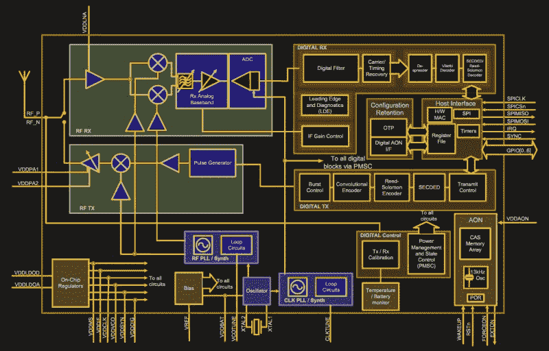

# 什么是超宽带？

> 原文：<https://hackaday.com/2021/06/09/what-is-ultra-wideband/>

如果你最近一直在关注手机技术，你可能会意识到苹果最新的 iphone 和 AirTag 定位标签给这个平台带来了一些新的东西。当谈到手机时，超宽带无线电是新的热点，那么它们是什么，对我们这些试验这些东西的人来说有什么好处呢？

An Apple AirTag being paired with an iPhone. [Swisshashtag, CC BY-SA 4.0](https://commons.wikimedia.org/wiki/File:Apple_AirTags_einrichten.jpg).

在这种情况下，超宽带指的是具有超过 500 MHz 的非常高的带宽和在该频谱上非常低的总功率密度的无线电信号。传输不是像在传统无线电系统中那样通过离散频率载波的调制来编码，而是通过在该带宽上发射宽带射频能量脉冲来编码。它可以存在于与较窄带宽信道化服务相同的非授权频谱上，并且巨大的带宽赋予了它极高的短程数据传输带宽能力。消费者设备使用的芯片组使用大约 3.5 到 6.5 GHz 之间的 UWB 信道范围，用无线电术语来说，这是一个巨大的频谱量。

UWB 的真正诀窍不在于它的数据传输能力，而在于定位服务，因为它允许通过组合宽带宽上的频率来合成零点几纳秒量级的极短 RF 脉冲。这些脉冲可用于发射器和接收器之间极其精确的飞行时间测量，允许将它们之间的距离确定到几厘米的精度。在诸如 Apple AirTags 之类的系统中，标签很可能对一个以上配备 UWB 的 Apple 产品可见，因此它可以用于与几个源的三角测量，从而用于精确的 2D 和 3D 定位。

The block diagram of the DW1000 UWB chip.

令人高兴的是，这项技术不仅仅适用于手机制造商，因为商用 UWB 芯片已经上市好几年了，现在已经有了价格合理的开发板。我可以看到我的一个朋友在全球速卖通花了 20 多美元买的一块板，这可能代表了廉价 UWB 模块的现状。这是一个 AI-Thinker NodeMCU-BU01 板，板上有一个 STM32F103 微控制器和一个 B & T BU01 UWB 模块[，它包含一个 Qorvo DW1000 UWB 收发器 IC](https://www.qorvo.com/products/p/DW1000) ，板上有一个非常独特的 UWB 天线。DW1000 被定位为室内定位芯片，而不是数据传输设备，尽管它的数据速率为 6.8 Mb/s，在该领域并不完全是一只乌龟。遗憾的是，我自己没有能力玩它，但他买了它，打算用他自己的 AirTag 风格的定位标签进行实验。

看起来 UWB 设备很可能会被广泛使用，如果被黑客攻击的 AirTag 不是你的实验选择，还有其他可能更容易获得的设备，它们只会变得更便宜和更多。它可能会从大型科技公司那里获得与侵犯隐私的网状网络的关联，但在这背后，在我们感兴趣的领域中，这种类型的定位能力肯定有很多有趣的可能性。留意新的主板，开始考虑你想用它做什么！