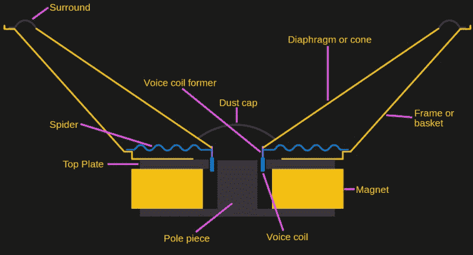
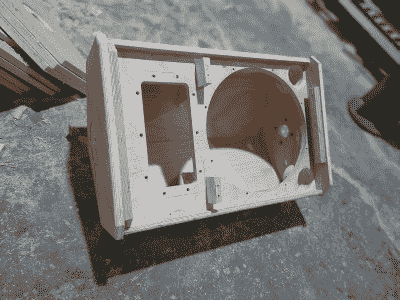
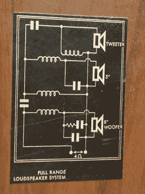

# 了解音频:扬声器入门

> 原文：<https://hackaday.com/2021/06/25/know-audio-a-loudspeaker-primer/>

我们从严格的实用和工程角度出发，在没有被任何音响发烧友误导的情况下，开始了我们的高保真音响世界之旅，我们已经看到了任何音响系统中最重要的组成部分:听众的耳朵。是时候沿着链条往下移动到下一个环节了；扩音器。

声音是空气中的压力波，扬声器的目的是移动空气来产生这些波。有各种各样的“奇异”扬声器技术，包括压电和[静电](https://hackaday.com/2016/08/03/electrostatic-loudspeakers-high-end-hifi-you-can-build-yourself/)设计，这里我们将考虑普通的动圈扬声器。它最常用于典型扬声器系统中的大低音或较小的中音驱动器。

A cross-section of a loudspeaker. Iain, png by Rohitbd, [CC BY-SA 3.0](https://commons.wikimedia.org/wiki/File:Speaker-cross-section.svg).

动圈式扬声器有一个轻质的锥体，由一个绕其边缘的柔性耦合悬挂，在其尖端附近有一个电线线圈，位于一个强大的磁场中。向一个方向施加电流使其向外移动，向另一个方向向内移动。给它通上交流电会使它振动，由此产生的空气运动会产生声音。有多少扬声器设计师，就有多少基本想法的变化，但通常是锥盆和柔性耦合保留在一个开背金属框架中，该框架也包含磁铁，锥盆由某种形式的硬纸板制成。

## 无限困惑

试着在自由的空气中播放一个扬声器，你会发现它的声音令人乏味。扬声器从后面和前面产生压力波，相位相差 180 度，相互干扰。结果有点混乱，尤其是低频会抵消掉。需要一些隔离前后声音的方法，这就是音箱的形式。

An infinite baffle loudspeaker enclosure. Gaudiowork, [CC BY-SA 4.0](https://commons.wikimedia.org/wiki/File:Gaudio_work.jpg)

理想的柜子是所谓的无限挡板。想象你站在一面向四面八方无限延伸的墙前，扬声器安装在你的面前。当锥体移动时，您只能接收到扬声器前方的声波，因此您的耳朵可以接收到扬声器产生的全部声音，而不会受到前后声音混合的不良影响。

但是你没有无限的墙。如果你把墙做得越来越小，并开始通过弯曲扬声器的背面来补偿任何声音泄漏，最终你会得到一个密封的盒子，扬声器安装在它的前面，看起来很像我们都熟悉的扬声器外壳。这一主题有多种变化，采用调谐端口，试图利用扬声器后部的一些声音，并对其进行相移，以增强前部声音，但这种密封盒无限挡板音箱仍然是最常见的扬声器音箱类型，因为它易于制造，效果良好。

## 一个好的演讲者不仅仅是一个盒子

对于你会遇到的大多数这种类型的扬声器，你可以做一个合适大小的外壳来容纳它们，它们听起来会很不错。但是，除非你非常幸运，否则你无法在音箱音量合适的情况下最大限度地发挥它的潜力。扬声器使用一组描述其各种电气和机械属性的参数进行数学建模，这两个研究人员将它们命名为 [Thiele-Small parameters](https://audiojudgement.com/thiele-small-parameters-explained/) 。使用这些参数，可以计算出给定扬声器的最佳音箱，从而为该设备带来最佳音质。遗憾的是，廉价扬声器通常没有任何公开的小参数，但如果你选择的扬声器有这些参数，你可以使用它们来获得最佳效果。

The circuit diagram of the crossover network inside a vintage Philips speaker. Piano Piano!, [CC BY 2.0](https://commons.wikimedia.org/wiki/File:Philips_Speaker_22RH426_21Z,_4_Ohm,_Made_in_Holland,_30_Watt_(5259976183).jpg).

扬声器外壳的材料必须合适，因为错误的选择会严重降低声音质量。扬声器外壳应该由在扬声器产生的频率下不会共振或弯曲的材料制成，因此理想情况下，它应该具有相当大的质量和刚度。毕竟，它需要包含声音。由于这个原因，许多质量不错的音箱都是由中密度纤维板制成的，因为它具有这些品质，而且相当便宜。即使是好的外壳，也经常部分填充隔音填料，这是一种轻质蓬松材料，旨在抑制外壳内的反射和共振。

因为音箱有质量，越大越不容易加速。善于再现较低频率的大扬声器被称为低音扬声器。中音扬声器和高频高音扬声器专门设计用于分辨不同的频段。一组被称为交叉网络的 LC 滤波器负责仅将所需内容馈送到每个锥体。

最后，有一种扬声器似乎无视所有的可能性，听起来很好，尽管在一个看起来非常不合适的外壳中。在我的桌子上，我有一个蓝牙扬声器，它花了我大约 25 美元，大约有两包卡片那么大，但它的声音比我对这种设备的预期要好很多。答案在于电子。事实上，这是一个有严重缺陷的扬声器，但它的内置放大器包含一个 DSP，可以补偿音频中的这些缺陷。除非你也是一个 DSP 奇才，否则不要试图复制这种性质的小型扬声器，因为它必然不会复制其商业等效物的声音。

扬声器不必很复杂，但不仅仅是 3D 打印一个看起来不错的盒子。但是在制造花哨的音箱时，我们在很大程度上进入了收益递减规律，一旦超过某个价格点，进一步的预算扩展是否物有所值就有争议了。最终，它回到了让压力波传到你耳朵里的物理学上——如果一对像样的扬声器对你来说听起来不错，那么也许你没有花太多钱就物有所值。

高保真链中的下一步是连接扬声器和放大器的电缆，但由于我们将在稍后的日期整体研究电缆，因此我们最好在下一期节目中研究放大器，以及什么是好的放大器。