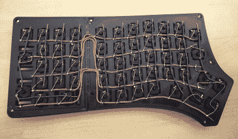

# 氧化还原还原:分裂 Keeb 得到一个数字垫

> 原文：<https://hackaday.com/2021/06/10/redox-redux-split-keeb-gets-a-num-pad/>

分体键盘最糟糕的是什么？如果他们有一个普遍的缺点，那就是几乎没有一个人有数字键盘。如果你能在那个东西上飞行，但是挣扎着使用顶行号码，你会非常想念 num pad，相信我们。那么答案是什么呢？[自己设计键盘，当然是](https://github.com/ToasterFuel/Keyboard)。[ToasterFuel]有足够的面包来为他的第一个键盘制作做一个小实验，我们认为结果做得很好，这对第一批 keebs 来说有点罕见。

 这个设计基于氧化还原，它本身是 ErgoDox 的混合，旨在解决后者的常见抱怨——它太大了，拇指簇几乎无法使用。我们喜欢这种定制的布局，它的 F 键和大写锁定位置的 Escape 键。在那些键帽下，你会发现 100%的樱桃 MX 绿色，所以[ToasterFuel]必须有相当强壮的手指来敲打那些超级噼啪声。

引擎盖下的其他一切都很标准，有一对 Arduino Pro Micros 在运行。因为 num pad 的原因，[ToasterFuel]不得不手工布线，我们对他在短短三周内完成整个项目印象深刻。这包括编写他自己的固件！

已经找到或建立了一个你喜欢的分裂，但仍然错过 num 垫？为什么不造一个来搭配你的键盘呢？