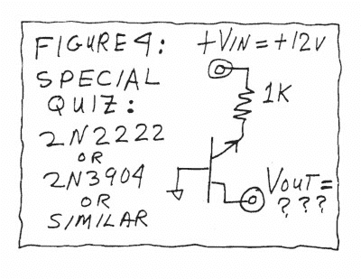

# 一个经典半导体之谜的解释

> 原文：<https://hackaday.com/2021/06/10/an-explanation-of-a-classic-semiconductor-riddle/>

早在 1996 年，鲍勃·皮斯在愚人节专栏中提出了一个实验。"用一个普通的 NPN 晶体管，将基极接地，用一个 1kω的电阻将发射极拉至 12 V，测量集电极相对于地的电压。"做这个实验，你可能会惊讶地发现集电极上有一个小的负电压。菲利普·皮奥尔斯基一直很喜欢这个谜语，并在 Youtube 视频中解释了它的工作原理。

诀窍的关键是晶体管的击穿电压；对于典型的小型 NPN 晶体管，通常在 7-8 伏左右。此时，基极-发射极结进入击穿状态，开始发光。这种光实际上穿过硅晶格，到达基极-集电极结，在适当的条件下就像光电二极管一样。在这些条件下，集电极会产生负电压。

[Filip]继续尝试用顶部被切掉的 TO-3 晶体管做实验，这样他可以看到实际效果。他在暗室中拍摄的照片显示，硅芯片上出现了微小的光点。如果你对实际效果有更多的了解，请在下面留言。

这似乎是一个简单的好奇心，然而硅结及其光发射是半导体物理学中一个活跃的研究领域。休息后的视频。

 [https://www.youtube.com/embed/bKlbO5mOZm4?version=3&rel=1&showsearch=0&showinfo=1&iv_load_policy=1&fs=1&hl=en-US&autohide=2&wmode=transparent](https://www.youtube.com/embed/bKlbO5mOZm4?version=3&rel=1&showsearch=0&showinfo=1&iv_load_policy=1&fs=1&hl=en-US&autohide=2&wmode=transparent)

