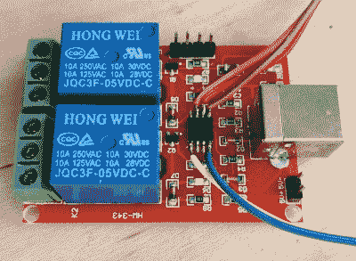

# 自定义固件教 USB 中继板新招

> 原文：<https://hackaday.com/2021/06/14/custom-firmware-teaches-usb-relay-board-new-tricks/>

如果您正在寻找一种快速简便的方法来从您的计算机上控制一些设备，廉价的 USB 中继板可能是理想的解决方案。这些都是相当简单的小玩意，只不过由一个微控制器和几个继电器组成。但这并不意味着没有改进的空间，正如[michas omkowski]最近展示的那样，[用定制固件刷新这些板允许用户修改它们的默认功能](https://slomkowski.eu/projects/automatic-usb-mains-switch/)。

在他的案例中，[micha]想要建立一个电源板，一旦他的电脑进入睡眠状态，它就会切断任何插入其中的设备的电源。不幸的是，他不能只检查线路上是否有 5 V，因为他的主板一直保持 USB 端口通电。但通过对中继板的固件进行一些修改，他认为他应该能够通过观察总线活动时每毫秒发出的帧开始包来检测 USB 是否有任何活动。

Wiring up the ATtiny45 for flashing.

现在[micha]并不声称自己是第一个为这些主板之一定制固件的人，事实上，[他认为一个现有的开源固件项目](https://github.com/u1f35c/usb-relay-firmware)是他工作的灵感来源。但他确实为这些 ATtiny45 供电设备创建了一个全新的*GPLv3 固件，其中包括最新版本的 V-USB 等改进。碰巧的是，V-USB 包括开箱即用的帧开始包检测，这使得实现他的活动检测代码更加容易。*

随着新的固件刷新到继电器板的芯片中，[micha]把它放在一个外壳中，并连接了插座。但是仍然有一块拼图缺失了。似乎 Linux 实际上不会发送帧开始包，除非它主动与 USB 设备通信，这是所谓的“选择性挂起”节能特性的一部分。幸运的是，它支持基于供应商/产品 ID 对特定设备禁用这一功能，所以在稍微修改了 udev 之后，一切都像预期的那样工作了。

我们喜欢 Hackaday 的定制固件项目。他们不仅不让专有软件进入我们的设备，而且[他们经常解锁新的和扩展的功能](https://hackaday.com/2020/12/08/exploring-custom-firmware-on-xiaomi-thermometers/)，否则这些功能[会隐藏在人工付费墙后面](https://hackaday.com/2021/04/28/exploring-the-world-of-nintendo-3ds-homebrew/)。