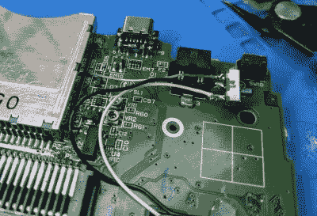

# Game Boy 宏构建保留 DS 兼容性

> 原文：<https://hackaday.com/2021/06/14/game-boy-macro-build-retains-ds-compatibility/>

建立一个所谓的“Game Boy Macro”是挽救铰链或顶部屏幕损坏的任天堂 DS 的一个好方法，因为该系统只需要较低的显示器来玩 Game Boy Advance 游戏。自然地，设计用来同时使用这两种屏幕的 DS 游戏将不再可玩。或者至少，我们是这么想的。但是正如[无脸科技]所展示的那样，[如果你做一点额外的焊接工作，实际上可以在 Game Boy Macro 上玩 DS 游戏](https://facelesstech.wordpress.com/2021/05/16/gameboy-macro-xl-switching-screens/)。

原来原来原来 DS 主板上有两个测试点，可以分别为顶部和底部屏幕拾取信号。只需三根电线和一个简单的开关，您就可以选择将哪个信号实时输入底部屏幕，而不会影响图像质量。现在，这对于经常使用 DS 顶部和底部显示屏的游戏没有任何好处，但对于许多游戏来说，底部屏幕只用于地图或库存显示，你只需要偶尔瞥一眼。

Installed screen switch. Note USB-C upgrade module.

由于能够在它们之间随意切换，大量的 DS 游戏只需一个屏幕就可以完美地玩。有趣的是，无论输入哪个视频，触摸面板仍然工作正常；因此，如果你记住了需要触摸哪些区域来执行不同的动作，你甚至不需要翻转图像。在下面的视频中，[Facelesstech]用*新的超级马里奥兄弟*演示了这个概念，否则这个概念将无法播放，因为动作通常显示在顶部屏幕上。

这种黑客行为之所以可能，是因为 DS 上的两个显示屏在触摸覆盖层之外是相同的，正如我们在之前深入研究这款革命性手持设备背后的技术时所了解到的那样，这是任天堂用来从其相对贫乏的 3D 硬件中榨取尽可能多的性能的一种伎俩。不幸的是，似乎这种修改在 DS Lite 上更难实现，[所以它不会与我们最近报道的](https://hackaday.com/2021/06/08/nintendo-ds-transformed-into-gameboy-macro/)光滑的*游戏&观看*风格的游戏男孩宏兼容。

 [https://www.youtube.com/embed/PyqmmJKVfEE?version=3&rel=1&showsearch=0&showinfo=1&iv_load_policy=1&fs=1&hl=en-US&autohide=2&wmode=transparent](https://www.youtube.com/embed/PyqmmJKVfEE?version=3&rel=1&showsearch=0&showinfo=1&iv_load_policy=1&fs=1&hl=en-US&autohide=2&wmode=transparent)

