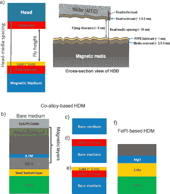
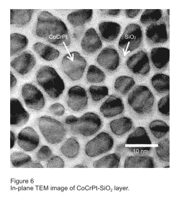
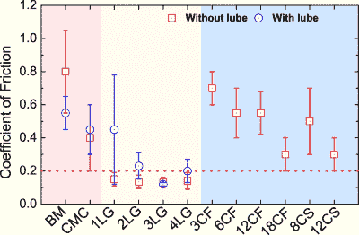

# 石墨烯如何实现下一代高密度硬盘

> 原文：<https://hackaday.com/2021/06/23/how-graphene-may-enable-the-next-generations-of-high-density-hard-drives/>

经过几十年对硬盘驱动器(HDD)技术的改进，制造商现在即将迈出下一大步，将存储密度提高到新的水平。使用激光辅助写入，像 [Seagate 这样的制造商计划在 2026 年前推出](https://www.anandtech.com/show/16544/seagates-roadmap-120-tb-hdds) 50+ TB 硬盘，在 2030 年后推出 120+ TB 硬盘。秘方的一部分是热辅助磁记录(HAMR)。

实现 HAMR 的一个障碍是为磁介质找到一种保护涂层，这种涂层可以处理这种频繁的加热，同时比当前的涂层更薄，以便磁头可以移动到更靠近表面的位置。根据 N. Dwivedi 等人最近在《自然通讯》上发表的一篇论文，这种新的保护涂层可能是以石墨烯片的形式出现的。

## 对保护涂层的需求

Schematic view of hard disk media structures (a) Schematic cross-section of a hard disk drive with magnetic medium, disk overcoat, lubricant, fly height, head overcoat, head. (b) Bare CoCrPt-Oxide platter. (Credit: N. Dwivedi et al.)

也许将硬盘称为“旋转铁锈”的讽刺之处在于，腐蚀过程是这些设备长期运行的主要敌人之一。如果暴露在大气中，盘片基底材料上的薄磁性层很容易被腐蚀。钴，CoCrPt 合金中的 Co，对这个过程特别敏感。一旦被腐蚀，盘片的这一部分就很难保持磁性。这种涂层的主要目的之一就是防止这种情况发生。

涂层的另一个用途是作为防止机械损伤的保护措施。尽管人们害怕“磁头碰撞”，但与磁盘的机械接触是相当常见的，外套的用途之一是防止这种情况，并减少摩擦。后者通常涉及润滑剂的使用，这在涂层的顶部增加了另一层。润滑剂层与外涂层一起构成了磁头-介质间距(HMS)的重要部分，从而决定了磁头与记录介质的接近程度。

为了让硬盘的面密度(AD)不断增加，这种 HMS 有必要进一步降低，这意味着更薄的外套。今天，这些是碳基涂层(COCs)，通常厚度在 2.5-3 纳米之间。对于即将推出的与 HAMR 兼容的高密度磁介质，这意味着 COC 必须满足以下要求:

*   为所有特征提供小于 1 nm 的涂层
*   全面防腐保护
*   相当于当前 COCs 的抗磨性
*   耐磨性和抗拉伸性(弹性，即杨氏模量)
*   润滑剂兼容性(例如 PFPE)。

In-plane TEM image of CoCrPt-SiO[2] layer. (Credit: I. Kaitsu et al.)

这里值得注意的是，在从 PMR(垂直磁记录)到 HAMR 的转变过程中，磁记录材料本身也可能改变。这与从线性磁记录(LMR)到 PMR 的转变过程中发生的情况类似，详见 I. Kaitsu 等人于 2005 年撰写的本文[。](https://www.fujitsu.com/global/documents/about/resources/publications/fstj/archives/vol42-1/paper14.pdf)

对于 LMR，盘片公司使用 CoCrPt 涂层作为磁介质，但对于 PMR，这种涂层必须更加颗粒化。这里的解决方案是添加二氧化硅，因为它的晶粒边界整齐地将 CoCrPt 细分为磁性晶粒，这与 PMR 读/写头配合良好。

对于 HAMR 磁介质，盘片堆叠再次改变，这次使用 FePt 作为记录介质，因为这种合金在使用基于热的记录时通常是稳定的。这为 FePt 基盘片的涂层增加了另外两个要求:

*   在 HAMR 循环中热稳定。
*   不仅兼容 CoCrPt，还兼容 FePt。

基于 HAMR 的驱动器的一个持续的问题是局部加热的应用迅速降低了 COC。找到一种新的、更热稳定的涂层材料对它们的进一步商业化至关重要。

最终，FePt 薄膜可能会让位给位图案化介质( [BPM](https://en.wikipedia.org/wiki/Patterned_media) )，其中磁岛被图案化到磁记录层中。这将类似于钴铬合金-二氧化硅 [2] 磁性颗粒，只是规模更小。理想情况下，与 FePt 一起工作的相同的< 1 nm COC 也将与这些新的和即将到来的技术一起工作。

## 碳的多面性

The various allotropes of carbon. Graphene is allotrope (b).

正如 COC 的名字所示，它也是基于碳原子的，就像石墨烯一样。那么目前的 COC 和新的石墨烯基 COC 有什么区别呢？主要区别在于碳原子连接在一起的方式，也被称为碳的[同素异形体](https://en.wikipedia.org/wiki/Allotropes_of_carbon)。在[石墨烯](https://en.wikipedia.org/wiki/Graphene)中，碳原子以规则的六边形晶格连接在一起。

这种规则的晶格是石墨烯如此稳定的部分原因，但生产它一直是一个重大挑战。直到 2004 年，当曼彻斯特大学的安德烈·海姆和康斯坦丁·诺沃肖洛夫使用世界闻名的“透明胶带”技术从石墨中拉出石墨烯层时，它才被完全分离和表征。

从那时起，石墨烯的商业应用研究一直在进行，最近的一项研究是将其用于硬盘 COC。作为一种热和其他方面稳定的二维材料，它似乎非常适合任何需要完全覆盖表面的情况。即使所述表面像在基于 HAMR 的硬盘驱动器的情况下一样定期被激光喷砂。

## 科学证实了

Comparison of measured coefficients of friction. (Credit: N. Dwivedi et al.)

在 N. Dwivedi 等人使用化学气相沉积(CVD)之后，使用湿转移工艺用 1-4 层石墨烯(1-4LG)涂覆裸介质。然后，他们将这些石墨烯 COC 与现有的商业 COC 一起进行了各种测试，包括机械(摩擦和磨损)、基于激光的加热和腐蚀保护。

尽管即使单层石墨烯(1LG)也能显著减少腐蚀，并表现出良好的机械、摩擦和热稳定性，但人们发现> 2LG 的涂层可能会提供最大的好处。不仅使用现有的 CoCrPt-SiO2 介质，还使用 FePt 和 HAMR，以及 HAMR 和 BPM。这实质上意味着，20 多磅的 COC 应该适用于现在和未来的硬盘。

另一个有趣的发现是，石墨烯基 COC 不像目前的商业 COC 那样需要润滑。这样做的好处是，硬盘驱动器中商业使用的 PFPE 润滑在与 HAMR 一起使用时不热稳定，因此能够省略它而只使用耐热石墨烯意味着两个问题可以通过使用> 2LG 而不是非石墨烯 COC 简单地解决。

## 这是小事

这篇论文最有趣的地方在于它洞察到新技术的发展是如何被看似微小的细节所阻碍的。即使在 FePt 中已经发现了合适的磁记录介质，即使在读/写头中集成半导体激光器已经或多或少地解决了问题，但是缺少合适的涂层材料可能会使所有的努力脱轨，或者至少推迟几年。

当然，我们现在还不能庆祝和订购 HAMR 硬盘。材料科学的有趣之处在于，一个概念已经在实验室中得到验证，并且必须扩大到大规模生产。在实验室环境下化学气相沉积石墨烯以生产几个测试用的盘片和在自动化工厂环境下生产成千上万个之间有着巨大的差异。

目前有令人眼花缭乱的方法来生产石墨烯，这既是好消息也是坏消息。不是所有的方法都能制造出同样质量的石墨烯，也不是所有的方法都适合大规模生产，或者集成到硬盘制造过程中。下一步将是找出从最近的论文中获得结果的最佳方法，并使其在工厂环境中发挥作用，这可能需要很多年。

但是正如科学中的所有事情一样，好事情总是降临到有耐心的人身上。

(**标题图片:**单片石墨烯的可视化。信用:亚历山大，CCA-SA 3.0)