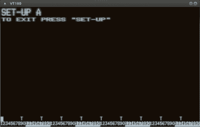

# 2:3 比例 VT100 终端更接近其根源

> 原文：<https://hackaday.com/2021/06/15/23-scale-vt100-terminal-gets-closer-to-its-roots/>

当几个月前[【迈克尔盖迪】完成他的按比例缩小的 DEC VT100 复制品](https://hackaday.io/project/177596-23-scale-vt100-terminal-reproduction)时，他非常明确地表示，这个项目只是为了在外表上看起来像一个老式的终端。对这种情况的一瞥显示，没有什么比运行其默认操作系统的 Raspberry Pi 更奇特的了，这使得终端非常适合模拟经典游戏，就像它拨号到远程系统一样。但是任何黑客都知道，一些项目最终会发展出自己的生命。

开始很简单。Raspberry Pi 增加了一个 RS-232 串行帽，这意味着 3D 打印的 VT100 实际上可以使用`minicom`等软件作为串行终端进行操作。[然后【拉斯·布林霍夫】卷入了](https://hackaday.io/project/180312-vt100-simulator-and-3d-printed-replica)。他喜欢印刷的 VT100 的外观，并认为它应该比一般的终端仿真器更好。所以他继续前进，开始为它开发一个定制的终端模拟器。

Reliving those CRT glory days.

这里的想法是，一个 an 8080 仿真器实际上运行一个原始的 VT100 固件 ROM，包括所有的缺点。它会发出你所期望的真实硬件的哔哔声和唧唧声，甚至还有一些 OpenGL 的诡计用来模仿旧的 CRT 显示器，完成扫描线和字符周围的柔和光晕。

自然，视觉效果消耗了相当数量的处理能力，所以[Lars]警告说，低于 Pi 4 的任何东西都可能会变慢。当然，如果您正在寻找经典的终端体验，没有什么可以阻止您在桌面计算机上运行模拟器。

VT100 的这一华丽再现需要一个真正的串行接口或一个模拟器来重现原版的独特菜单系统吗？一点也不。即使没有这些补充，当[迈克尔]第一次在发送时，它还是让我们大吃一惊。但是我们高兴这些人投入时间来完善这个已经非常出色的项目吗？我们认为你已经知道答案了。