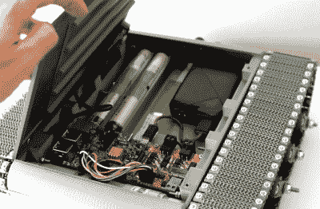

# 临时搭建的履带式机器人前来报到

> 原文：<https://hackaday.com/2021/06/17/scratch-built-tracked-robot-reporting-for-duty/>

受久经沙场的军用机器人的启发，[Engineering Juice]想要建造自己的遥控漫游车，可以从前线传送实时视频。但是他没有使用现成的履带式机器人底盘，而是决定从头开始设计和 3D 打印整个东西。虽然最终产品可能不会防弹，但它在穿越沙子和其他崎岖地形时似乎没有任何问题。

当然，这个项目最令人印象深刻的方面是滚子链轨道和悬挂系统，它由 200 多个单独的印刷零件、紧固件、轴承和连杆组成。最初，[Engineering Juice]为机器人设计了一个不太复杂的悬挂系统，但不幸的是，它在测试过程中有卡住的趋势。然而，新的和改进的设计，每侧使用四个铰接车轮，在速度和越野能力之间提供了令人印象深刻的平衡。

 内部有一个 Raspberry Pi 4 搭配一个 L298 双 H 桥控制器板来驱动重型齿轮电机。当 Pi 使用标准 USB 电源时，驱动电机由定制的 18650 电池组供电，该电池组利用 3D 打印框架来保护和固定电池。连接到 Pi 的 CSI 头的商用夜视摄像头解决方案安装在前端，通过 WiFi 向操作员播放实时视频。

为了实际控制这个机器人，[Engineering Juice]开发了一个红色的节点图形用户界面，非常适合智能手机的触摸屏。当然，凭借树莓派的强大功能和灵活性，[你可以想出任何你想要的控制方案](https://hackaday.com/2021/06/12/raspberry-pi-zero-takes-the-wheel-in-miniature-fighting-robot/)。或者甚至可能[全力以赴，使其自治](https://hackaday.com/2020/09/22/autonomous-rover-navigates-the-house-with-lidar/)。看起来机器人内部仍然有足够的空间来放置额外的硬件和传感器，所以我们很有兴趣看看事情会如何发展。

有没有想到一个不需要 tracks 提供的全地形能力的漫游者项目？几块用过的“悬浮滑板”可以很容易地被征用来创建一个惊人强大的轮式平台用作基地。

 [https://www.youtube.com/embed/5bgXjKqfwAk?version=3&rel=1&showsearch=0&showinfo=1&iv_load_policy=1&fs=1&hl=en-US&autohide=2&wmode=transparent](https://www.youtube.com/embed/5bgXjKqfwAk?version=3&rel=1&showsearch=0&showinfo=1&iv_load_policy=1&fs=1&hl=en-US&autohide=2&wmode=transparent)

