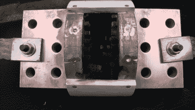

# 烧一根 5000 安培的保险丝需要一些功夫

> 原文：<https://hackaday.com/2021/06/18/blowing-a-5000a-fuse-takes-some-doing/>

保险丝通常是为了在故障发生时阻止过大的电流损坏设备或人们柔软、多肉的身体。但是，有些人喜欢吹它们只是为了好玩，【Photonicinduction】就是这样的人。他最近决定把船推出去，下定决心要在自己的后院引爆一个 5000 安培的保险丝。(视频，下面嵌入。)

The fuse looks quite haggard after the event

这不是胆小的人能做的工作。保险丝的额定电流为 5，000 安培，这是其预期工作电流的额定电流。根据数据手册，该器件能够承受 30，000 A 电流长达 5 秒钟。瞬间引爆保险丝需要大约 20 万安培。

为了实现这种强大的电流，建立了一个电容器组，通过保险丝释放大量的能量。整个电容器组由 10 个并联的独立电容器单元组成，电流为 10，000 μF，能够在 3000 V 时提供 200，000 A 的电流(只是时间不长。)通过一个额定电流仅为 12,000 A 的气动开关，用保险丝将气缸组切换到电路中

结果是可怕的，当电源切断时，保险丝和开关触点都会喷出灼热的金属和闪光。这是一场精彩的表演。我们以前也展示过大型电容器组，尽管与我们今天在这里看到的相比，它们显得苍白无力。

 [https://www.youtube.com/embed/0mGhhdPgXG8?version=3&rel=1&showsearch=0&showinfo=1&iv_load_policy=1&fs=1&hl=en-US&autohide=2&wmode=transparent](https://www.youtube.com/embed/0mGhhdPgXG8?version=3&rel=1&showsearch=0&showinfo=1&iv_load_policy=1&fs=1&hl=en-US&autohide=2&wmode=transparent)

【感谢 B1tbang3r 的提示！]