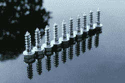
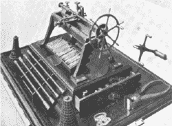
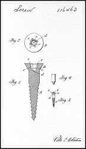
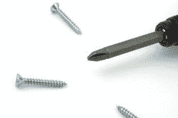
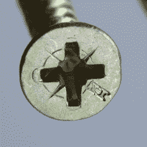

# 更好的捕鼠器(或螺旋驱动器)并不总是成功的

> 原文：<https://hackaday.com/2021/08/04/better-mousetraps-or-screw-drives-dont-always-win/>

我注意到，最近，开槽螺钉头几乎在新设备上消失了。我发现唯一值得注意的是，它花了这么长时间。虽然开槽头确实已经存在了很长时间，但更好的系统是常见的，并且已经存在了至少一个世纪。

Check out those cool threads.

开槽磁头(技术上称为驱动器)如此普遍的原因可能是因为它们非常容易制造。一把钢锯就足够了，还有其他方法可以到达那里。据我所知，对用户来说，唯一的好处是你可以很容易地清洁一个开槽驱动器，并且——可能——使用现场权宜之计，如黄油刀和硬币来转动螺丝。我听人们说螺丝刀可以撬开油漆罐盖之类的东西也是一个特征，但那是工具的特征，而不是螺丝刀的特征。

然而，缺点是显著的。很难对一字槽螺丝刀施加很大的扭矩而不将其推出或折断螺钉头。螺丝刀也不是自定心的，所以偏轴施力是常见的，也是造成问题的原因之一。

## 一点历史

大约 2000 年前，像橄榄压榨机这样的螺纹木材开始出现。到了 15 世纪，金属螺丝出现了，但由于是手工制作的，它们不是很规则，只在有限的应用中流行。约伯和威廉·怀亚特在 1760 年申请了螺旋机的专利，但是直到 10 年后才出现可行的模型。

1770 年，英国人杰西·拉姆斯登发明了第一台可工作的螺纹车床，他用这台车床制造了千分尺和其他科学仪器。他也是一位数学家，你可能会从他对光学的贡献中了解他。大约在 1800 年，亨利·莫德斯利发明了一台大型螺纹车床，美国机械师大卫·威尔金森发明了一台类似的车床。车床允许生产可互换的零件，这是工业革命的关键，在工业革命中，像艾利·惠特尼这样的人能够大规模生产像枪支这样的物品，而以前枪支是独一无二的。

Screw-cutting lathe from around 1800.

在 Maudslay 的发明之前，车床通常用脚踏板操作，操作者只需将工具放在工件上。这对于切割螺纹不够精确，所以螺钉是徒手用凿子和锉刀制成的。Maudslay 的车床有可变齿轮，允许不同螺距的螺纹。威尔克森的是一个更大的机器，但不容易配置。即便如此，政府还是使用了大约 200 台像威尔克森那样的车床，并因为这项发明奖励了他 1 万美元——相当于今天的 25 万美元。

一直以来，磁头几乎都是一个简单的插槽。在 1744 年，你可以得到一个适合木匠支架的平刃，就像今天的钻头需要一个螺丝刀。然而到了 1800 年，手持螺丝刀已经很普遍了。

用车床切削螺纹只是形成螺纹的一种方式。虽然它很精确，但它也很昂贵，而且会削弱金属。冷轧是经济的，并且不去除任何金属，但是威廉·基恩在 1836 年的第一次尝试失败了，因为铸铁模具不能胜任这项任务。在 1867 年，哈维·j·哈伍德也尝试了冷轧，但是使用这种方法的实际螺纹形成不得不等到 19 世纪 80 年代早期的海沃德·哈维和查尔斯·罗杰斯。一些特殊的螺栓仍然被切割，下面的视频显示了现代操作，第二个视频显示了更常见的现代过程。

 [https://www.youtube.com/embed/DAOg4_FwOCg?version=3&rel=1&showsearch=0&showinfo=1&iv_load_policy=1&fs=1&hl=en-US&autohide=2&wmode=transparent](https://www.youtube.com/embed/DAOg4_FwOCg?version=3&rel=1&showsearch=0&showinfo=1&iv_load_policy=1&fs=1&hl=en-US&autohide=2&wmode=transparent)

 [https://www.youtube.com/embed/MvWmH3Dr52o?version=3&rel=1&showsearch=0&showinfo=1&iv_load_policy=1&fs=1&hl=en-US&autohide=2&wmode=transparent](https://www.youtube.com/embed/MvWmH3Dr52o?version=3&rel=1&showsearch=0&showinfo=1&iv_load_policy=1&fs=1&hl=en-US&autohide=2&wmode=transparent)

## 现代问题

Canadian patent drawing for a Robertson drive screw.

具有讽刺意味的是，当装配线因为标准螺纹而成为可能时，它们也对开槽驱动器的不满意负责。发明家想要做得更好。1908 年，加拿大人彼得·罗伯逊发明了一种方头螺丝刀，其中螺丝刀和孔有轻微的锥度。曾有过生产类似驱动器的其他尝试，但它们都很难制造，也没有流行起来。罗伯逊的发明有助于使用模具进行廉价制造。

这有几个好处。首先，驱动器是自定心的。第二，即使在高扭矩水平下，驱动器也不会滑出。加拿大 T 型福特使用了 700 多个罗伯逊螺钉。

## 福特和菲利普斯

A Phillips driver, although those screws look suspiciously like Robertsons.

福特发现 Robertson drive 在每辆车的生产成本上节省了一些钱，但对只有一个供应商持谨慎态度。然而，罗伯逊在英国的授权经历很糟糕，他不愿再签下另一份授权协议。

20 世纪 30 年代，亨利·飞利浦在约翰·汤姆逊的基础上，推出了飞利浦螺丝起子。这也是自定心的，与开槽驱动器相比，更适合自动化方法。不过，正如你可能经历过的那样，过大的扭矩可能会使头部凸出。该公司声称这是防止过度收紧的一个特征。通用汽车最终在 1936 年的凯迪拉克中使用了菲利普驱动，这也保证了它的受欢迎程度。

[Robertson](https://www.robertsonscrew.com) 驱动螺钉几乎占据了加拿大销售的所有螺钉，在其他地方几乎没有使用过。尽管大多数人认为罗伯逊驱动器更优越，一个商业决定使它成为一个小玩家。

## 更多地

Pozidriv screw heads can be identified by the extra notch marks

有数量惊人的[驱动器类型](https://en.wikipedia.org/wiki/List_of_screw_drives)在那里，其中许多没有菲利普斯头的问题。威廉·艾伦的六角驱动被广泛应用。波兹迪夫在日本以外并不常见。然而，开槽驱动器幸存下来，菲利普斯仍然几乎无处不在，在世界上大部分地区。

这让我们不禁好奇。俗话说，如果你造了一个更好的捕鼠器，世界就会找到你。但这似乎不是真的。这更像是如果你制造了一个更好的捕鼠器，成功地将其推向市场，建立一个伟大的分销网络，并捍卫你的知识产权…嗯，你明白了。

我专注于驱动技术，但是螺纹本身是一个迷人的设计，我们的丹·马洛尼几年前就开始研究。如果你想知道更多关于其他类型的螺栓和它们的吸引力，下面有趣的视频有很多好的信息。它仍然没有回答为什么我们没有看到更多使用“更好”的驱动器的问题。你怎么想呢?

 [https://www.youtube.com/embed/5cA9bZRHpZE?version=3&rel=1&showsearch=0&showinfo=1&iv_load_policy=1&fs=1&hl=en-US&autohide=2&wmode=transparent](https://www.youtube.com/embed/5cA9bZRHpZE?version=3&rel=1&showsearch=0&showinfo=1&iv_load_policy=1&fs=1&hl=en-US&autohide=2&wmode=transparent)

如果你想尝试自己的螺栓，也许你需要一个[迷你车床](https://hackaday.com/2018/12/31/take-a-mini-lathe-for-a-spin/)。或者也许你只是想得到一些关于得到[完美螺丝刀](https://hackaday.com/2016/06/15/hackers-toolbox-the-handheld-screw-driver/)的建议。