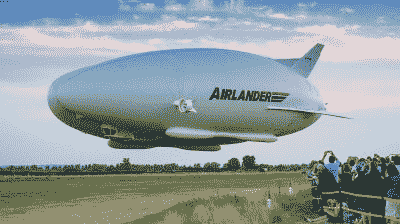
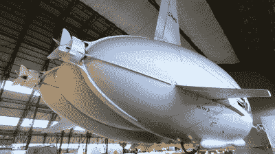
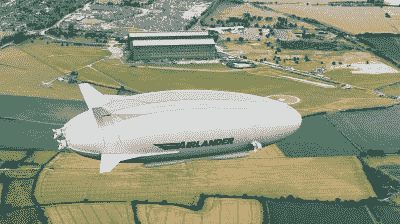
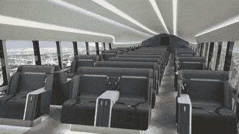

# 飞艇能通过新的混合设计卷土重来吗？

> 原文：<https://hackaday.com/2021/07/01/could-airships-make-a-comeback-with-new-hybrid-designs/>

飞艇。缓慢，难以着陆，充满氢气时极易燃烧。如今，它们更多地被认为是一种历史珍品，而不是一种有用的运输方式。

混合动力飞行器是一家总部位于英国的初创公司，致力于创造一种现代飞艇概念。目标是为短程航线创造更清洁的空中运输，同时通过彻底的重新设计解决飞艇概念的许多问题。他们的飞行器名为“空中登陆者 10 号”,将完成所有这些任务。但是这足以让飞艇重返天空吗？

## 混合技术

Airlander 10 seen taking off during its first flight.

Airlander 10 不像传统飞艇那样是一种轻于空气的飞行器。取而代之的是，飞行器利用氦气球的浮力只能产生 60-80%的升力。剩下的部分是空气动力产生的，空气从飞艇主体的椭圆形上通过。这种升力还可以通过飞艇两侧的两个柴油动力管道风扇来进一步增强，这些风扇可以旋转以帮助起飞和着陆。后部另外两个固定的导管风扇为飞行器提供主要的推动力。

与传统的飞艇模型相比，混合方法带来了几个好处。其中最主要的是，由于 Airlander 10 比空气重，它不需要在整个飞行过程中排出氦气以避免燃料燃烧时产生正浮力，也不需要在着陆时排出氦气。然而，它仍然保持着在空中长时间游荡的能力，因为它需要燃烧很少的燃料来保持在高空。据报道，当有人驾驶时，它能够持续五天，如果在无人驾驶的配置下操作，甚至更长的时间。使用氦气进行升力，而不是仅仅依靠发动机推力和机翼，这意味着它比传统的固定翼客机更省油。该公司自己的估计表明，Airlander 10 可以将短程航线的排放量削减高达 90%。平缓的起飞和着陆特性也意味着该车辆不需要传统的机场设施，使其可以在偏远地区，草地，沙滩，甚至水上更容易地操作。

The craft currently uses four diesel-powered ducted fans. An all-electric drive system is in development to further reduce emissions.

当然，相对于传统的航空旅行来说，还是有缺点的。这种混合飞艇只能达到 148 公里/小时的巡航速度，远远低于现代喷气式客机大约 900 公里/小时的速度。客机 10 也很大——长 91 米，宽 34 米，与波音 737 一样宽，长度是它的三倍。此外，虽然它能够在没有准备好的平坦表面着陆，但混合动力飞行器需要一个 600 米直径的圆圈。这是一个相当大的区域，这意味着在许多地方寻找着陆点可能会很困难。

混合动力飞行器表示，Airlander 10 将能够在短途旅行中搭载多达 100 名乘客，略高于现代单排客机的一半。一条被提议的客运线路是从贝尔法斯特到利物浦的短途航线。前者乘传统飞机需要一个小时，乘渡船大约需要 8 到 9 个小时。“空中登陆者 10 号”预计将在 5 小时 20 分钟内完成旅程。另一条拟议中的路线，从巴塞罗那到帕尔马德马略卡岛，也是同样的路线，乘喷气式飞机 1 小时，乘船 9 小时。混合动力飞艇可以在大约 4 个半小时内完成。

Airlander 10 as seen in flight over Cardington.

混合动力汽车声称，航空旅行的额外费用，如机场登记和安全检查，大大增加了飞行时间本身，因此给了 Airlander 一个优势。然而，很难理解为什么他们的慢速飞行器没有这些要求；即使是海上渡轮也需要时间来处理停靠和乘客装载。

这是一种缓慢而优雅的飞行，正如 BBC 2016 年的一段视频所示。注意它在空中的飞行方式，之所以需要大的着陆面积，可能是因为迎风起飞对安全至关重要。【2017 年还有一个有趣的故事，原型飞船在试飞后的早上从系泊处松脱。当这种情况发生时，紧急放气系统启动，飞机停在机场的外围。想象一下，有一天你去工作，你一直在工作的巨型飞艇停在你离开的机场的中途，它的空气球因为卡在围栏上而下垂。

Interior designs are renders at this stage, but boast far more room than contemporary passenger aircraft.

新技术将不得不与现有的廉价航班竞争；短途航线的机票通常不到 50 英镑。当然，混合飞艇的低燃料消耗确实有所帮助。空中登陆者 10 本身造价 2500 万英镑，是混合动力飞行器 1 . 4 亿英镑开发预算中的一部分。与购买一架现代单通道客机所需的 3 亿美元或更多相比，这就相形见绌了。四台柴油活塞发动机的运行和维护成本也可能低于两台大型喷气式发动机。然而，现有的喷气式飞机运营有一个好处，那就是它已经很好地建立起来，并且为公众所熟悉。

As opposed to the above luxury or sightseeing design, in a more budget-focused role, the Airlander could carry up to 100 passengers.

鉴于氦元素的稀缺和昂贵，混合飞艇对氦的依赖也容易引发问题。混合动力飞行器网站声称“600 架 Airlander 飞机仅占年度氦气消耗量的 1%。”然而，我们怀疑计算可能会漏掉一个零。600 架 Airlander 10 飞机，每架飞机使用 38000 立方米的氦气，加起来就是 22800 亿立方米的气体。[2018 年](https://cen.acs.org/business/instrumentation/Help-helium-users-way/97/i46)天然气产量约为 1.6 亿立方米；粗略计算，2021 年的实际数字在全球供应量的 10-15%之间。当然，没有那么多的 Airlander 10 飞机，该公司计划从 2025 年起每年建造 12 艘飞艇。[随着氦气短缺的缓解，](https://physicstoday.scitation.org/do/10.1063/PT.6.2.20200605a/full/)供应应该不会有什么大问题，尽管应该有人在网站上整理一下数学。

一种新的交通方式很少会轻易诞生；英吉利海峡隧道一旦投入使用，就面临多年的混乱。载客气垫船曾经看起来也像是一颗银弹，[但是在最近几十年里几乎消失了。](https://www.bbc.com/news/magazine-34658386)混合动力飞艇的概念是否会成为常规的运输环节，将取决于投资者是否会首先拿出资金让这个概念上线。从那时起，面对现有对手的激烈竞争，运营商需要找到一种经济的运营方式。