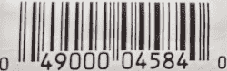

# 显而易见的技术:检查数字和人为错误

> 原文：<https://hackaday.com/2021/08/25/tech-in-plain-site-check-digits-and-human-error/>

工作正常并装有正确软件的计算机是不会出错的。然而，人们会犯很多错误(包括编写糟糕的软件或破坏计算机)。在质量圈里，有一个日语术语， *poka yoke* ，大致意思是“避免错误”。这个想法是通过使错误变得太明显而不发生来避免错误。例如，考虑手机中的 SIM 卡。小对角意味着它只能往一个方向走。如果你放的方式不对，那显然是不对的。

 要想在*防差错*取得成功，你必须能够想象用户可能会做错什么，然后想出一些办法让它明显是错的。这种例子在我们身边比比皆是，有时我们甚至不知道。例如，你的信用卡号、汽车的 VIN 码和一罐豆子上的 UPC 码有什么共同之处？

答案是它们都是很长的数字串，众所周知，人类很难正确输入。人们会遗漏数字或者调换数字。因此，编写这种接受数字的应用程序的人通常希望进行检查，以确保这个人没有犯错误。

当然，数字就是数字，对吧？如果我告诉你输入一个五位数的邮政编码，我可以算出你输入的是四位数还是六位数，但是很难知道你指的是 77508 还是 77580。这就是为什么长而重要的数字有一个或多个校验位。

校验位就像校验和或 CRC——你从数字中的其他数字计算它，如果你的计算结果与你得到的校验位不匹配，那么一定有什么地方出错了。

## 简单的例子

为了简单起见，假设您有一个四位数的 PIN 号 0000 到 9999，我们想用一个校验位生成一个五位数的代码。一个简单的方法是将所有的数字加在一起，除了最后一个数字(即除以 10 或取模 10 后的余数)之外，其余的都扔掉。

例如，0052 变成 00527，9522 变成 95228。简单吧？现在你知道 10118 不是一个有效的数字。当然，00527 有效，但 00257 或 52007 也有效。所以也许我们可以做得更好。

## 真实生活

在现实生活中，算法试图考虑数字的位置。有几种方法可以做到这一点，正如你所料，有很多数学方法来决定什么是最好的。许多系统使用加权算法，其中每个数字具有不同的权重，通常为 1、3、7 或 9，没有两个相邻的数字具有相同的权重。由于这些数字与 10 互质，任何一个数字的变化都会导致不同的校验位。使用这种加权也能捕捉到大约 90%的单个置换，除了那些涉及 5 和 2 的置换(因为 5 和 2 是 10 的倍数)。

例如，普遍存在的 UPC 代码使用 1 和 3 的权重作为备用数字，其中数字 1 是最右边的数字(不是校验位),随后是向左移动的数字 2、3 等等。算法是:

1.  忽略校验位，从右边开始，将奇数位置的所有数字相加
2.  将总和乘以 3(奇数的权重)
3.  忽略校验位，将剩余位数添加到累计总数中
4.  取和的最后一位数(即除以 10 后的余数)；如果数字不是零，从 10 中减去它

 比如我桌上有一罐 UPC 为 681131309516 的喷雾空气。前六位数字是公司独有的。接下来的五个数字是唯一的 ID，最后一个是校验位。这意味着奇数位数字是 1、9、3、3、1 和 6。偶数位数是 5、0、1、1 和 8。第一个总数是 23，乘以 3 等于 69。偶数产生 15，总计 84，初步校验位为 4。因为这不是零，所以真正的校验位是 10-4 或 6。试着改变任意一个数字，或者在两组之间交换任意两个数字，看看你会得到什么结果。

## 甚至更好

ISBN-10 甚至更强大。它使用一个十位数，其中每个数字都有从 1 到 10 的不同权重，并取除以 11 后的余数。这将捕获所有常见错误，但会导致校验位为 10，用 x 表示。

还有其他更健壮的算法，如 [Damm](https://en.wikipedia.org/wiki/Damm_algorithm) 、[维尔霍夫](https://en.wikipedia.org/wiki/Verhoeff_algorithm)和[卢恩](https://en.wikipedia.org/wiki/Luhn_algorithm)。您还可以添加更多的校验位来获得更好的性能，就像 CRC 的位数越多，通常越健壮。

## 意义

这些校验位不是用来作为安全装置的。通常情况下，算法是众所周知的，很容易弄清楚。所以并不是坏人因为校验位而搞不清楚如何制作假信用卡号。它们只是提供了一个小小的防差错装置，这样程序就可以立即发现这些数字中的常见错误。这是你下次设计界面或其他容易出现人为错误的东西时要记住的。

当然，如果你想防止计算机出错，你最好用一个 [CRC](https://hackaday.com/2019/06/27/reverse-engineering-cyclic-redundancy-codes/) 。如果你不担心人类计算校验位，还有其他方法[捕捉错误](https://hackaday.com/2016/02/10/error-detection-and-correction-reed-solomon-convolution-and-trellis-diagrams/)。