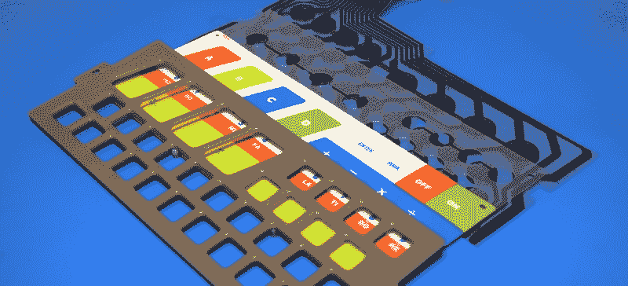
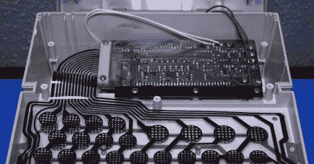
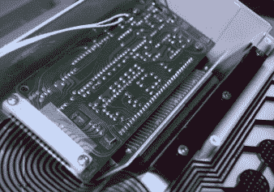
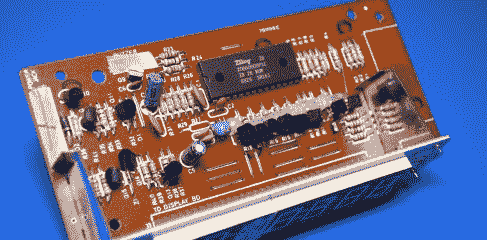
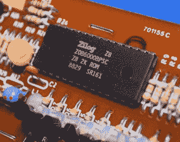
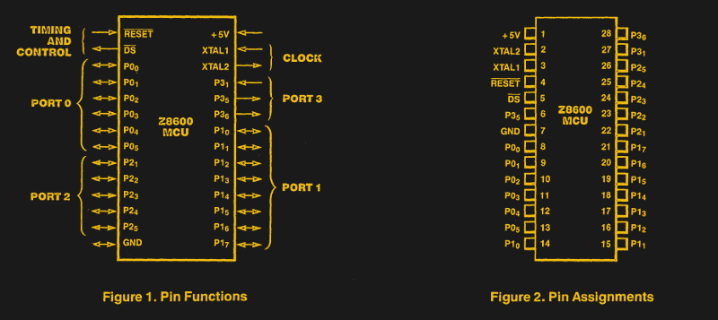
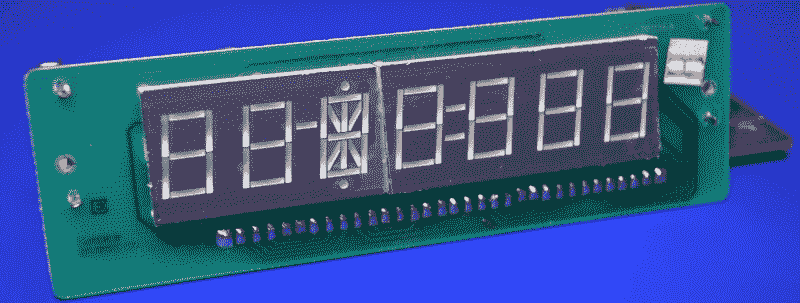
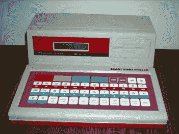

# 拆卸:伟易达智能启动

> 原文：<https://hackaday.com/2021/07/12/teardown-vtech-smart-start/>

普通读者可能知道，我对老式的伟易达教育玩具有一定的亲近感，*尤其是那些试图在视觉上甚至功能上与当代计算机设计相结合的玩具。在 20 世纪 80 年代末，当个人电脑的存在变得显而易见时，这些设备被视为一种负担得起的方式，让孩子甚至青少年有时间动手操作一些至少在某种程度上类似于他们父母使用的昂贵得多的机器。*

Much Smarter: VTech PreComputer 1000

一个完美的例子是 1988 年发布的 PreComputer 1000。它拥有完整的 QWERTY 键盘和运行基本程序的能力，[它真正模糊了玩具和电脑之间的界限](https://hackaday.com/2019/11/19/teardown-vtech-precomputer-1000-is-an-iconic-pc-in-a-toy-wrapper/)。事实上，从技术的角度来看，它与早期的台式电脑并没有太大的区别，因为它是由与 TRS-80 型号 I 相同的 Zilog Z80 CPU 驱动的

相比之下，智能启动与台式电子计算器有更多的共同点。尽管它比 PreComputer 1000 早两年发布，但你一眼就能看出它是一个简单得多的设备。这至少部分是因为它是针对年轻观众的，但肯定当时计算机技术的快速发展也起到了一定作用。有点讽刺的是，伟易达至少还试图让 Smart Start 看起来像一台台式电脑，前面板上有人造磁盘驱动器。

当然，外表是会骗人的。虽然 Smart Start 从外表上看起来很幼稚，但这并不意味着在其米色塑料外表下隐藏着一些令人惊讶的技术发现。只有一个办法可以知道。

## 敏感的话题

一眼看去，Smart Start 的形状和人体工程学非常清楚地表明，你应该将它放在桌子上并坐在它的前面，坦率地说，对于一个小孩子的玩具来说，这似乎过于乐观了。后来，伟易达电脑非常注重便携性，因此，即使你最终需要一个平坦的表面来实际操作它们，它们至少提供了一个手柄或携带带，以便儿童可以轻松移动它们。

SmartStart 的键盘也出乎意料，如果真的可以这么称呼它的话。改变模式的按钮，可能是最少被按下的按钮，被放置在离用户最近的地方。上面是 10 个数字按钮，也标有 solfège 音节，显然至少有一种机器功能可以产生音调。然后我们有一个巨大的 A/B/C/D 按钮，我收集了书中提到的多项选择活动所使用的按钮，这些按钮将与智能启动一起提供，顺便说一句，我没有。

就结构而言，键盘似乎可以相对容易地重新调整用途。图形覆盖层可以交换，下面的导电碳迹线连接到您选择的微控制器的 GPIO 引脚。但是就输入设备而言，它使用起来相当糟糕，所以请记住这一点。

## 在后台

智能启动的上部隔间容纳所有电子设备，在这种情况下，基本上是由两个 PCB 组成的单个单元。较小的显示 PCB 通过金属支架和一根极短的带状电缆永久固定在主板上。大胆猜测，我会想象它是这样设计的，以便显示器可以位于其他 VTech 型号上更偏远的位置。

    

翻转电路板，我们可以看到智能启动是由 Zilog 芯片驱动的，这次是 Z0860008PSC。与后来的 VTech 型号中使用的 Z80 处理器不同，这是一种单芯片“微型计算机”解决方案。今天我们称之为微控制器，但微型计算机听起来更令人印象深刻。

    

该芯片集成振荡器、128 字节 RAM 和 22 个 I/O 引脚。但与我们大多数人习惯使用的微控制器不同，代码存储在 2 KB 的 ROM 中，这些 ROM 在制造过程中就已经固化了。这使得 Z8600 在再利用方面几乎完全没有价值，但它仍然是一个有趣的部分。

Programming pins? What are those?

除了 MCU 之外，该板最显著的特点是 9 个 LM90 晶体管和电阻阵列，用于驱动 LED 显示段，而不是专用的驱动芯片。九个晶体管似乎不够，但由于显示器在软件中被复用，并非所有的数字都同时点亮，这一事实在试图拍摄智能启动时变得非常清楚。

## 求解 X

说到 LED 显示屏，仔细观察会发现一个有趣的布局，这显然是 Smart Start 打算玩的那种数字游戏的产物。大多数字符是七段字符，但第三个字符有十五段，用于填充机器能够使用的所有数学运算符。第四个字符是等式中的第二项，在智能启动的情况下，它显然只能是 0 到 9。等号后面还有三个字符，这是有意义的，因为它应该显示的最大数字是 99 和 9 的乘积，即 891。

有一点我不清楚，就是第二个和第三个字符之间的小破折号。如前所述，我没有任何 Smart Start 的文档，所以如果你在还是初级黑客时碰巧有一个这样的小工具，并且记得它的意思，请在下面留下评论。

## 卑微的出身

Image Credit: [VTech Wiki](https://vtech.fandom.com/wiki/Smart_Start_Speller)

在我的研究中，我发现这种电脑的一个变种叫做智能拼写器，是在 1988 年发布的。这台电脑使用了与原始智能启动相同的外壳，缩小了彩色 A/B/C/D 键以适应键盘上的另一行，并用 LCD 取代了 LED 显示屏。看看后来的 Smart Start 型号是否切换到当时在其他 VTech 产品中使用的 Z80，或者它是否坚持使用更简单的 Z8600，这将是一件有趣的事情。

无论如何，很明显，Smart Start 和后来的 VTech 计算机之间的差异不仅仅是外观上的差异。虽然这个早期条目确实表明该公司对 Zilog 硅的偏好在预计算机之前就开始了，但它缺乏给后来的机器带来优势的输入、输出和可扩展性。我们已经看到现代项目为这些更强大的 VTech 计算机带来了新的软件，但是由于 Z8600 的一次性本质是智能启动的核心，它注定只能是孩子的玩具。