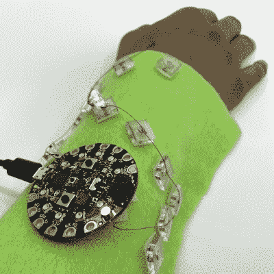

# 电子纺织品的灵活原型制作不需要花费太多

> 原文：<https://hackaday.com/2021/06/22/flexible-prototyping-for-e-textiles-that-doesnt-cost-an-arm-and-a-leg/>

让我们面对现实吧:几乎所有关于电子纺织品的事情都很复杂。如果可穿戴设备很简单，可能会有更多人在这个领域工作。但是，尽管大多数电路原型制作是在二维空间完成的，但可穿戴设备的原型制作需要在三维空间进行思考和规划。最重要的是，你必须计算出你需要多少导电线，而且那东西并不便宜。

[【alch _ emist】有一种在 3D 空间中排列电路的方法，可以解决尝试制作可穿戴设备原型的严酷现实](https://www.instructables.com/Arrangeable-Prototype-Board-for-E-textiles/)。有整个重力的事情要处理，然后当然在人体的任何地方都没有直线。下面是它的工作原理:[alch_emist]制作了一系列可重复使用的连接点，用于粘合基底，如毛毡。他们用激光切割了一组丙烯酸方块，并在每个方块上钻了一个孔，以容纳钕磁铁。在每个方块的背面都有一小块粘扣带的钩面，这使得连接点留在毛毡上，但很容易重新排列。

我们喜欢用毛毡做原型的想法，因为它是一种如此便宜和多功能的织物，还因为你可以很容易地将它缠绕在你的手臂或腿上，然后看看当你这样做时电路会如何移动。

还没到你下一个可穿戴项目的规划阶段？[在 2D，磁铁和导电线玩得一样好](https://hackaday.com/2020/02/26/magnets-make-prototyping-e-textiles-a-snap/)。