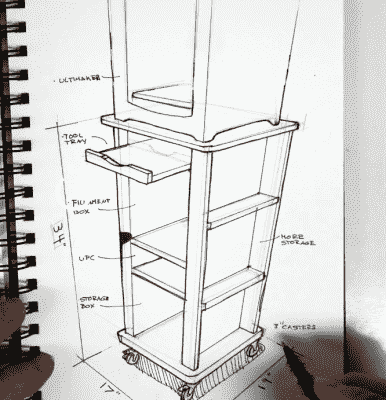

# 定制 3D 打印机推车隐藏了巧妙的功能

> 原文：<https://hackaday.com/2021/06/26/custom-3d-printer-cart-hides-clever-features/>

即使你有一个相当大的工作室，你一次只能在工作台上放这么多东西。这就是为什么多产的制造商[Eric Strebel]决定为他相当笨重的 Ultimaker 3 扩展打印机制造这种光滑的手推车。(视频，嵌在下面。)虽然推车的设计显然符合 Ultimaker 的审美，但无论你想用哪种打印机或工具在商店里时髦地推车，下面的视频肯定会有一些有用的提示和技巧。

[【Eric】做了第二个视频](https://www.youtube.com/watch?v=dko0vgd3UOw)关于草图设计。从表面上看，这可能看起来像一个非常标准的滚动推车，不可否认的是，至少有一半的视频比我们通常在 Hackaday 上感兴趣的东西更多一点。但是[Eric]已经在购物车中构建了许多整洁的小细节，我们认为这些小细节值得在未来的项目中进行存档。

例如，我们真的很喜欢他使用磁铁将塑料手提袋固定到位，尤其是他让磁铁先对齐，然后用螺丝和热熔胶将所有东西固定住的方法。集成的不间断电源也是一个不错的选择，因为它不仅有助于在停电时保护您的打印，还意味着您甚至可以在打印机工作时移动手推车(非常小心……)。

但也许购物车中最有趣的元素是[Eric]将 Ultimaker 的 NFC 传感器从打印机的背面转移到了购物车中。这使得打印机仍然可以读取 Ultimaker 细丝卷中内置的 NFC 芯片，即使它们被安全地锁在密封的盒子中远离湿气。

现在，您需要做的就是申请贷款，以支付构建您自己的版本所需的所有 MDF。在这一点上，如果用金属包裹 3D 打印机比用木头便宜，我们不会感到惊讶。

 [https://www.youtube.com/embed/pjaanuAtrhI?version=3&rel=1&showsearch=0&showinfo=1&iv_load_policy=1&fs=1&hl=en-US&autohide=2&wmode=transparent](https://www.youtube.com/embed/pjaanuAtrhI?version=3&rel=1&showsearch=0&showinfo=1&iv_load_policy=1&fs=1&hl=en-US&autohide=2&wmode=transparent)

