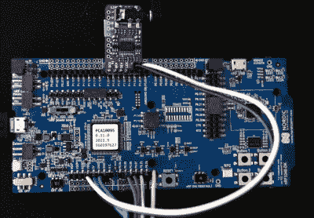

# 末日降临 NRF5340

> 原文：<https://hackaday.com/2021/06/22/doom-comes-to-the-nrf5340/>

如果你正在寻找运行我们日常设备的微型微控制器已经变得多么强大的提醒，请查看令人印象深刻的工作[【Audun Wilhelmsen】为让 DOOM 在北欧半导体 nRF5340](https://devzone.nordicsemi.com/nordic/nordic-blog/b/blog/posts/doom-on-nrf5340) 上运行所做的工作。这是你期望在耳机或无线键盘中找到的那种蓝牙 SoC，但它封装了一个 128 MHz 的处理器，可以与标志性的第一人称射击游戏推荐你在旧的米色盒子 PC 中使用的英特尔 486 并驾齐驱。

也就是说，将开源射手移植到 nRF5340 并不容易。挑战在于让这款游戏在内存只有区区 512 KB 的微控制器上运行，这款游戏早在 1993 年就建议你的电脑拥有 8 MB 内存。幸运的是，游戏加载到 RAM 中的许多数据都是静态的。虽然当游戏从一个狭小的 IDE 硬盘上运行时，这可能是必要的，但固态存储几乎瞬时的访问时间和 nRF5340 的就地执行(XIP)能力意味着[Audun]可以将所有这些都转移到一个 SPI 连接的 8 MB 闪存芯片上，只需对代码进行一些调整。

nRF53 Development board with I2S DAC

总的来说，[Audun]解释说，为最初的末日引擎所做的许多设计决定都是基于这样的假设，即限制因素将是 CPU 能力而不是 RAM。这导致一些东西经常被预先计算并存储在内存中，以备即时访问。但是有了 nRF5340 的额外马力，它通常有助于翻转这种动态并逆转原始开发人员所做的优化。

在硬件方面，事情相对简单。4.3 英寸 800×480 液晶显示器通过 SPI 连接，I2S DAC 处理声音。蓝牙本来是控制的合理选择，但为了简单起见，[Audun]最终使用了 BBC micro:bit，可以通过 Nordic 自己的专有协议与 nRF5340 通信。尽管他提到蓝牙鼠标和键盘支持是他最终想要实现的。

如果这个黑客使用的一些软件技巧听起来很熟悉，那是因为大约一周前一个非常[相似的技术被用来让一个宜家特罗 DFRI 灯泡运行厄运。不幸的是，它一定惹怒了一些人，因为它很快就被从网上撤了下来。听起来像是[Audun]从他在 Nordic Semiconductor 的老板那里得到了公开这个项目的许可，所以希望这个项目能持续一段时间。](https://hackaday.com/2021/06/15/a-smart-light-bulb-running-doom-is-a-pretty-bright-idea/)

 [https://www.youtube.com/embed/FN1pXUirx0Q?version=3&rel=1&showsearch=0&showinfo=1&iv_load_policy=1&fs=1&hl=en-US&autohide=2&wmode=transparent](https://www.youtube.com/embed/FN1pXUirx0Q?version=3&rel=1&showsearch=0&showinfo=1&iv_load_policy=1&fs=1&hl=en-US&autohide=2&wmode=transparent)

