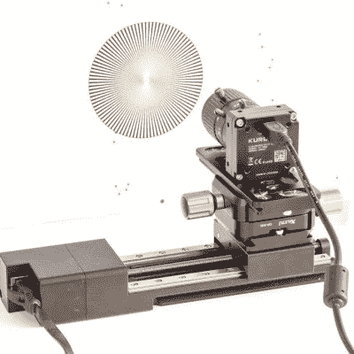

# 视频去抖软件测量线性轨道质量

> 原文：<https://hackaday.com/2021/06/27/video-de-shaker-software-measures-linear-rail-quality/>

这里有一个有趣的实验，[试图通过使用一种视觉里程计](https://www.kurokesu.com/main/2020/06/29/measure-linear-rail-quality-with-camera-and-excel/)来测量线性轨道的质量，通过在轨道上安装一台摄像机并使用开源软件分析视频来完成，开源软件通常用于稳定抖动的视频镜头。没有一条直线轨道是完美的，当摄像机沿着轨道移动时，应该可以通过记录视频片段并分析结果来测量不完美的程度。铁轨上的瑕疵会导致视频出现一定程度的晃动，这将有助于确定铁轨质量的特征。

 为了测试这个想法，【Saulius】将一个高清摄像头连接到一个线性轨道上，将摄像头对准一个高对比度的纹理图案(使生成的视频更容易分析)，并在以固定速度移动摄像头穿过轨道的同时录制视频。生成的视频被输入到用于 VirtualDub 的 [Deshaker 插件中，其中重要的部分是`deshaker.log`文件，它包含稳定视频所需的 X、Y、旋转和缩放校正值。[Saulius]使用这些值创建了一个描述线性轨道质量的图表。](https://www.guthspot.se/video/deshaker.htm)

这是一个聪明的概念证明，尤其是它如何不使用特殊工具，并以一种不同寻常的方式利用视频稳定算法。然而，这些结果并不容易转化为具体的、真实的测量。将图像结果转换为微米是一个像素计数的问题，对于这项任务，视频稳定是一个不完美的工具，因为该算法优先考虑视觉结果，而不是绝对测量。尽管如此，这是一个有趣的实验，完全能够测量相对意义上的铁路质量。不禁有点好奇它会如何描绘出[像这些纸板数控模块](https://hackaday.com/2015/03/01/cardboard-cnc-machine-boxes-up-both-a-tool-and-a-framework/)这样的东西。