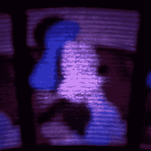

# 大的旋转盘形成一个小的彩色视频显示器

> 原文：<https://hackaday.com/2021/06/23/big-spinning-disk-makes-a-small-color-video-display/>

Believe it or not, the Mickey Mouse clip used for this demonstration is actually in the public domain.

最早的电视使用了一种被称为尼普科夫圆盘的旋转圆盘技术，这正是[科学' n' Stuff]用他们基于 Arduino 的机械彩色电视重新创造的东西。)该设备从 SD 卡中读取视频和音频，并使用精确定时的 RGB LED 显示视频，通过穿孔的转盘可见。视觉暂留效应产生的视频相对于光盘的大小来说很小，但却非常具有观赏性。一个转折是视频是彩色的！

尼普可夫圆盘是一个相当简单的机电装置，它依赖于时间；这是现代微控制器和 RGB LED 完全能够实现的。在这种设备中，光盘上的孔产生 32 条垂直扫描线，每条扫描线由 96 个“像素”组成。旋转磁盘技术总是局限于单色，但在这种实施方式中，通过相应地调整 RGB LED，每个“像素”都被赋予了自己独特的颜色。

第一个视频展示了该设备，并演示了它的工作原理；请注意，它可能看起来像有多个小屏幕，但中心的一个可以被认为是“真正的”显示器，其他的基本上是由于漏光造成的伪像。如果你对尼普可夫圆盘工作原理的具体细节感兴趣，那么[第二个视频](https://www.youtube.com/watch?v=NPG1CTZw2XY)会让你更感兴趣，因为它详细介绍了所有东西是如何工作的。

关于尼普可夫圆盘的另一个有趣的事情是[图像采集并不比图像显示](https://hackaday.com/2017/06/28/mechanical-image-acquisition-with-a-nipkow-disc/)复杂多少。

[via [Arduino 博客]](https://blog.arduino.cc/2021/06/18/homemade-mechanical-color-tv-runs-on-an-arduino-due/)

 [https://www.youtube.com/embed/S3k6_yT3xcU?version=3&rel=1&showsearch=0&showinfo=1&iv_load_policy=1&fs=1&hl=en-US&autohide=2&wmode=transparent](https://www.youtube.com/embed/S3k6_yT3xcU?version=3&rel=1&showsearch=0&showinfo=1&iv_load_policy=1&fs=1&hl=en-US&autohide=2&wmode=transparent)

 [https://www.youtube.com/embed/NPG1CTZw2XY?version=3&rel=1&showsearch=0&showinfo=1&iv_load_policy=1&fs=1&hl=en-US&autohide=2&wmode=transparent](https://www.youtube.com/embed/NPG1CTZw2XY?version=3&rel=1&showsearch=0&showinfo=1&iv_load_policy=1&fs=1&hl=en-US&autohide=2&wmode=transparent)

