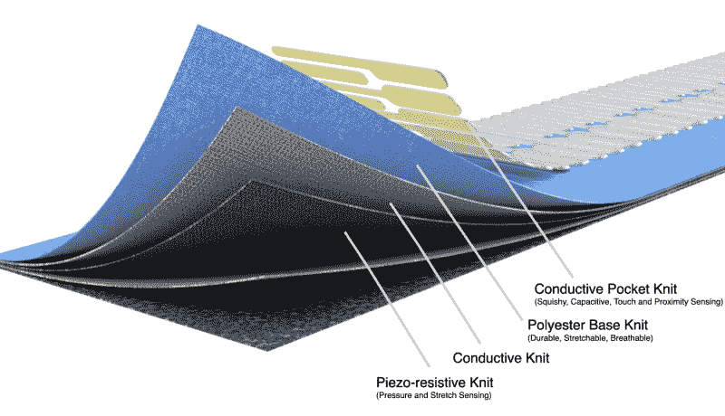

# 麻省理工学院的针织键盘是一个相当灵活的 MIDI 控制器

> 原文：<https://hackaday.com/2021/06/30/mits-knitted-keyboard-is-quite-a-flexible-midi-controller/>

在原声钢琴等标准乐器上，制造噪音的方法只有这么多。他们的僵化和投入不允许超大范围的表达。另一方面，如果你把你的界面编织在一起，可能性几乎是无限的。[麻省理工学院新改进的针织键盘是一种独一无二的乐器](https://www.media.mit.edu/projects/knittedkeyboard-ii/overview/)——它对触摸、压力和持续的接近做出反应，这意味着你可以像键盘、特雷门琴和介于两者之间的东西一样弹奏它。因为它是一个 MIDI 接口，它最终听起来就像软件中的任何乐器。

 这个五八度界面的银键是导电纱做的，蓝色背景是普通涤纶丝。下面是一个导电针织层来完成按键电路，以及一个压阻针织层来响应压力和拉伸。它运行在 Teensy 4.0 上，使用五个 MPR121 接近/触摸控制器，每个八度音阶一个。

这种键盘真正令人兴奋的是它的音乐(和物理)多功能性。正如您所料，键盘从击键中获取离散输入，但它也通过接近传感器从悬停和挥动中获取连续输入，甚至通过挤压、拉动、拉伸和扭转构成按键的导电纱线来获取物理输入。这意味着它考虑了触后反应(初次接触后施加的压力)——这是大多数常规乐器不可能做到的。由于这款键盘主要由纱线和织物制成，你可以将它卷起来，带到任何地方，或者将它挂在脖子上，营造出不同的声音效果。

如果你想了解更多细节，可以看看之前版本的论文[(PDF)，它也使用热变色纱线来显示不同的颜色，用于使用加热元件的各种游戏模式。在新版本中，[Irmandy Wicaksono]和他的团队试图改善感应模式、针织美学和键盘的整体触感。两个版本我们都爱！休息之后一定要去看看。](https://dam-prod.media.mit.edu/x/2020/05/01/NIME2020_fin3.pdf)

想要在不出门的情况下摆弄电容式触摸传感器吗？[用纸和铝箔自己制作](https://hackaday.com/2015/11/30/conjuring-capacitive-touch-sensors-from-paper-and-aluminum-foil/)。

[https://player.vimeo.com/video/562885935](https://player.vimeo.com/video/562885935)