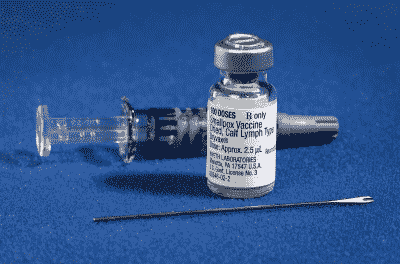
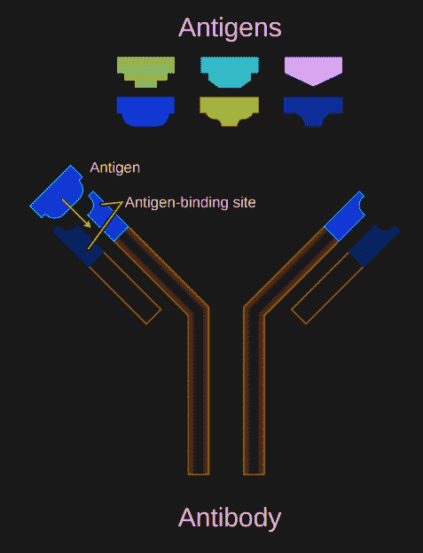
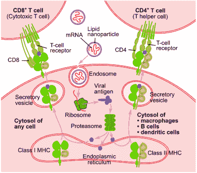
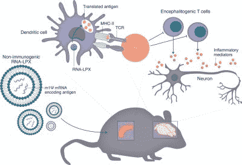

# RNA 疗法和通过与免疫系统一起工作来对抗疾病

> 原文：<https://hackaday.com/2021/07/26/rna-therapeutics-and-fighting-diseases-by-working-with-the-immune-system/>

在新型冠状病毒疫情出现之前，很少有人知道 mRNA 疫苗的存在。然而，经过几个月的 Moderna 和 BioNTech 疫苗接种，以及为数百万人提供强有力保护的明确迹象，现在似乎很难想象一个没有 mRNA 疫苗技术的世界，特别是当更多的传统疫苗似乎无法抵抗新的新冠肺炎变种，以及所谓的“长 COVID”的破坏变得更加明显的时候。

然而，就在不久前，Moderna 和 BioNTech 还只是一群初创公司，试图利用全新的、基本上未经证实的 rna 疗法领域，为各种疾病开发有利可图的疗法。尽管自 1989 年以来就已经研究了 mRNA 在治疗中的特殊用途，但根据 [Khalid A. Hajj 等人](https://www.nature.com/articles/natrevmats201756)的说法，即使是最近在 2017 年，仍有许多关于将 mRNA 递送到细胞中的安全有效方法的问题

显然，这些问题在 2021 年已经得到解决，这让人们不禁想知道 mRNA 递送提供的其他令人兴奋的可能性，从疟疾、癌症、艾滋病毒的疫苗，到治疗自身免疫性疾病。mRNA 疫苗领域是如何如此快速地发展的，我们可以期待在未来几年看到什么？

## 简言之，疫苗

Smallpox vaccination kit including the diluent, a vial of Dryvax® smallpox vaccine, and a bifurcated needle.

在疫苗出现之前，[接种](https://en.wikipedia.org/wiki/Inoculation)的做法相当普遍，尤其是在中国，至少可以追溯到 15 世纪。这种所谓的[天花](https://en.wikipedia.org/wiki/Variolation)(天花接种，源自天花的名字*天花*)主要集中在天花上，涉及从天花患者身上提取活的病原体，并将其引入对该疾病没有预先免疫的人体内。

当爱德华·詹纳在 18 世纪推广使用牛痘代替天花来诱导对天花的免疫力时，这就是疫苗接种的开始。与接种不同，[疫苗接种](https://en.wikipedia.org/wiki/Vaccine)寻求使用异型病原体(如牛痘)、灭活或弱化的病原体，或病原体的特定成分(单位)，其可以诱导针对该病原体的免疫。

人类免疫系统的核心是[抗原](https://en.wikipedia.org/wiki/Antigen)的概念，抗原是免疫系统可以使用[抗体](https://en.wikipedia.org/wiki/Antibody)识别的病原体或毒素的特定蛋白质或其他元素。这些抗体是 Y 形蛋白质，可以结合特定的抗原。它们可以附着在 B 细胞(B 细胞受体，BCRs)上，也可以自由漂浮在细胞外液(如血浆)中。

由于对病原体感染具有天然免疫力，身体的[适应性免疫系统](https://en.wikipedia.org/wiki/Adaptive_immune_system)通常会学会识别外来抗原并应对威胁。疫苗的用途是将这些抗原(例如[新型冠状病毒](https://en.wikipedia.org/wiki/SARS-CoV-2)的独特刺突蛋白)呈现给免疫系统，以便免疫系统(特别是 B 细胞)有机会记住它，以便它可以更快地对感染做出反应。

## 没有复杂性的疫苗

Schematic diagram of an antibody with antigens.

由于疫苗的主要目的是为免疫系统提供最有效的抗原，这导致了多年来寻求优化免疫反应的各种疫苗类型。在这里，[新型冠状病毒疫苗](https://en.wikipedia.org/wiki/COVID-19_vaccine)的快速发展非常有助于说明当前的技术水平。基本上，只有两种类型的疫苗能够在最短的时间内开发出来:病毒载体和 mRNA 疫苗。

这两种都是新型疫苗，而且都没有以这样的规模部署过。它们与其他类型疫苗的不同之处在于，它们不需要病原体在体外生长，而是专注于将遗传物质(mRNA)输送到细胞中，在细胞中，这些遗传物质可以由细胞的核糖体翻译成形成靶抗原的蛋白质。

理论上，这将跳过许多复杂性，因为它只需要产生足够多的 RNA 串并将其插入身体细胞，而不需要合成目标抗原(蛋白质)并注射它们。在使用完整病原体的传统疫苗的情况下，RNA 的使用跳过了由这些活病原体引起的意外爆发的风险，包括常见于[脊髓灰质炎疫苗](https://en.wikipedia.org/wiki/Polio_vaccine)(疫苗诱导的脊髓灰质炎)的减毒株。

然而，尽管有其相似之处，mRNA 疫苗比病毒载体有一个主要优势:使用基于[脂质纳米颗粒](https://en.wikipedia.org/wiki/Solid_lipid_nanoparticle)的(LNP)递送系统，该系统稳定脆弱的 mRNA 链。这首先与 [Patisiran](https://en.wikipedia.org/wiki/Patisiran) 一起使用，Patisiran 是一种利用 siRNA(基因沉默 RNA)治疗多发性神经病的 RNA 治疗药物。通过[对这些 LNP 的精心设计](https://cen.acs.org/pharmaceuticals/drug-delivery/Without-lipid-shells-mRNA-vaccines/99/i8?PageSpeed=noscript)，它们实际上就像人体自身细胞的(基于脂质的)膜一样，不会引起免疫系统的注意。

由于病毒载体根据定义使用病毒来破坏和进入细胞，这些病毒很可能被免疫系统检测到，并且一些可能具有身体已知的抗原。mRNA 疫苗的 LNP 涂层使其相对隐蔽。病毒载体的另一个主要问题是，它们需要对病毒 RNA 进行修饰，插入需要作为有效载荷携带的 RNA 串，同时确保这些基因修饰正确进行。

## 刺激这些细胞

一旦 mRNA 疫苗被注射到体内，绝大多数 LNP 包被的颗粒被[树突细胞](https://en.wikipedia.org/wiki/Dendritic_cell)吸收，树突细胞在细胞外空间漫游，可以被视为免疫系统的哨兵。在树突细胞内，mRNA 串被释放，在那里它最终被核糖体加工，就像源于细胞核的任何其他 mRNA 串一样。这导致例如新型冠状病毒刺突蛋白的产生，然后树突细胞将在其膜上将其暴露给 B 和 T 细胞。

Schematic working of an mRNA vaccine. (Credit: Jmarchn – CC BY-SA 3.0)

这里需要注意的重要一点是，这些不是来源于细胞核的完全相同的 mRNA 串，因为细胞的防御系统监控外来 RNA 的入侵。这是通过核苷修饰的 mRNA (modRNA)来规避的，其中核苷被替换为合成的类似物。这不影响核糖体的处理。在 CureVac 公司的新型冠状病毒 mRNA 疫苗的案例中，使用未经修饰的 mRNA 串可能是它在试验中表现出非常低的效力的原因，这使得它目前无法成为一种可行的疫苗。

基于这些数据，特别是来自 Moderna 和 BioNTech-Pfizer 新型冠状病毒 mRNA 疫苗的数据，我们可以推断出 LNP 涂层和 modRNA 的结合是使其如此有效的原因。Jackson S. Turner 等人最近的另一个有趣发现[是，这些 mRNA 疫苗还会触发 B 细胞形成](https://www.nature.com/articles/s41586-021-03738-2)[生发中心](https://en.wikipedia.org/wiki/Germinal_center)，这是 B 细胞的有效训练场所，可促进长期记忆，从而对特定抗原产生免疫力。

## 解决自身免疫性疾病

当谈到适应性免疫系统的缺点时，人们肯定会指出自身免疫疾病。这些包括身体产生的 T 细胞和 B 细胞，它们对自身蛋白作出反应，所谓自身蛋白是指通常构成人体的蛋白质。自身免疫性疾病包括从 1 型糖尿病到狼疮，每种疾病都涉及一种或多种特定类型的自身蛋白，这些蛋白会受到我们自身免疫系统的攻击。

正常情况下，T 和 B 细胞在骨髓中形成后，它们的细胞受体通过 [V(D)J 重组](https://en.wikipedia.org/wiki/V(D)J_recombination)随机排列，以赋予它们最大可能的范围。[中枢耐受](https://en.wikipedia.org/wiki/Central_tolerance)——T 和 B 细胞的阴性选择——的存在是为了测试这些新的淋巴细胞，看看它们是否会发生自身反应，从而可能参与自身免疫。对呈递的自身蛋白有反应的任何 T 或 B 淋巴细胞通过凋亡(程序性细胞死亡)而终止，或者被重新编程而不再自身反应。

Inducing tolerance with anti-inflammatory mRNA vaccine (credit: Christina Krienke et al.)

虽然中枢耐受和外周耐受存在的目的是为了防止出现 T2 自体免疫疾病，同时尽可能提供针对新病原体的最佳保护，但有许多因素可以破坏这一点，包括自体免疫调节基因的突变( [AIRE](https://en.wikipedia.org/wiki/Autoimmune_regulator) )和在 1 型糖尿病的情况下 INS(胰岛素)基因的突变。

Christine M. Wardell 等人[描述了由](https://www.nature.com/articles/s41587-021-00880-0) [Christina Krienke 等人](https://science.sciencemag.org/content/371/6525/145)进行的一项研究，该研究使用耐受化疫苗接种方法治疗[多发性硬化症](https://en.wikipedia.org/wiki/Multiple_sclerosis)。在小鼠中，这种治疗基本上治愈了注射了这种疫苗的小鼠的 MS 样疾病。通过一个被称为暴露疗法的过程，自身免疫反应被下调，并可能被重置。

与这项研究相关的是减少或消除对无害过敏原如花粉的免疫反应。如 2018 年 [Sandra Scheiblhofer 等人](https://www.ncbi.nlm.nih.gov/pmc/articles/PMC6283005/)的一篇文献综述中所详述，该文献参考了人类和[动物研究](https://www.hindawi.com/journals/jir/2015/797421/)。这些研究表明，mRNA 疫苗也有望终身缓解过敏症状。

## 外卖疫苗

在这一点上，围绕 mRNA 疫苗和 RNA 疗法的好消息是很难忽视的。能够打印所需蛋白质的 modRNA 串的有效性很难被低估，以及这对例如[癌症治疗](https://pubmed.ncbi.nlm.nih.gov/28101688/)的影响。 [BioNTech](https://www.clinicaltrialsarena.com/news/first-patient-dosed-in-biontech-phase-ii-trial-of-mrna-cancer-vaccine/) 和 [Moderna](https://www.modernatx.com/pipeline/therapeutic-areas/mrna-personalized-cancer-vaccines-and-immuno-oncology) 都参与了临床试验，旨在评估针对患者癌症的特定[新表位](https://en.wikipedia.org/wiki/Neoepitope)抗原的定制 mRNA 疫苗是否能够提供有效的治疗，如果不能治愈各种类型的癌症的话。

Katherine L. Mallory 等人最近的一篇论文涵盖了一种潜在的基于 mRNA 的疟疾疫苗。编码疟原虫的 *PfCSP* 外壳蛋白，初步发现显示对该疾病有杀菌(即没有传播到其他宿主的可能性)保护作用。如果能在此基础上开发出一种有效的疫苗，每年就能挽救超过 405，000 人的生命，以及无数的疟疾病例。

在 Zekun Mu 等人今年发表的另一篇论文中，探索了 HIV mRNA 疫苗的进展和未来路径。这种疫苗将提供分层反应，最初尽可能多地消除 HIV 病原体，随后是二次细胞毒性反应，试图消除任何成为 HIV 宿主的细胞。虽然还为时尚早，但这里也有很多希望。

## 免疫疗法的圣杯

RNA 疗法最吸引人的方面可能是，它通过直接与免疫系统合作，形成了免疫疗法的最佳形式。通过增强或沉默基因转录，可以直接解决某些缺陷和过剩，而 mRNA 疫苗似乎有望上调和下调免疫反应。

通过这种方式，它与身体的自然系统和谐地工作，同时有能力在必要时提供纠正和信息。同时，考虑到定制 mRNA 疫苗的容易性和相对较低的成本，这可能意味着甚至[孤儿疾病](https://en.wikipedia.org/wiki/Rare_disease)可能最终会得到一些急需的关注。这可能使 RNA 疗法和 mRNA 疫苗成为自抗生素发现以来最大的医学革命之一。

虽然去年有人担心 mRNA 疫苗的超低温储存要求，但随着我们对 mRNA 疫苗及其稳定性的了解越来越多，我们现在知道，我们可以在普通的冰箱里放一个月而不用担心。这将有助于使 mRNA 疫苗和 RNA 疗法成为未来几年的标准。

(*标题图*:核糖体在 tRNA 帮助下翻译 mRNA 的工作原理示意图)