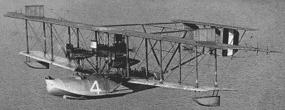
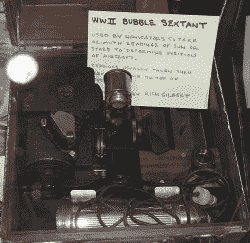
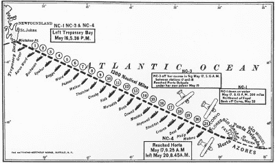

# 谁第一个飞越大西洋？1919 年的飞艇

> 原文：<https://hackaday.com/2021/07/22/who-flew-across-the-atlantic-first-the-airborne-boats-of-1919/>

航空史有点奇怪。人们倾向于记住一些第一次，但不记得另一些，有时甚至不记得第一次。例如，每个人都知道阿米莉亚·埃尔哈特试图成为第一个环球飞行的女性。她失败了，但你知道谁成功了吗？是杰瑞·莫克。第一个做的人怎么样？威利·波斯特，一个基本上被公众遗忘的名字。查尔斯·林德伯格是另一个很好的例子。他是第一个飞越大西洋的人，对吗？不完全是。真正的第一次跨大西洋飞行的故事是美国海军航空黑客的故事。

## 寻找一艘会飞的船

飞机真正开始于 1903 年莱特兄弟的飞行——尽管你可以为一些更早的飞行提供理由——到 1914 年，已经有了乘坐快艇横渡大西洋的说法。然而，当时的发动机并不可靠，飞机必须能够携带足够的燃料，以便在加油点之间飞行。这限制了起飞和降落地点的选择。

NC-4 Sea Plane with an Additional Engine for the Transatlantic Attempt

1914 年，一位英国慈善家让格伦·柯蒂斯建造了一艘翼展 72 英尺的飞行船，安装了三个引擎，并将其命名为*美国*。它本来是要飞越大西洋的，但是随着第一次世界大战的爆发，它再也没有出现过。

美国在战争期间也需要飞行艇，主要用于反潜战。1917 年，海军和柯蒂斯决定生产 NC 或海军柯蒂斯飞行艇，通常称为 Nancies。这在当时是一架大型飞机，长 69 英尺，翼展大约相当于波音 727 的 108 英尺。到 1918 年，第一艘 12 吨重的南希号进行了首航。

## 穿过波浪

A WWII-era Bubble Sextant

海军决定让三艘 NC 快艇穿越大西洋。当然，今天派一架飞机飞越大西洋不是什么大事，但在 1918 年，这相当于宣布你将在 1969 年登上月球。未来的总统和助理海军部长富兰克林·d·罗斯福是飞行想法的主要支持者。但是飞行只是这个更大难题的一部分。

李察·柏德，另一个你可能从历史中知道的名字，也参与了这个项目。他后来因极地探险而闻名，但在战争期间，他开发了工具和技术来改善水上航行。特别是，他和泡泡六分仪一起工作。当用六分仪测量时，船只使用地平线，但飞机需要不同的方法，因为它们被提升到水面以上，而不是在水面上找到自然水平。气泡六分仪为测量提供了自然地平线以外的另一种选择。

伯德还使用了漂移指示器，它利用地面上的参考点来确定飞机漂移了多远。这两者对试图穿越海洋的飞机都是有用的。虽然他并没有真正开始飞行，但他确实在计划中提供了帮助。

## 多好的计划

Map of One Leg of the Transatlantic Flight Path Shows Some of the Navigation Reference Ships

为了确保成功，海军在沿途大约每隔 50 英里部署了 61 艘船只，以帮助导航，并在必要时营救船员。当你想到在一条精确的路径上排列 61 艘船的物流时，这是令人惊讶的。

三艘快艇将参加比赛。第一信息通报、NC3 和第四信息通报。NC2 的机翼被拆下来修理另一架飞机。根据工程师查尔斯·奥姆斯特德(Charles Olmsted)开发的方程，这些飞机还得到了一个额外的发动机和超高效的螺旋桨。这些螺旋桨比传统的效率高 20%。所以你会认为有了这些支持，三架飞机会毫无困难地通过。但事情没那么简单。

这三架飞机于 1919 年 5 月 8 日离开洛克威(纽约市的一部分)飞往纽芬兰。NC-4 失去了两个引擎，不得不降落在科德角附近的海洋中。飞机像船一样航行了五个小时到达查塔姆的海军航空站。其他飞机在大约 9 个小时后着陆，但 NC-4 直到 5 月 14 日才赶上。媒体推测，实际上处于处女航的 NC-4 是一只跛脚鸭，将被抛在后面。

还有一个问题。所有三架飞机的新螺旋桨都在破裂。决定回到标准的。

## 离开纽芬兰

5 月 10 日，两架飞机 NC-1 和 NC-3 试图在没有 NC-4 的情况下起飞，但由于太重而无法离开水面。一旦 NC-4 重新加入三人组，他们在 5 月 16 日再次成功尝试。

导航仪器很差，但他们每隔 50 英里就有一列海军驱逐舰来照亮道路。NC-3 发生了电气故障，飞机脱离编队以避免撞上黑暗面。一旦雾变大，就很难看到对方或船只。然而，NC-3 中的飞行员看到了一艘不在航线上的驱逐舰，并认为这是引导他们去亚速尔群岛的船只之一，于是修正了航向。

最终，很明显他应该接近亚速尔群岛，但找不到下一艘船。飞机在汹涌的海浪中降落，冲垮了一个引擎支柱，导致 NC-3 飞机停飞。NC-1 也着陆试图定位，虽然没有损坏，但海面太高，飞机无法再次起飞，实际上结束了它的任务。

## 制作它

那就剩下 NC-4 这种差点没上手的跛脚鸭飞机了。它也是三架飞机中最快的一架。它穿过了迷雾，船员们在与迷失方向作斗争。他们通过无线电定位和航位推算知道他们已经接近目的地了。最后，雾中的间隙让他们瞥见了其中的一个岛屿，这个信息引导他们找到了一个合适的港口登陆。跛脚鸭成功了。

NC-1 的船员被一艘希腊货船带走了。它最终沉入了海底。然而，NC-3 失踪了几天。为了减轻重量，机组人员几乎拆除了飞机上的所有部件，包括无线电发射机。由于无法在汹涌的大海中起飞，机组人员用飞机的尾部作为船帆，并以尾部为起点航行了 200 多英里，驶向亚速尔群岛。虽然不是航空第一，但它是令人眼花缭乱的航海术。

## 忘记

NC-4 的机组人员——艾伯特·里德、沃尔特·辛顿、埃尔默·斯通、詹姆斯·布里斯、尤金·罗兹和赫伯特·罗德——都是好伙伴。也没人记得威利·波斯特或杰里·莫克。1919 年晚些时候，阿尔科克和布朗驾驶双翼飞机从纽芬兰飞往爱尔兰，赢得了 1 万英镑。几个星期后，一艘飞艇穿越了大西洋，甚至还搭载了一些乘客。

正如你在下面的视频中看到的 6:33 标记，里德和罗兹将在当代飞机上以更快的速度复制他们在 1949 年的飞行。还有 1919 年航班的新闻短片。

 [https://www.youtube.com/embed/pUSSfNFw8Fw?version=3&rel=1&showsearch=0&showinfo=1&iv_load_policy=1&fs=1&hl=en-US&autohide=2&start=394&wmode=transparent](https://www.youtube.com/embed/pUSSfNFw8Fw?version=3&rel=1&showsearch=0&showinfo=1&iv_load_policy=1&fs=1&hl=en-US&autohide=2&start=394&wmode=transparent)

我们为什么要记住查尔斯·林德伯格？嗯，他直飞，降落在欧洲大陆。其他人都像 NC-4 一样从一个地方跳到另一个地方。他还受益于巨大的压力，公众对飞行的不同看法，以及他独自飞行。他的孩子在飞行后被绑架的悲剧也巩固了他作为公众人物的地位。然后，他也是一个发明家，但世界似乎在很大程度上忘记了这一点。

之前，我们谈到了[技术无畏](https://hackaday.com/2021/05/25/technical-audacity-and-the-phone-book/)。驾驶一架 20 世纪 20 年代的飞机飞越大西洋似乎是合格的。那些早期的先驱们开发了技术并吸取了教训，这将有助于使越洋飞行很快成为平常事。然而我们几乎不记得他们是谁。