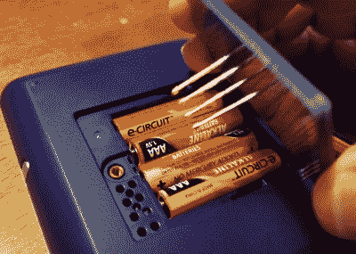

# 智能响应 XE 转口袋基本游乐场

> 原文：<https://hackaday.com/2021/06/29/smart-response-xe-turned-pocket-basic-playground/>

自从智能响应 XE 在 2018 年引起我们的注意以来，我们一直在密切关注利用 Arduino 兼容教育小工具的项目。诚然，社区真正开始挖掘 QWERTY 手持设备的功能比我们预期的时间要长一些，但我们偶尔会看到类似于[这种对[Dan Geiger]【T1]的智能响应 XE 的基本移植的努力，这提醒了我们为什么一开始就对这款设备如此感兴趣。](https://www.instructables.com/SMART-Response-XE-Tiny-Basic-Port/)

 这个项目结合了【拉里银行】的 [SMART Response XE 支持库和 Tiny BASIC Plus，后者本身就是【迈克尔菲尔德】对 Arduino 基本端口的更新。最终的结果是一个有趣的小基本手持设备，它具有你所期望的所有特性和功能，加上[丹]添加的几个设备特定的命令，如检查电池电压的`BATT`和将基本程序保存和加载到 EEPROM 的`MSAVE` / `MLOAD`。](https://hackaday.com/2018/09/08/smart-response-xe-gets-wireless-bootloader/)

为了将基本解释器安装到您自己的 SMART Response XE 中，[Dan]使用 AVR ISP MkII 和焊接到一点 perboard 上的几个 pogo 引脚，完成了将其刷新到硬件的过程。设备的电池门下面有孔，可以暴露 PCB 上的编程焊盘，所以你甚至不需要打开外壳。虽然如果你*愿意*打开箱子，你也可以[添加一个 CC1101 收发器，这样这个方便的小设备就可以兼作频谱分析仪](https://hackaday.com/2019/10/22/a-spectrum-analyzer-for-the-smart-response-xe/)。

 [https://www.youtube.com/embed/yD2hqngGI6U?version=3&rel=1&showsearch=0&showinfo=1&iv_load_policy=1&fs=1&hl=en-US&autohide=2&wmode=transparent](https://www.youtube.com/embed/yD2hqngGI6U?version=3&rel=1&showsearch=0&showinfo=1&iv_load_policy=1&fs=1&hl=en-US&autohide=2&wmode=transparent)

