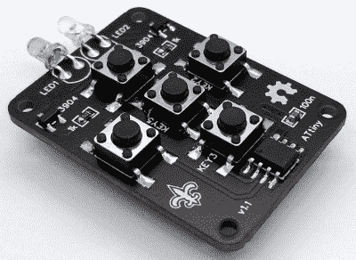

# 由 ATtiny13A 供电的 OSHW 红外遥控器

> 原文：<https://hackaday.com/2021/07/02/an-oshw-ir-remote-control-powered-by-the-attiny13a/>

消费电子产品中的新热点可能是基于蓝牙低能耗等协议的射频遥控器，但传统的红外遥控器仍有很长的寿命。尤其是像来自[Stefan Wagner] 的 [TinyRemoteXL 这样的项目，它可以让你构建和编程一个你自己的 IR“点击器”。无论你是想打造自己的定制通用遥控器，还是想打造 TV-B-Gone 的升级版，这种开源努力都是一个很好的起点。](https://github.com/wagiminator/ATtiny13-TinyRemoteXL)

The original TinyRemote.

正如你可能已经从名字中猜到的那样，这个项目实际上是[Stefan]以前组装的 tiny remote 的一个更大版本。该项目的文档更深入地探讨了对话 IR 的具体细节，如果您对底层内容感兴趣的话，绝对值得一读。对于最初的五按钮 TinyRemote，硬件只包括一个 ATtiny13A 微控制器、一对 IR LEDs 和驱动它们的晶体管。

但在 XL 上，事情有点棘手，因为现在有 12 个按钮供 ATtiny13A 读取。显然，没有足够的引脚来直接读取这么多按钮，但通过 BAS16TW 二极管阵列和电阻的组合，[Stefan]能够使用芯片的中断引脚和 ADC 检测到按下了什么按钮。这当然是一个方便的技巧，这个项目的开源性质给了你一个很好的机会来看看它是如何实现的。

在这个项目和最近发布的令人印象深刻的开发板(Djordje 曼迪克)之间，我们似乎看到了红外黑客的复兴。今年早些时候，我们甚至看到了配备 IR 的 ESP8266 板的[商业发布。](https://hackaday.com/2021/04/23/this-esp8266-dev-board-has-a-surprising-story-behind-it/)