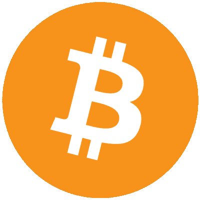
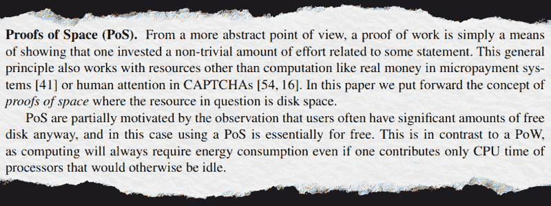
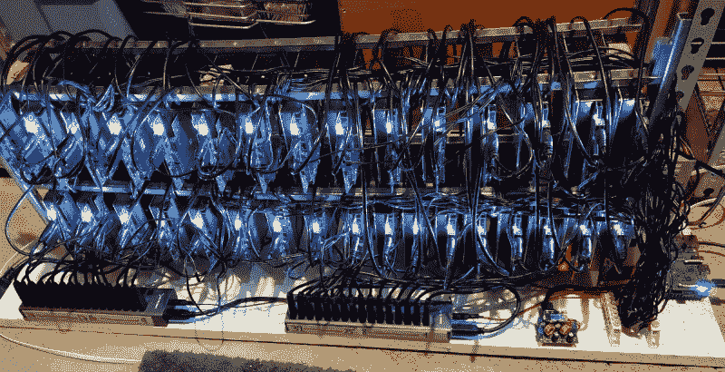
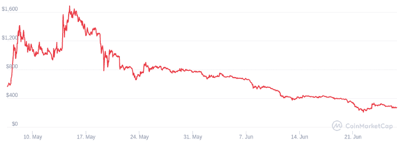

# 什么是 Chia，为什么它会吃掉所有的硬盘？

> 原文：<https://hackaday.com/2021/07/07/whats-chia-and-why-is-it-eating-all-the-hard-drives/>

在这一点上，普通黑客读者可能熟悉所谓的“工作证明”(PoW)加密货币，如比特币、以太坊和 Dogecoin。用最基本的术语来说，这些加密货币允许用户通过向网络贡献计算能力来赚钱。不幸的是，你的标准桌面 CPU 已经过了移动足够多的比特来获得任何有价值的东西的时候了。寻求盈利的个人因此求助于构建高端显卡阵列，明确目的是“挖掘”他们选择的加密货币。

 这些矿工，加上持续的芯片短缺，已经蹂躏了 GPU 市场。任何一个最近在考虑建造或升级电脑的人都会知道，新的显卡供不应求，即使是原本会被视为预算选项的旧型号，价格也高得离谱。为了安抚他们的核心客户， [NVIDIA 甚至推出了没有视频输出的加密货币专用卡](https://blogs.nvidia.com/blog/2021/02/18/geforce-cmp/)。希望专业矿工会购买这些加密货币挖掘处理器(CMP)而不是传统的显卡，从而腾出后者供游戏玩家购买。但是由于 CMPs 的有限可用性和相对较高的成本，他们几乎没有改善这种情况。

现在，如果你不用电脑玩游戏，这似乎是一个遥远的问题。你甚至可以被原谅认为这只不过是两个互相争斗的无聊的追求。毕竟，在一个仍然将几十年前的 Thinkpads 作为便携式计算的高水位标志的社区，对尖端显卡的某种矛盾心理可能是可以预料的。

但是，一种新形式的加密货币正在兴起，它威胁的不仅仅是铁杆游戏玩家。对于“空间证明”(PoS)加密货币，它不是关于拥有最快的 CPU 或最高数量的 GPUs 交易的商品是存储空间，拥有最多硬盘的玩家获胜。

## 中国的崛起

从概念上讲，PoS 加密货币已经存在了一段时间。这个想法最初是由 Stefan Dziembowski、Sebastian Faust、Vladimir Kolmogorov 和 Krzysztof Pietrzak 在 2013 年的论文*“空间的证明”* 中提出的，该论文后来在 2015 年的第 35 届国际密码学大会上发表。这篇论文的核心论点是，权力货币本质上是浪费的，因为它们消耗处理能力才能发挥作用，并指出批评者已经预测比特币将是一场环境灾难。相比之下，闲置的计算机和运行假设的 PoS 软件的计算机之间的能耗差异可以忽略不计。此外，他们推断计算机已经有大量未使用的磁盘空间可以提供给网络。

基于*“空间的证明”*中提出的概念，确实出现了一些加密货币，但在 2017 年 Chia 网络成立之前，它们都没有真正流行起来。至少部分得益于渴望涉足区块链科技的投资者，[这家初创公司今年 5 月的估值达到了 5 亿美元](https://www.bloomberg.com/news/articles/2021-05-24/blockchain-startup-chia-nabs-500-million-valuation-eyes-ipo)。由 BitTorrent 开发者布拉姆·科恩创建的 Chia 文档在很大程度上倾向于这样一种观点，即它是比特币的“绿色”替代品，既不需要高性能计算机，也不需要任何设备，如果你对 Chia 不再感兴趣，这些设备就不能轻易重复使用。正如在他们的 FAQ 中所解释的，没有什么可以阻止你从你的驱动器中删除 Chia 数据，并将它们用于常规文件存储。

至少在理论上，中国似乎是更环保的选择。想想看，像 GeForce RTX 3080 这样的现代高端显卡在全速运行时可以轻松获得超过 300 瓦的功率，而即使是最耗电的固态硬盘也只有 8 瓦。当然，这并没有考虑到硬件的成本，或者每种资源的相对价值，这些价值是由它们各自的加密货币来衡量的。但是，如果你唯一关心的是你的系统消耗多少瓦特，你可以在它们接近现代 GPU 消耗之前旋转 20 或 30 个固态硬盘。

## 农场生活

术语“挖掘”对于加密货币的工作证明是有意义的，因为你正在努力解锁一些有价值的东西。但在 Chia 的说法中，那些希望将自己的存储空间奉献给网络的人被称为“农民”；因为在初始设置之后，它基本上变成了被动活动。用户只需照料他们的农场，在这种情况下，这意味着保持一组磁盘驱动器通电并得到适当维护，然后等待发芽。

在一个完美的世界里，你可以简单地将你的太空证明软件指向一个空的硬盘驱动器，并因此而获得荣誉。但在实践中，这样一个简单的系统容易受到欺诈。因此，如果你想把你的驱动器专用于 Chia，软件需要定期验证它们没有被用于其他用途。当一个驱动器首次联机时，Chia 软件将通过用加密数据填充未使用的空间来“绘制”它。然后，当区块链广播一个挑战，农民的驱动器将被扫描，谁有最接近的匹配哈希将得到奖励。

因为它本质上像彩票一样运作，所以增加您获得匹配哈希并获得 Chia 作为回报的机会的最佳方式是向您的服务器场添加更多存储。好消息是经营一个农场不需要任何强大的计算能力。事实上，[Chia 文档建议使用一台单板计算机](https://github.com/Chia-Network/chia-blockchain/wiki/Reference-Farming-Hardware),如 Raspberry Pi 4 或 ROCK Pi，以及一系列 USB 驱动器来管理您的数字作物。

Chia reference farming setup, using 32 HDDs and a ROCK Pi 4

那么一个人需要多大的农场才能在 Chia 上赚钱呢？有许多变量，其中许多每天都在变化，但简单的答案是，仅一个图占用 100 GB，您将需要*许多*驱动器才能看到任何显著的回报。在撰写本文时，Chia 计算器显示， [100 TB 阵列按照当前价格每月可以带来 240 美元的收入](https://chiacalculator.com/)。但是，由于涉及到一定的运气因素，你在现实世界中的结果绝对会有所不同。

## 事情变得复杂了

显而易见，Chia 越来越受欢迎会带来怎样的问题。建立一个农场并不需要尖端的显卡，只有相对较少的计算机用户可能首先购买这种显卡；它需要像 USB 集线器和外部硬盘驱动器这样我们都认为理所当然的常见硬件。激增的 Chia 甚至可能限制单板计算机的可用性，这将比任何人都更影响黑客和社区。到目前为止，短缺仅限于高容量企业级驱动器，但不难想象这将如何扩展到消费类硬件。

那是因为 Chia 有一个肮脏的秘密。虽然耕作在很大程度上是被动的，但创建最初的 100 GB“地块”的过程绝不是这样。创建加密哈希不仅需要相当强大的计算机，而且将它们写出来会使目标驱动器本身承受巨大的压力。为了解决这个问题，农民已经开始在较小的固态硬盘上创建他们的地块，然后在完成后将它们转移到更高容量的企业驱动器上进行长期存储。在这种配置中，固态硬盘被视为一种可消耗的资源，一些报告[声称只需几周时间就可以烧穿一个标准的消费硬盘](https://www.tomshardware.com/news/chia-crypto-farming-can-destroy-ssds)。

对驱动器的需求是真实的。希捷的一名代表最近证实，制造商正在探索 Chia 专用驱动器的想法，但没有详细说明这将需要什么。尽管英伟达遏制矿工的努力收效甚微，但很难想象它会有多大改变。除非加密货币定制的硬件比传统选项更便宜，更容易获得，否则农民和矿工不会努力转换。

## 市场波动

也不全是坏消息。虽然在一段时间内，那里的情况看起来确实很糟糕，但似乎更冷静的头脑可能会占上风。当 Chia 的价格在 5 月份飙升到 1600 美元多一点时，人们疯狂抢购硬盘，但到了 6 月 1 日，价格降到了 700 美元左右。如今，它的价格约为 280 美元。

Chia’s value has tumbled since its mid-May peak. Source: [CoinMarketCap](https://coinmarketcap.com/currencies/chia-network/)

从数据来看，Chia 似乎已经没有什么用了。除非其价值很快反弹，否则潜在农民的投资回报就不存在了。为什么要花几千元赚几百？考虑到奖励系统类似彩票的性质，甚至有可能你什么都不会得到。

运气好的话，也许可怕的硬盘末日会与我们擦肩而过。考虑到我们已经要应付多少短缺，我们当然可以休息一下。但正如我们在其他加密货币中看到的那样，埃隆·马斯克的一条推文可能会让中国在一夜之间扭转乾坤。所以也许现在买几个备用硬盘并不是最糟糕的主意。