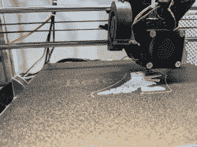
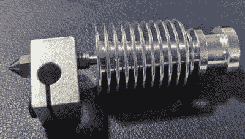
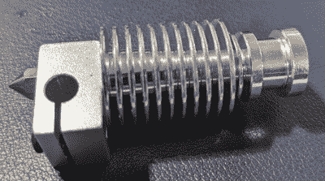
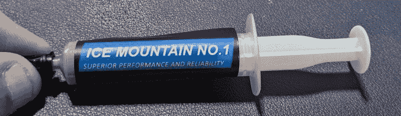

# 本周失败:金属热端升级

> 原文：<https://hackaday.com/2021/07/29/fail-of-the-week-the-metal-hot-end-upgrade/>

我的儿子帕特里克已经不止一次地观察到我不喜欢 3D 打印。这听起来可能有点奇怪，因为我早在 2012 年就造了一台打印机，从那以后我已经造了很多台打印机，目前我的实验室里至少有三台。但是 Patrick 正确地认识到我实际上并不喜欢打印我需要的东西。我真正喜欢的是建造、修理，更重要的是改进打印机本身。如果你正在阅读 Hackaday，你可能知道那是怎么回事。这是一个升级变坏的故事，虽然结局足够幸福。如果你曾经考虑过从传统热端转向全金属热端，你可能想听听我的意见，也许我可以帮你省去一些麻烦。

几年前，我以非常低的价格买了一台 Anet A8。对于打印机来说，这已经足够了。不错，但不惊人。但它是一台有趣的打印机，因为你真的需要在它身上做一些工作来支撑丙烯酸框架并修复其他缺点。我在相对较短的时间内愉快地改进了打印机，我还买了一堆铝挤压件来重建框架，以符合你可以在 Thingiverse 上找到的 [AM8 计划。](https://www.thingiverse.com/thing:2263216)

## 一辆 AM8 诞生了

The All Metal Hotend in Action Finally!

但是生活就是这样，那盒挤压制品在架子上放了几年。寻找一个疫情的项目，我决定是时候冒险了，结果非常好。打印机上有一个坚固的金属框架确实使它成为了一台世界级的打印机。除了一件事。

A8 上的挤出机——实际上是整个 X 装配——在 AM8 上并没有真正改变。我对挤压机做了一些非常简单的改动，但是大部分都是原料，这很痛苦。挤出机是在 U 形金属框架中的 NEMA17 步进机，常规挤出机用螺栓固定在其上。一个风扇完全覆盖了挤出机，加热螺杆直接进入底部，然后是加热块和喷嘴。

我已经[移动风扇进入](https://www.thingiverse.com/thing:1749614)，这是大多数 A8 的人都会做的事情。然而，这东西是一个痛苦的加载和冷却不太大的热休息，堵塞是合理的常见，如果不是像你可能期望的那样常见。然而清除堵塞是相当痛苦的。

## 新型挤出机

我知道很长一段时间，我想把一些更好的地方，我有几个山寨 E3D V6 热端坐在周围。像挤压型材一样，它们已经存放了几年。我印了一个装裱，效果很好。一旦成功，我重新设计了底座，装上克隆泰坦挤压机，用鲍登管喂它。

太棒了！易于装载，很少堵塞，任何堵塞都很容易修复。是时候收工了，对吧？当然不是。我只需要再做一个改变。

## 全金属

如果你以前没有拆开过热端，一般的流程是塑料进入散热器。然后它通过一个叫做热障或咽喉的小管。该管试图将热端的热部分与朝向喷嘴的灯丝隔离。热中断的远端与加热块内的喷嘴对接，加热块是一个金属块，用于固定加热元件和热敏电阻。理想情况下，长丝在离开热障并进入喷嘴之前熔化。

Hot End before Tightening; note heat break between heat sink and block

Hot End after Tightening; heat break is no longer visible

正常的热障内部有聚四氟乙烯，即使它变得有点软，也能保持细丝在轨道上。然而，在 250C 以上的温度下，聚四氟乙烯管可能会破裂，因此它们也只在金属中产生热量。一个正常的金属热断路器将是非常薄的不锈钢，但你也可以得到一些由钛或甚至一些使用两种不同的金属。下面的视频展示了两种常见酒店的组装指南。

 [https://www.youtube.com/embed/dTKyOTalpy4?version=3&rel=1&showsearch=0&showinfo=1&iv_load_policy=1&fs=1&hl=en-US&autohide=2&wmode=transparent](https://www.youtube.com/embed/dTKyOTalpy4?version=3&rel=1&showsearch=0&showinfo=1&iv_load_policy=1&fs=1&hl=en-US&autohide=2&wmode=transparent)

所以，很明显，全金属的酒店会更好，对吗？也许不是。这取决于你想做什么。虽然全金属的 hotend 可以让你提高温度，但它们也有自己的问题。首先，有些塑料确实想粘在金属上。这对于收回来说尤其成问题。第二，如果热量爬上热障，它可能会提前融化，这也可能导致堵塞和挤压不足。

如果你不需要 250C 以上的温度，你可以考虑不要换成全金属的。但是当然，我想要那个温度范围，我做到了。这导致了一个谜，就像许多神秘的故事一样，罪魁祸首将是一个短暂瞥见的次要玩家。

## 起初…

首先，我把一个普通的不锈钢热障与新的喷嘴。它带有一个小的热化合物包层，我用在了热敷的冷端。打印机几乎马上就会卡住。请记住，与旧喷嘴和热打破，一切都很好。

热障应该具有尽可能小的导热性，以便灯丝在进入加热块之前不会熔化。通常，管子很薄，因为它传导的热量较少。出于某种原因，没有聚四氟乙烯的新热障卡得很厉害。

堵塞似乎发生在收缩时。关闭收缩功能有效，但留下了非常粗糙的指纹。我试着减少收缩，但无论我下得多低，热端都会卡住。当我把灯丝拉回来时，它会有一个蘑菇状的头阻止它再次进入热障。

3D 打印机上的一切似乎都是相互关联的。所以我把 30 毫米散热风扇拿掉了——毕竟是廉价克隆——换上了一个本来流量更大的 40 毫米风扇。我用[一个打印的适配器](https://www.thingiverse.com/thing:2748800)把它组装起来。似乎没什么帮助。

我还订了一个钛热敷。钛的导热性更差，所以理论上，它应该能使热端的冷部分更冷。这似乎也不太管用，而且我的热贴快用完了。

## 解决方法

因为我有这么少的热粘贴，我想使用一些 CPU 化合物。但是，查了一下我所拥有的，最高温度有点低。然而，经过思考，我意识到，无论如何，热中断的冷端不应该像喷嘴一样热，所以它应该是可行的。

仅将化合物涂在上部螺纹上的想法是，您故意想要阻止热量从加热块传递到热断点。但是，无论热量如何进入裂口，你都要以最快的速度传递到散热器。

一种叫做“冰山 1 号”的新型热粘贴物成功了。我不知道通用的白色膏体是旧的还是质量太差。冰山是一些碳/硅化合物，似乎工作得很好。不再有堵塞或热蠕变。

## 蝴蝶效应

这是一个很好的例子，说明了 3D 打印中几乎每个设置和组件都是相互关联的。新的热端需要调整床高、流动温度和回缩设置。它还要求热端部件之间有足够的热传递。

最后值不值？只是对于解放军来说，很可能不是。然而，现在我准备用不同的细丝做实验，PLA 打印看起来做得很好。

下一步是什么？也许[多重挤压](https://hackaday.com/2015/11/18/diamond-hotend-opens-the-color-gamut-for-3d-printing/)？如果你真的想测试你的酒店和知识，试试[复活一台被虐待的机器](https://hackaday.com/2020/02/10/bringing-a-swap-meet-3d-printer-back-from-the-dead/)。