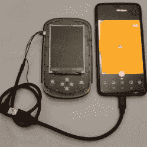

# 黑入热成像仪以实现热传感器的双重用途

> 原文：<https://hackaday.com/2021/07/04/hacking-a-thermal-imager-for-dual-use-of-the-thermal-sensor/>

有时候一个设备并不能完全满足你的需求，在这种情况下，一点点改动就能达到目的。这就是为什么[能够从 HTI HT-A1 热像仪](http://www.blog.zapro.dk/?p=547)记录视频，尽管该设备实际上不支持该功能，这要归功于仔细的调查和保修违规。

Plugging in a custom USB cable allows a mobile phone app to access the thermal sensor, while the host device itself remains ignorant.

[我们过去已经看到过 HT-A1](https://hackaday.com/2018/11/07/teardown-of-a-relatively-cheap-thermal-camera/) 的拆解，结果是 Seek——该设备内部实际热传感器的制造商——[为他们的模块发布了 OEM 开发套件](https://www.thermal.com/oem.html)和手机应用程序。这是否意味着可以通过开发套件应用程序访问 HT-A1 的原始传感器模块？一根被黑在一起的 USB 线后来显示答案是肯定的！该应用程序不仅允许查看热成像，还可以录制视频(HT-A1 本身不支持的功能)。)

但是，即使 HT-A1 不允许记录，作为一个带屏幕的手持热传感器，它仍然以自己的方式非常有用，如果只是为了一个原始的传感器模块而毁掉这个单元，那将是一种耻辱。最终最好的解决方案是将传感器放回 HT-A1，并安装一些开关电路来断开传感器与 HT-A1 CPU 的连接，并根据需要将其数据转移到 USB 插头。这意味着 HT-A1 可以正常使用，但通过在设备关闭时插入定制的电缆，热传感器可以通过手机应用程序访问。两全其美。你可以在下面看到一个简短的庆祝热猫视频，证明它的工作。

 [https://www.youtube.com/embed/His8tXQrNY4?version=3&rel=1&showsearch=0&showinfo=1&iv_load_policy=1&fs=1&hl=en-US&autohide=2&wmode=transparent](https://www.youtube.com/embed/His8tXQrNY4?version=3&rel=1&showsearch=0&showinfo=1&iv_load_policy=1&fs=1&hl=en-US&autohide=2&wmode=transparent)

