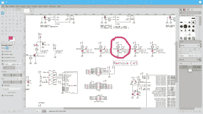

# Linux Fu:企鹅的 PDF

> 原文：<https://hackaday.com/2021/07/06/linux-fu-pdf-for-penguins/>

PostScript 最初是一种打印机编程语言。虽然 PostScript 打印机仍然是一种东西，但有许多其他方法可以将数据发送到打印机。但是 PostScript 也产生了可移植文档格式或 PDF，并且取得了巨大的成功。几乎每天你都会在电脑屏幕上看到某种 PDF 文档。当然，也有其他竞争格式，但与 PDF 相比，它们只占有很小的市场份额。在 Linux 下查看 pdf 没问题。但是编辑它们呢？事实证明，这也很容易，如果你知道怎么做的话。

## GUI 工具

[](https://hackaday.com/wp-content/uploads/2021/06/gimp.png)

你可以使用很多工具来编辑 PDF 文件，但是关键是效果会有多好。任何东西都可以做到这一点:LibreOffice Draw，Inkscape，甚至 GIMP。如果你想做的只是用白盒删除一些东西或者做一个注释，这些工具通常很好，但是对于更复杂的变化，或者像素完美的输出，它们可能不是正确的工具。

最大的问题是，这些工具大多把 PDF 作为一个图像，或者至少是一组对象来处理。例如，文本列可能会变成一组离散的行。更改导致换行的内容将需要您更改所有其他行以匹配。有时文字甚至根本不是文字，而是图像。这很大程度上取决于创作者如何开始制作 PDF。如果你不介意使用基于网络的工具，[pdfescene](https://www.pdfescape.com)是免费的，而且非常好用。其他选项包括 Scribus 和 Okular。这两种工具都不能真正编辑文件，但可以将它们作为图像导入，以便进一步操作。例如，Okular 的查看模式可以添加像高亮和手绘线这样的注释。

不出所料，如果 emacs 在 x 下运行，它可以显示 PDF 文件。您可以使用 Control+C Control+C 来切换查看文本表示。毕竟，大多数 PDF 文件格式是文本，emacs 甚至可以处理二进制文件。因此，如果你不介意在 PDF 格式中工作——非常像 PostScript——你可以在 emacs 或其他文本编辑器中进行编辑。

有一些专门的非自由编辑器，至少有一个[开源 PDF 专用编辑器](https://sourceforge.net/projects/pdfedit/)。当然，像 Linux 中的大多数东西一样，您也可以使用命令行。

## 隐藏文本

将 pdf 作为文本处理的问题是——即使是在 emacs 中——它们通常是压缩的并且不可读。例如，单词可能一次出现一个字符，由格式化代码或其他数据分隔。因此在 PDF 中搜索任意文本可能不起作用。

您可以转换文件以使用更多未压缩的文本，尽管这不是万灵药。例如，如果您打开业余无线电台的一篇文章中的这一段，并想更改单词“convention”，很难说出该文本的确切位置，但它在这个大致区域的某个地方:

```
3 0 obj << /Length 14770 /Filter /FlateDecode >> stream
H�|Wɒ�8��+p$gJ,�c��v�cS�Ҍc��J�$���\ZV�����\0�� �CTR�������r��[�}�7}����|��������I5u���`M�>�/��?l�.8�@��gBzq�r!#�%� AE�� �˜ ᥉��x!$��X8^%$��A�D�B���(���b�[H �>����#��{a���e0$^H&|/����U1$^��#��/�G�Us��/"/��\ <i�'qC���$xe�"X�x22�������G��F�Lp]Mnm�$] #TI��G�q�l��'3;!���!+�ȷ�{䕀���
��b��Qja����Q i� GRn�\0�g;L����x�Zܿ㌳�n�2�R& :"x�r�ky�[JPK��/���S��i��������]r�F�p����k�� |���
QI�mx>1�\�1�Q��y)ХǺ�Z�U.^�](pN��dx����;�֬;d�_�{˪�cYa�\�.t�s�}�ْ{<\0ZW�:�Ȅ�Oɴ��cS�UzluP�֨o}ި��Uqf��o��V��bT%mj|��t����;v�{s�Rj˺���

```

祝你在汤里找到它。你想把它转换成未压缩的文本。

```
qpdf -qdf input.pdf output.txt
```

结果文件实际上是一个 PDF 文件，尽管我把它命名为. txt。但是，它把所有东西都解压了。虽然这仍然不太好，但至少你可以找到你需要改变的部分:

```
1.2632 -1.1242 TD
0.0739 Tc
0.1263 Tw
(One potentially confusing Stamp)Tj
-1.2632 -1.1368 TD
0.026 Tc
0.1248 Tw
[(con)38.6(v)20.7(ention is that the I/O pin numbers)]TJ
0 -1.1242 TD
0.0262 Tc
0.0072 Tw
[<646f6e90>13.6(t correspond to the IC pin numbers.)]TJ
T*
```

例如，再次祝你搜索单词“convention”好运。但还是比第一个例子好。使用/Author 和/Title 之类的东西，甚至可以在未处理的文件中找到元数据。

## 命令行魔术

`qpdf`工具可以将一个 PDF 文件转换成另一个 PDF 文件。它可以优化网络服务、文本编辑的输出，还可以做一些简单的事情，如删除页面或合并多个文件。您可以阅读[文档](http://qpdf.sourceforge.net/files/qpdf-manual.html)，但是这里我们使用 QDF 模式生成一个合法的 PDF 文件，其中所有对象都按数字顺序排列，并使用普通的 Unix 风格的行尾。这允许您更容易地用文本编辑器编辑文件，但是正如您所看到的，这并不总是使它变得简单。删除整个对象是一件令人头痛的事情，但是如果您删除了所有提到的对象，那么您可以运行 fix-qdf 来重新创建正确的 qdf 文件。

对 PDF 文件进行常见编辑的另一种方式是使用 [PDFtk 服务器](https://www.pdflabs.com/tools/pdftk-server/)(没有服务器名字的 PDFtk 是一个用于 Windows 的 GUI 工具包)。使用 PDFtk，您可以合并或拆分文档、旋转页面以及执行许多其他常见任务。例如，要按顺序连接两个文件:

```
pdftk in1.pdf in2.pdf cat output output.pdf
```

你可以省略，比如说，第 9 页:

```
pdftk in1.pdf in2.pdf cat 1-8 10-end output output.pdf
```

您也可以按不同的顺序随机排列合并的页面:

```
pdftk A=in1.pdf B=in2.pdf shuffle A B output output.pdf
```

## 文本到 PDF 并返回

如果你想从命令行把文本转换成 PDF，你有几个选择。Pandoc 是一个神奇的工具，可以将 markdown 转换成几乎任何东西。它不仅可以将 markdown 转换成 PDF 格式，还可以转换成其他格式。

您还可以使用各种组合的 [ps2pdf](https://web.mit.edu/ghostscript/www/Ps2pdf.htm) (以及一个生成 PostScript 的工具)、pdf 2 text([poppler-utils](https://poppler.freedesktop.org)的一部分)或 [Ghostscript](https://www.ghostscript.com) 来创建 pdf 或从中提取文本。Ghostscript 可以做很多事情，包括将 PDF 转换为多种图像格式，例如，如果您想将它们作为图像显示在网页上。

## 特殊打印和其他工具

[](https://hackaday.com/wp-content/uploads/2021/06/printer.png) 有时候你想修改一个 PDF 文件，让它以某种方式打印出来。例如，我们已经讨论了如何合并奇数页和偶数页，但是您可能需要一些其他命令来实现这个目的:

*   [pdf xup](http://manpages.ubuntu.com/manpages/bionic/man1/pdfxup.1.html)–使用 pdflatex 和 Ghostscript 在一个打印页面上放置多页(例如，2 合 1)
*   `pdfjam`–使用 LaTeX 将文档放在不同尺寸的页面上，或在一张打印页上生成多页
*   `pdfposter`–从一页创建多页大输出

如果你喜欢贵由，可以去看看 PDFsam basic 。如果你对 Java 软件感兴趣，有[多价](http://multivalent.sourceforge.net)。

## 包裹

像往常一样，在 Linux 中有很多方法可以完成日常任务。有时候，挑战不是做工作，而是找到最适合你工作风格的工具。

奇怪的是，pandoc [因为不同的原因不断出现](https://hackaday.com/2017/05/23/stupid-git-tricks/)。如果你喜欢纸质文件，你需要一台打印机和[装订夹](https://hackaday.com/2012/07/16/dealing-with-the-horrors-of-pdfs-by-binding-your-own-books/)。