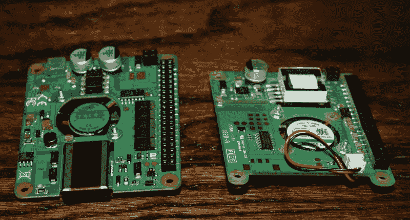
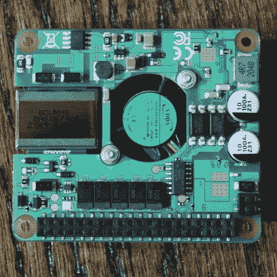
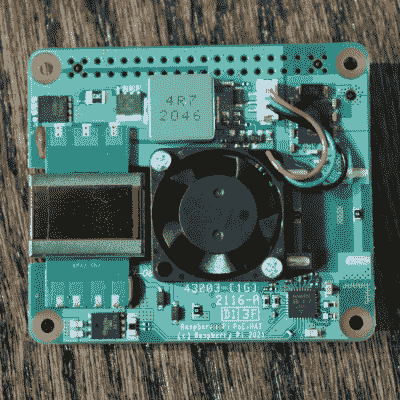
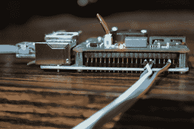

# 戴上树莓皮 POE+帽子

> 原文：<https://hackaday.com/2021/07/14/hands-on-with-the-raspberry-pi-poe-hat/>

圆周率的世界里发生了很多事情。就在我们认为树莓派基金会要休息一下的时候，他们宣布为派 B3+和派 4 推出一款新的 PoE+帽子(硬件附在顶部)，就在预订开始时，我下了订单。

现在我知道你在想什么，我们不是已经为支持 PoE 的个人用户提供了 PoE 帽子吗？是的， [Pi PoE 帽子早在 2018 年](https://www.raspberrypi.org/products/poe-hat/)就发布了，虽然它存在一些问题，但通过召回和小的重新设计，这些问题都得到了解决。从那时起，我们都很高兴地使用这些帽子来提供高达 2.5 安培的 5 伏 Pi，但警告 USB 端口被限制为 1.2 安培的电流。

$20 for either of them. Choose wisely.

Raspberry Pi 4 出现了，突然电路板本身在负载下可以超过 7 瓦。加上一两个饥饿的 USB 设备的 6 瓦功率，我们已经超过了标称的 12.5 瓦功率预算。因此，一些试图将 Pi 4 与 POE 配合使用的用户在通过 USB 为双 SSD 驱动器供电时遇到了电源问题。显而易见的解决方案是让 PoE 帽子提供更多的功率，但最初的帽子已经达到了 PoE 可以提供的 802.3af 的极限，最大功率输出为 12.95 瓦。

Raspberry Pi 基金会提出的解决方案是生产新产品 PoE+帽子，并以同样的 20 美元价格与旧帽子一起销售。802.3at 的俗称是“PoE+”，它是专门为更高功率的设备设计的，最大功率为 30 瓦。PoE+ HAT 的官方额定输出功率为 20 瓦，5 伏 4 安培。这些是输出统计数据，因此效率数据不会计入您的电力预算，内置风扇也不会。

## 比我们预想的要多

官方规格没有告诉完整的故事，证明了最初的声明，声称 5 安培，而不是 4 安培。这种差异让我够烦的了，我联系了他本人，首席执行官(Eben Upton)。头儿证实:

> 规格是它将提供 20W，但它被设计为 25W，以给我们一些工程余量

因此，如果你想超级保守，并确保尽可能长的寿命，保持你的功耗在 20 瓦或以下。我测试了这顶帽子，测试到它放弃的程度，为了不泄露秘密，25 瓦还是有点保守。稍后会详细介绍。

我们知道这里有很多可用的能源，但要得到它们并不容易。例如，Pi 4 可以通过 USB 端口推动高达 [1.2 安培的功率。在 5 伏电压下，只有 6 瓦的功率，其余的在哪里？理论上有一个简单的答案，因为帽子通过 5v 的 GPIO 引脚提供电源。我们所需要做的就是跳到那些针上……那些针根本不会从帽子里伸出来。](https://www.raspberrypi.org/documentation/hardware/raspberrypi/power/README.md)

Really an amateur job, but it works!

我很想看到一个官方的解决方案，让 GPIO 引脚可以戴上帽子，而不是一个不雅的解决方案，比如使用那些为最初的 PoE 帽子推荐的做作的引脚扩展器。那我们被识破了吗？没有。你看，在 Pi 和帽子之间有一个 1/4 英寸的 GPIO 引脚。这只是足够的空间，一个良好的老式绕线连接，以及一些安全的焊料。

好了，现在我们可以使用超过 6 瓦特的能量了。有两个明显的问题:有多少能量，我们能用它做什么？为了一石二鸟，我拿了一串 RGB 发光二极管，将电源直接连接到 5v 的轨道上。PoE+帽子有一个很棒的功能，它增加了一个系统节点，告诉你帽子提供了多少电流。`cat /sys/devices/platform/rpi-poe-power-supply@0/power_supply/rpi-poe/current_now`

为了测试这顶帽子，我发明了一种新的测量单位，赛博朋克霓虹紫像素。我使用 PoE+ HAT 来测量 Pi 和像素消耗的功率，还记录了 PoE 开关报告的功率使用，并使用非接触式 IR 温度计在 LED 灯条通电几分钟后找到帽子上的最热点。

> 我发明了一种新的功耗单位:赛博朋克霓虹紫色发光二极管。这是 100 CNPs。[pic.twitter.com/aiNEiwfNDc](https://t.co/aiNEiwfNDc)
> 
> —乔纳森·本内特(@ jp _ Bennett)[2021 年 7 月 5 日](https://twitter.com/jp_bennett/status/1412191308958113793?ref_src=twsrc%5Etfw)