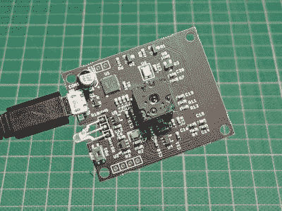
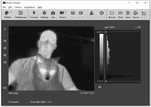
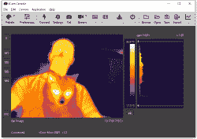
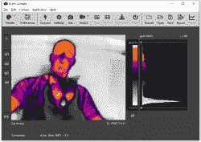
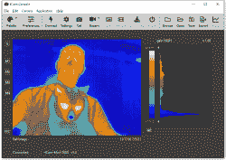
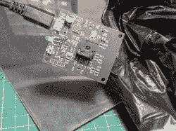
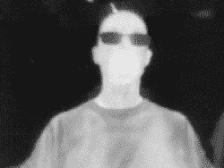
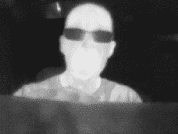

# 动手复习:TCam-Mini WiFi 热像仪

> 原文：<https://hackaday.com/2021/07/27/hand-on-review-tcam-mini-wifi-thermal-imager/>

热感相机是我一直想添加到我的工作台中的一个工具，所以当我了解到 Dan Julio 的无线热感相机 tCam-Mini 时，我下了订单。热像仪是一种摄像机，它的图像代表温度，可以很容易地看到热点和冷点，或者读取摄像机视野内任何一点的温度。tCam-Mini 的主要(也是最昂贵的)组件是[轻子](https://lepton.flir.com/) 3.5 传感器，它位于电路板中间的一个插座中。该传感器是单独出售的，但该活动使它成为一个附加产品。

想看看 3D 打印机的加热床预热的均匀程度，或者检查热板是否在最佳温度下回流 PCB？如果你有热视觉而不是正常的眼睛，看看你的宠物看起来有多奇怪怎么样？像 tCam-mini 这样的热像仪是实现这一目标的工具，但了解 tCam-mini 的工作原理非常重要。虽然它看起来像一个网络摄像头，但它的工作方式却不一样。

## 事实真相

Looks like a webcam, doesn’t work like one.

tCam-Mini 是一种基于命令的无线 ESP32 驱动板，使用 Lepton 3.5 传感器进行热成像。在此处的图像中，USB 电缆用于供电，但所有热图像数据都通过 WiFi 与桌面应用程序交换。tCam-mini 使用基于 JSON 的包接口，启动和运行的最简单方法是使用桌面应用程序查看图像和流视频。

tCam-Mini 是一款小型的网络专用设备。Dan 提供的桌面应用程序是流式传输数据和访问传感器全部功能的最简单方法，但 web 应用程序和 Python 库也在开发中。

## 它不是什么

tCam-Mini 不是一个独立的摄像设备，它不像网络摄像头或数码相机那样工作。没有屏幕，没有存储照片和视频的存储卡，相机本身也没有任何硬件控制。它最接近显示器的东西是一个红色/绿色状态 LED，板上唯一的按钮执行 WiFi 重置。tCam-Mini 实际上是一个远程摄像机，由主机通过 WiFi 访问。(此外，tCam-mini 不应与 tCam 混淆，tCam 是一种更大、功能更全的电池供电版本，带触摸屏显示器，仍在开发中。)

虽然 tCam-Mini 是一款带有 WiFi 接口的相机，但它没有运行网络服务器，也不能直接通过浏览器界面提供热图像。它必须通过其命令界面使用，例如通过使用桌面应用程序。

## 设置和桌面应用程序

tCam-Mini 通电后做的第一件事是启用 WiFi，以便它可以接受来自主机的连接。电源可以通过 USB 电缆提供，也可以直接向板上的 5 V 输入供电。

默认情况下，摄像机使用固定 IP 地址 192.168.4.1 启动到 AP 模式(充当无线接入点)。必须将主机连接到 tCam-Mini 的接入点，然后运行桌面应用程序并单击“连接”按钮。一旦电路板接受连接(状态 LED 将变为绿色表示这一点)，所有功能都将在桌面应用程序中可用，包括热图像流。

桌面应用程序还可以用来改变 tCam-Mini 的启动行为，指示它连接到现有的无线网络(可选地使用静态 IP ),而不是引导到 AP 模式。如果事情变得非常糟糕，只需按住 tCam-mini 上的按钮几秒钟，直到状态 LED 闪烁，当 tCam-Mini 返回到默认的 AP 模式行为时，一切都会被原谅。

## 热成像样本

tCam-mini 能够使用各种调色板来表示热数据，下面是其中的一些。一旦图像被导出，它就只是一个图像，但是从桌面应用程序中本地保存的静止图像或视频可以自由地应用不同的调色板(或者从图像中的不同点读取温度，如果图像是在辐射测量模式下拍摄的)。这有助于在保存影像后分析数据。

Grayscale (default)

Fusion palette

Ironblack (my favorite)

Arctic palette

热图像整洁， 偶尔会令人惊讶或反直觉。例如，通过 tCam-mini 的镜片，我的眼镜看起来像太阳镜。此外，当我通过相机观察时，有两种材料具有特别有趣的特性:一个不透明的黑色垃圾袋是透明的，而一片镜面丙烯酸树脂是不透明的。

Two materials that behave somewhat unexpectedly: mirrored acrylic, and a black plastic garbage bag.

The black garbage bag is completely opaque to the naked eye, but the thermal camera sees right through it.

This mirrored sheet on the other hand appears opaque in a thermal sense (though my fingers leave a mark.)

为了展示一些动态结果，这里有一个我的 Prusa MK3/S 3D 打印机预热到 60°c 的构建平台的短视频(在视频中，监测点被放置并偶尔移动到不同的感兴趣区域。每个点的温度显示在视频窗口的正上方。s 是中间的方形标记，其他的是 m1 到 m4。)

 <https://hackaday.com/wp-content/uploads/2021/07/PRUSA-MK3S-Heatbed-Warmup-Video-3x-Subtitled.mp4?_=1>

[https://hackaday.com/wp-content/uploads/2021/07/PRUSA-MK3S-Heatbed-Warmup-Video-3x-Subtitled.mp4](https://hackaday.com/wp-content/uploads/2021/07/PRUSA-MK3S-Heatbed-Warmup-Video-3x-Subtitled.mp4)

正如您所看到的，大约两分钟后，预热完成，构建平台的表面非常均匀。对于任何注意到床表面似乎最终温度低于 60°C 几度的人来说，这是一个很好的时机来指出，尽管轻子 3.5 传感器在描绘温度变化方面非常出色，但从技术上讲，它们的精度为+/-5-10°C。在录制视频时，我偶尔会用非接触式温度计抽查一些区域。这些读数似乎总是与 tCam-mini 报告的一致，这对我来说已经足够好了，但 [Dan 仍然在寻求提高轻子 3.5 传感器的准确性](https://hackaday.io/project/159615-lepton-35-thermal-imaging-camera/log/190984-finally-starting-to-look-at-accuracy)。

## 辐射控制与自动增益控制(AGC)模式

关于轻子 3.5 传感器的两个术语是辐射度和 AGC 模式。相机可以在这两种操作模式下工作，桌面应用程序允许在这两种模式之间切换。

在辐射测量模式下，图像的每个像素都包含一个温度读数。另一方面，AGC 模式优先考虑图像质量，但这是有代价的:每个像素不再包含自己的温度读数。AGC 模式创建了一个更好的场景温度变化和梯度的可视化表示，而辐射模式作为温度传感器的角色更“纯粹”。

就接口而言，两种模式的工作方式相似，只是在 AGC 模式下无法设置多个测量点。

## 资源综述

tCam-Mini 是一个具有非常特殊作用的硬件，因为它不是即插即用的，所以理解它的工作原理很重要。了解它做什么(和不做什么)将避免在设置和操作过程中出现问题。好消息是，这款设备使用起来一点都不困难，出色的桌面应用程序使它非常容易操作和管理。

由于 tCam-mini 有许多不同的部分，这里有一个在哪里可以找到必要的参考信息的备忘单。

| [tCam-mini at GroupGets](https://groupgets.com/campaigns/919-tcam-mini) | 原始活动页面 |
| [GitHub 库](https://github.com/danjulio/lepton/tree/master/ESP32/) | 与 tCam 相关的一切(tCam 和 tCam-mini) |
| [tCam-mini 资源](https://github.com/danjulio/lepton/tree/master/ESP32/tCam-Mini) | tCam-Mini 的具体细节 |
| [桌面应用](https://github.com/danjulio/lepton/tree/master/ESP32/DesktopApp) | 如何使用 tCam 的桌面应用程序 |
| [下载页面](http://danjuliodesigns.com/products/tcam_mini.html) | 桌面应用程序(和固件)二进制文件的下载页面 |
| [Hackaday.io 项目页面](https://hackaday.io/project/159615-lepton-35-thermal-imaging-camera) | 有关 tCam 开发的详细信息和新闻 |

## 热成像已经有了长足的进步

我总是对任何能让人看到超出我们正常感官范围的东西非常着迷，热成像绝对是其中之一。事实上，让我震惊的是，这在如此微小的设备中也是可能的。如果你有最喜欢的超感官工具，或者最喜欢的热成像应用，我很想听听，所以在评论中分享吧！