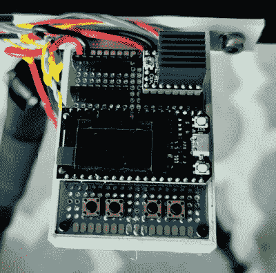

# 电动相机滑块赋予您的照片风格

> 原文：<https://hackaday.com/2021/07/11/motorized-camera-slider-gives-your-shots-style/>

我们都见过那些平滑的平移镜头，结合一些公共领域的节拍，是现代 YouTube 技术视频的标志。在你自己的作品中重现这种风格就像把你的浏览器指向亚马逊，拿起一个电动相机滑块一样简单，只要你不介意花几百美元。但是[帕韦·斯彼哈尔斯基]有一个更好的主意。他决定构建自己的相机滑块，并将其作为开源项目，这样其他人就可以开发自己的版本。

 他的设计使用了许多由于桌面 3D 打印机爆炸而变得流行和实惠的组件，如 2020 铝挤压件、LM8UU 直线轴承、8 毫米丝杠和 NEMA 17 步进电机。事实上，如果你有一台坏了的 3D 打印机，你不知道该怎么处理，把它拆成零件会让你离完成这个项目的 BOM 还有很长的路要走。

为了控制滑块，[pawe]使用了一个 ESP32 和 TMC 2209“step stick”驱动程序，连接到一个有机发光二极管显示器和几个按钮。按照设计，连接到由 ESP32 托管的简单网页的智能手机是控制相机的主要方法，但滑块上的按钮和显示屏本身可以在你需要时为你提供物理备份。

如果你需要比线性滑块更高级的东西，我们已经看到了一些令人印象深刻的 DIY 运动装置，它们可以围绕目标旋转相机，[可以拍摄出一些非常专业的照片](https://hackaday.com/2016/07/18/diy-motion-control-camera-rig-produces-money-shots-on-a-budget/)。

 [https://www.youtube.com/embed/z8LCp77dOxo?version=3&rel=1&showsearch=0&showinfo=1&iv_load_policy=1&fs=1&hl=en-US&autohide=2&wmode=transparent](https://www.youtube.com/embed/z8LCp77dOxo?version=3&rel=1&showsearch=0&showinfo=1&iv_load_policy=1&fs=1&hl=en-US&autohide=2&wmode=transparent)

