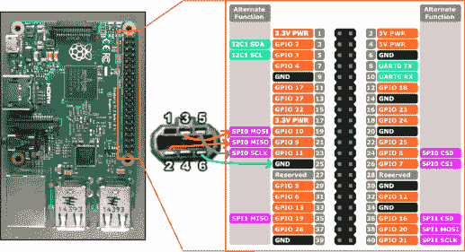

# GBA 上的 PlayStation 游戏，多了几个步骤

> 原文：<https://hackaday.com/2021/07/13/playstation-games-on-the-gba-with-a-few-extra-steps/>

这似乎是不可能的，但你现在看到的是一个索尼 PlayStation 游戏正在任天堂 Game Boy Advance 上运行。分辨率很糟糕，GBA 没有足够的按钮来处理大多数 3D 游戏，但它很有效。甚至还有音频支持，尽管打开它会大大降低速度。

它是如何工作的？诀窍在于创作者[Rodrigo Alfonso]实际上是在 Raspberry Pi 上模仿 PlayStation，并简单地将任天堂的手持设备用作外部显示器和控制器。我们说“简单”，但当然，绝不是这样。该项目的 GitHub 页面详细介绍了整个项目的工作原理，但简短的版本是，视频数据通过手持设备的串行端口使用 SPI 从 Linux 帧缓冲区发送到运行在 GBA 上的一个小程序。在测试中，他能够以 2.56 Mbps 的速度通过链路，当你只需要保持 240 × 160 的屏幕时，这是一个相当大的带宽。

 也许最好的部分是，你甚至不需要一个闪光推车就可以在家里试一试。[Rodrigo]使用了一个我们在其他 GBA 项目中见过的技巧，其中[程序实际上是在启动时通过连接线传输到手持设备上](https://hackaday.com/2020/04/21/esp32-refines-game-boy-bluetooth-adapter/)。

任天堂推出了这种“多重引导”功能，这样多人游戏就可以在系统之间进行，即使它们并不都有物理盒，但现在黑客已经破解了代码，这意味着你可以在完全未经修改的主机上运行任意代码；虽然你一关机它就被清除了。

[Rodrigo]提供了你在家尝试它所需的所有信息和软件，你只需要一个树莓 Pi，一个 Game Boy Advance，以及你不介意切断的 Link 线缆；远远少于在 NES 上运行*毁灭*的类似项目所需的硬件。由于他将所有东西都绑定到流行的 RetroPie 前端，我们想象它甚至可以在模仿早期的 2D 游戏机时工作；这将更适合 GBA 的显示器和有限的输入。