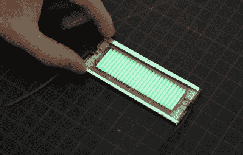

# 俄罗斯方块掌上电脑最终由氚电池供电

> 原文：<https://hackaday.com/2021/07/14/tetris-handheld-powered-by-tritium-cell-eventually/>

氚电池的想法非常简单:将足够多的微型发光管粘在光伏板上，你自己动手制作的“核电池”将在未来十年左右产生能量。唯一的问题是产生的能量，以几微瓦计算，不足以做太多事情。但是正如伊恩·查纳斯在他的最新视频中所展示的，你可以通过储存足够长的时间来延长这种电池的实际使用。

与我们之前看到的项目一样，伊恩通过在两块太阳能电池板之间夹入一排钥匙链大小的氚管来建造他的电池。与任何外部光线隔离，电池板产生的能量是电子管磷涂层受到电子轰击时发出的微弱绿光的结果。然后，这些电池板被用来为一组薄膜固态电池充电，这些电池以其极低的自放电率而闻名。

 一些快速计算告诉【伊恩】一周的充电应该可以为山寨手持*俄罗斯方块*游戏提供大约 10 分钟的电量。不幸的是，在等待了规定的时间后，他黑在一起的电源只运行了几秒钟。

他最大的猜测是，他得到了一批坏的薄膜电池，但由于他再也找不到他最初使用的确切零件号，他不得不为第二次尝试设计一个全新的 PCB。在等待了两个月之后，他终于可以在自制核能耗尽之前玩将近一个小时。

从游戏的角度来看，我们不会认为这非常实用，但就像我们去年报道的太阳能采集手持游戏一样，这是一个有趣的演示，展示了即使是极少量的电力也可以用于间歇性应用。这是一场短暂的不靠谱的*俄罗斯方块*，但这个概念可以很容易地应用于离网传感器。

 [https://www.youtube.com/embed/6byi-RFrgtU?version=3&rel=1&showsearch=0&showinfo=1&iv_load_policy=1&fs=1&hl=en-US&autohide=2&wmode=transparent](https://www.youtube.com/embed/6byi-RFrgtU?version=3&rel=1&showsearch=0&showinfo=1&iv_load_policy=1&fs=1&hl=en-US&autohide=2&wmode=transparent)

谢谢丹的提示。]